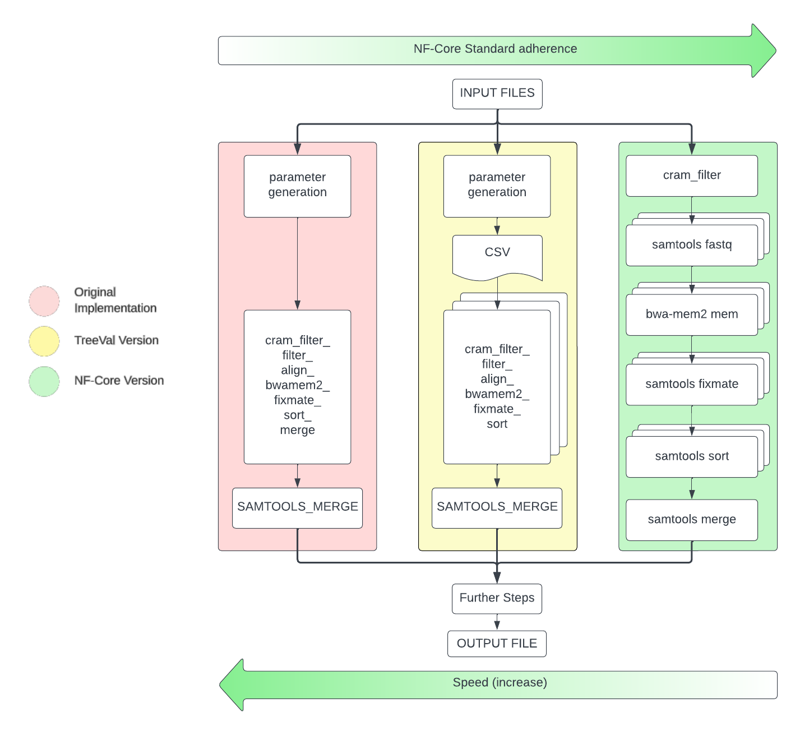

## nf-core Module Guidelines

Generally, modules should conform to the [nf-core Standards](https://nf-co.re/docs/contributing/modules#new-module-guidelines-and-pr-review-checklist). However, there are a small number of cases where this is not possible.

## Sanger-tol additions

### Pipeline Comments (Optional)

Reading the code of a pipeline can be daunting, especially if picking up the development for said pipeline. And so we propose that there should be structured comments to explain the context of implementation at each module, subworkflow and workflow.

```markdown
//
// { IMPORT | LOGIC | MODULE | SUBWORKFLOW | WORKFLOW }: Short explainer for contextualising code
//
```

For example, instead of a block of code such as:

```nextflow
SAMTOOLS_MARKDUP (pretext_input.input_bam,pretext_input.reference)
ch_versions = ch_versions.mix ( SAMTOOLS_MARKDUP.out.versions )
BAMTOBED_SORT(SAMTOOLS_MARKDUP.out.bam)
ch_versions = ch_versions.mix( BAMTOBED_SORT.out.versions )
GET_PAIRED_CONTACT_BED( BAMTOBED_SORT.out.sorted_bed )
ch_versions = ch_versions.mix( GET_PAIRED_CONTACT_BED.out.versions )
GET_PAIRED_CONTACT_BED.out.bed.combine( dot_genome ).multiMap {  meta, paired_contacts, meta_my_genome, my_genome ->
            paired      :   tuple([ id: meta.id, single_end: true], paired_contacts )
            genome      :   my_genome
            id          :   meta.id
}.set { ch_juicer_input }
```

It should be formatted as such:

```nextflow
    //
    // MODULE: MARK DUPLICATES OF THE MERGED AND POSITION SORTED BAM
    //
    SAMTOOLS_MARKDUP (
        pretext_input.input_bam,
        pretext_input.reference
    )
    ch_versions         = ch_versions.mix ( SAMTOOLS_MARKDUP.out.versions )

    //
    // MODULE: DUPLICATE READS FILTERED BAM | BAMTOBED | SORT BED FILE
    //
    BAMTOBED_SORT(
        SAMTOOLS_MARKDUP.out.bam
    )
    ch_versions         = ch_versions.mix( BAMTOBED_SORT.out.versions )

    //
    // MODULE: GENERATE CONTACT PAIRS IN BED FORMAT
    //
    GET_PAIRED_CONTACT_BED( BAMTOBED_SORT.out.sorted_bed )
    ch_versions         = ch_versions.mix( GET_PAIRED_CONTACT_BED.out.versions )

    //
    // LOGIC: PREPARE JUICER TOOLS INPUT CHANNELS
    //
    GET_PAIRED_CONTACT_BED.out.bed
        .combine( dot_genome )
        .multiMap {  meta, paired_contacts, meta_my_genome, my_genome ->
            paired      :   tuple([ id: meta.id, single_end: true], paired_contacts )
            genome      :   my_genome
            id          :   meta.id
        }
        .set { ch_juicer_input }
```

Although clues about the use of a channel should be obvious by its name. These comments help give context to why a tool is used here and explicitly states its purpose.

Further examples include:

```
//
// IMPORT: SUBWORKFLOWS CALLED BY THE MAIN PROCESS
//
include { YAML_INPUT        } from '../subworkflows/local/yaml_input'
include { GENERATE_GENOME   } from '../subworkflows/local/generate_genome'

//
// WORKFLOW: RUN TRUNCATED PIPELINE TO PRODUCE CONTACT MAPS AND PRETEXT ACCESSORIES
//
workflow SANGERTOL_TREEVAL_RAPID {
        TREEVAL_RAPID ()
}

//
// SUBWORKFLOW: Takes input fasta file and sample ID to generate a my.genome file
//
GENERATE_GENOME (
    YAML_INPUT.out.assembly_id,
    YAML_INPUT.out.reference
)
ch_versions     = ch_versions.mix(GENERATE_GENOME.out.versions)

//
// MODULE: SAMTOOLS FILTER OUT DUPLICATE READS FROM BAM | BAMTOBED | SORT BED FILE
//
BAMTOBED_SORT(
    SAMTOOLS_MARKDUP.out.bam
)
ch_versions         = ch_versions.mix( BAMTOBED_SORT.out.versions )

//
// LOGIC: COMBINES GENOME_FILE CHANNEL AND ABOVE OUTPUT, SPLITS INTO TWO CHANNELS
//        ALSO FILTERS OUT EMPTY MERGED.BED BASED ON WHETHER FILE IS >141 BYTES WHICH IS POTENTIALLY A SYMLINK
//
BEDTOOLS_SORT.out.sorted
    .map { meta, file ->
            tuple( [    id:         meta.id,
                        type:       meta.type,
                        file_size:  file.size()
                    ],
                    file ) }
    .filter { it[0].file_size >= 141 }
    .combine( dot_genome )
    .multiMap { meta, ref, genome_meta, genome ->
        bed_file:   tuple( [    id:         meta.id,
                                type:       meta.type,
                            ],
                            ref )
        dot_genome: genome
    }
    .set { ucsc_input }

```

These explainers do not have to be as comprehensive as in other documentation, just enough to provide context or reasoning for that module or logic block.

### The Super-module

In [TreeVal](https://www.github.com/sanger-tol/treeval), there is the [`cram_filter_align_bwamem2_fixmate_sort.nf`](https://github.com/sanger-tol/treeval/blob/dev/modules/local/cram_filter_align_bwamem2_fixmate_sort.nf) local module, which contains 3 tools across 5 commands.

```bash
input:
tuple val(meta), path(cramfile), path(cramindex), val(from), val(to), val(base), val(chunkid), val(rglines), val(bwaprefix)

...

script:
def args = task.ext.args ?: ''
def prefix = task.ext.prefix ?: "${meta.id}"
"""
cram_filter -n ${from}-${to} ${cramfile} - | \\
    samtools fastq -F0xB00 -nt - | \\
    bwa-mem2 mem -p ${bwaprefix} -t${task.cpus} -5SPCp -H'${rglines}' - | \\
    samtools fixmate -mpu - - | \\
    samtools sort --write-index -l1 -@${task.cpus} -T ${base}_${chunkid}_sort_tmp -o ${prefix}_${base}_${chunkid}_mem.bam -
"""
```

The original implementation of this module took a cram file and whilst reading, split the stream into 10,000 container segments (a cram container is analogous to 1 read), these stream segments are then processed upon (by the other 4 commands) before being merged into 1 mapped and sorted bam file for the primary assembly.

Nextflow cannot manipulate a data stream passing between two modules. This required us to create a module to pre compute the 10,000 container regions of interest in the cram file (in the form of a csv) and pass these as arguments to the cram*et al* module. Whilst not as performant as the original implementation (due to the small overhead created by Nextflow and the csv generation between parameter generation and cram*et al*), this is much more performant (in terms of compute resources and IO impact) than splitting the cram file into n (( total number of container / 10,000 ) \* no. of cram files) number of files before further manipulation with the next 4 commands. This means that the TreeVal implementation is the best case scenario, as shown below.



#### Reasons for:

- Where there is a significant reduction in compute resource and IO when compared to a subworkflow with the same function.

#### Reasons against:

- Where there is no performance increase.
- Where an intermediary file, inside the command pipe, is also an output file.
- More complex testing (requires more resources as, in this case, there are 5 tools running concurrently).
- Mulled containers are more cryptic as to the packages contained.
