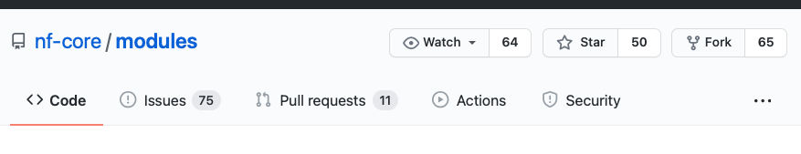

# Tutorial: Create a DSL2 Module

In this tutorial we will see how to create a new module for the nf-core modules repository. As an example, we will create a module to execute the FastqToBam function of the FGBIO suite of tools.

## Table of Contents

- [Introduction](#introduction)
    - [Module guidelines](#module-guidelines)
    - [NF-core Tools](#nf-core-tools)
- [Fork repository](#fork-the-modules-repo-and-branch)
- [Create template](#create-the-module-template)
- [Write the Code](#write-the-code)
    - [Inputs and Outputs](#inputs-outputs)
    - [Options args](#passing-options.args)
    -[Lint code](#lint-your-code)
- [Test code](#test-your-code)
    -[Create YAML](#create-test-yaml)
    -[Run tests](#run-tests-locally)
- [Pull Request](#create-a-pull-request)

## Introduction

If you create a new module with the goal of contributing the code to *nf-core*, we recommend to familiarise with the community guidelines and use *nf-core tools* as explained below.

### Module guidelines

The nf-core community has agreed on a minimal set of [guidelines](https://github.com/nf-core/modules#guidelines), intended to make module most suitable for general use, i.e. to be shared across a wide variety of community workflows.

### nf-core tools

Using [nf-core tools](https://nf-co.re/tools) is the best way to adhere to the guidelines, without worrying too much and writing things from scratch.
On the website you can find more details about [installation](https://nf-co.re/tools#installation), and all functionalities for [modules](https://nf-co.re/tools#modules).

## Fork the Modules Repo and branch

The first step, to contribute a module to the community repository is to fork *nf-core modules into your own account or organisation. To do this, you should click on the top-right of the nf-core modules repository, and choose "fork" as shown in the figure below.



You then choose the account or organisation you want to fork the repository into. Once forked, you can commit all changes you need into the new repository.

In order to create a new module, it is best to branch the code into a recognisable branch. You can do this in two ways.

- you can create a new branch locally, on the terminal, using the following command

```
git checkout -b newmodule
```
The branch will be syncronised with your remote once you push the first new commit.

- you can use the github interface

To do this, you can select the dropdown menu on the top-left of your repository code, write the name of the new branch and choose to create it as shown in the figure below.


You will then sync this locally (ideally, you clone the forked repository on your working environment to edit code more comfortably)


## Create the module template

Using *nf-core tools* it is very easy to create a new module. In our example, we change directory into the repository (*modules*) and we type

```
nf-core modules create -t fgbio/fastqtobam
```
You will notice that with `-t` we indicate the name of the new module we want to create using the following syntax:

- the first word indicates the tool (i.e. the software or suite)
- we separate the keys by a forward slash ("/")
- the second word indicates the function of the tool we are creating a module for

Magic will happen now: nf-core tools will create the following entries for the code of the module itself

```
software/fgbio
└── fastqtobam
    ├── functions.nf
    ├── main.nf
    └── meta.yml
```

And also the following for the testing of the module

```
tests/software/fgbio
└── fastqtobam
    ├── main.nf
    └── test.yml
```

Each of the files is pre-filled according to a defined nf-core template.

You fill find a number of commented section in the file, to help you modify the code while adhering to the guidelines, as you can appreciate in the following figure.


The above represents the main code of your module, which will need to be changed.
NF-core tools will attempt at retrieving the correct containers (for Docker and for Singularity) as well as the Conda recipe, and those fiels will be pre-filled for you.

Now you just have to write the code.
## Write the code


### Inputs/Outputs


### Passing options.args 


### Lint your code


## Test your code

### Create test YAML


### Run tests locally


## Create a Pull Request


