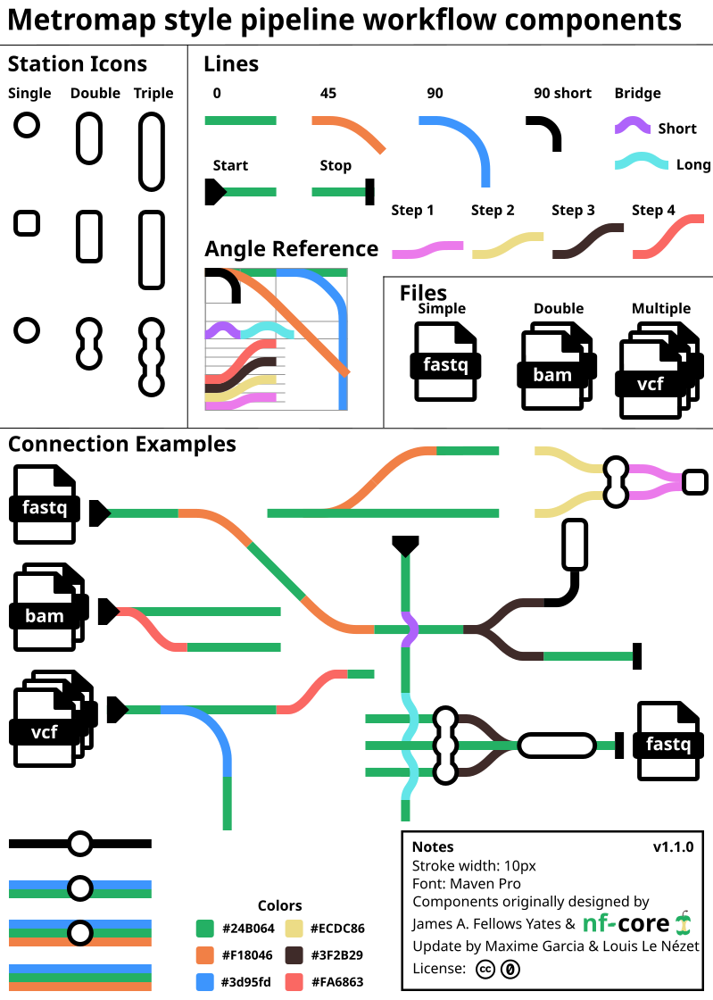

Simple workflow schematics help outline the main functionality and steps of a pipeline.
Most nf-core pipelines use a metro-map diagram, where each analysis route is a coloured line running through the processes it uses.

There are two ways to make one: generate it from a text file with [nf-metro](#use-nf-metro), or [draw it by hand](#draw-one-by-hand) in a vector editor.
Either way, declare the result in `nextflow.config`.

## Declare your diagram in the pipeline config

Set `manifest.diagram` in `nextflow.config` to a relative path to your diagram, so that Nextflow and other tools can find it:

```groovy title="nextflow.config"
manifest {
    // ...
    diagram = 'docs/images/metro_map.svg'
}
```

Nextflow accepts SVG, PNG, JPEG, GIF and WebP files.
Use an SVG if you can: it scales to any size and a single file can work on both light and dark backgrounds.

:::note{title="manifest.diagram needs Nextflow 26.10.0 or later" collapse}
Setting it is safe on older versions: the pipeline runs as normal, though some versions log a warning.

| Nextflow                  | Behaviour                                                                                 |
| ------------------------- | ----------------------------------------------------------------------------------------- |
| `21.10.6` – `25.04.8`     | `WARN: Invalid config manifest attribute 'diagram'` (printed twice)                       |
| `25.10.0` – `25.10.7`     | No warning                                                                                |
| `26.04.6`, `26.08.0-edge` | `WARN: Unrecognized config option 'manifest.diagram'`, with the strict syntax parser only |

Don't read `workflow.manifest.diagram` in pipeline code unless the pipeline requires Nextflow `26.10.0` or later: older versions fail.
:::

`nf-core pipelines lint` warns if `manifest.diagram` is not set.
It fails if the value is a URL rather than a relative path, is not one of the supported image formats, or points at a file that is not in the repository.

## Use nf-metro

[nf-metro](https://seqeralabs.github.io/nf-metro/latest/) renders a metro map from a text file, so the diagram lives in the pipeline repo as source and can be re-rendered whenever the workflow changes.

Describe the pipeline as a Mermaid graph, with `%%metro` directives to declare the lines.
NB: `PIPELINE` is a placeholder for your pipeline's name.

```txt title="assets/metro_map.mmd"
%%metro title: nf-core/PIPELINE
%%metro logo: ../docs/images/nf-core-PIPELINE_logo_light.png | ../docs/images/nf-core-PIPELINE_logo_dark.png
%%metro style: dark
%%metro line: main | Main | #4CAF50
%%metro line: qc | Quality Control | #2196F3 | dashed
%%metro legend: bl

graph LR
    input[Input]
    trim[Trimming]
    fastqc[FastQC]

    input -->|main| trim
    input -->|qc| fastqc
    trim -->|qc| fastqc
```

Then render it and commit the SVG:

```bash
nf-metro render assets/metro_map.mmd -o docs/images/metro_map.svg
```

### Light and dark mode

Colours in the SVG are written as CSS `light-dark()` pairs, so one file works on both light and dark backgrounds - there's no need for a `_light` / `_dark` SVG pair.

However, you may want `_light` and `_dark` pairs for PNG outputs for convenience for users.
You can also generate animated versions with little circles that move along the tracks.

A typical set of commands to generate these variants is as follows:

```bash
pip install 'nf-metro>=2.0.0'

# Static SVG + dark-mode PNG
nf-metro render assets/metro_map.mmd \
    -o docs/images/metro_map.svg \
    -o docs/images/metro_map_dark.png

# Static light-mode PNG
nf-metro render assets/metro_map.mmd --mode light \
    -o docs/images/metro_map_light.png

# Animated SVG
nf-metro render assets/metro_map.mmd --animate \
    -o docs/images/metro_map_animated.svg
```

### Additional features

If you like, nf-metro can also export interactive HTML, light up stations in real time as a run progresses, and import a Nextflow `-with-dag` diagram as a starting point.

- [Playground](https://seqeralabs.github.io/nf-metro/latest/playground/) - edit and preview in the browser, nothing to install
- [Guide](https://seqeralabs.github.io/nf-metro/latest/guide/) - directives, lines, sections and layout options
- [nf-core pipelines](https://seqeralabs.github.io/nf-metro/latest/pipelines/) and [gallery](https://seqeralabs.github.io/nf-metro/latest/gallery/) - rendered maps with their `.mmd` source
- [Theming](https://seqeralabs.github.io/nf-metro/latest/theming/) - brand palettes (`nfcore` is the default), light/dark handling and logos
- [CI and automation](https://seqeralabs.github.io/nf-metro/latest/automation/) - a GitHub Action that flags a committed SVG that is out of date

## Draw one by hand

Prior to nf-metro, most workflow schematics were made with vector image editors, such as the open-source tool [Inkscape](https://inkscape.org/) or commercial suite [Adobe Illustrator](https://www.adobe.com/products/illustrator.html).
This remains one of the best ways to generate a metro map, though it requires some patience and effort.

Useful tools for collaborative prototyping include [Google Drawings](https://docs.google.com/drawings/) and [LucidChart](https://www.lucidchart.com/pages/).

The components and examples below can be opened in these editors, and various parts can be borrowed and/or modified.
Components are also available on [bioicons](https://bioicons.com/icons/cc-0/Chemo-_and_Bioinformatics/James-A--Fellows-Yates/metromap_style_pipeline_workflow_components.svg), which has direct import extensions for [Inkscape](https://inkscape.org/) and [draw.io](https://app.diagrams.net/).

### Components

|                                                                                         Object                                                                                         | Description                                        | Link                                                                                                                                                                                                                                                                                                                                                                                                                                                                                                                                                                                                                                                                                                             | Source                                                                                                                                                                    |
| :------------------------------------------------------------------------------------------------------------------------------------------------------------------------------------: | -------------------------------------------------- | ---------------------------------------------------------------------------------------------------------------------------------------------------------------------------------------------------------------------------------------------------------------------------------------------------------------------------------------------------------------------------------------------------------------------------------------------------------------------------------------------------------------------------------------------------------------------------------------------------------------------------------------------------------------------------------------------------------------- | ------------------------------------------------------------------------------------------------------------------------------------------------------------------------- |
|  | Components for a metro-map style pipeline workflow | [SVG](https://raw.githubusercontent.com/nf-core/website/main/sites/docs/src/assets/images/graphic_design_assets/workflow_schematics_components/generic/metromap_style_pipeline_workflow_components.svg) <br> [PDF](https://raw.githubusercontent.com/nf-core/website/main/sites/docs/src/assets/images/graphic_design_assets/workflow_schematics_components/generic/metromap_style_pipeline_workflow_components.pdf) <br> [DRAW.IO](https://app.diagrams.net/#Uhttps%3A%2F%2Fraw.githubusercontent.com%2Fnf-core%2Fwebsite%2Frefs%2Fheads%2Fmain%2Fsites%2Fdocs%2Fsrc%2Fassets%2Fimages%2Fgraphic_design_assets%2Fworkflow_schematics_components%2Fgeneric%2Fmetromap_style_pipeline_workflow_components.drawio) | James A. Fellows Yates, Maxime Garcia, Louis Le Nézet & nf-core; under a [CC0](https://creativecommons.org/publicdomain/zero/1.0/?ref=chooser-v1) license (public domain) |

### Using draw.io

The web app [draw.io](https://app.diagrams.net/) helps you create, render and export different diagrams including metro-maps.
For even more convenience, you can use the asset library [nf-core xml item library](https://raw.githubusercontent.com/nf-core/website/refs/heads/main/sites/docs/src/assets/images/graphic_design_assets/workflow_schematics_components/generic/nf-core_components.xml).
It contains all of the components from the components above.
To open the nf-core component library:

1. Download the <a href="/images/graphic_design_assets/workflow_schematics_components/generic/nf-core_components.xml" download>library file</a>
2. Go to [draw.io](https://draw.io/)
3. Click _File → Open Library from → Device_
4. Select the downloaded the file

This will load the nf-core shapes into the sidebar without any CORS issues.

:::tip
Components can also be accessed via [bioicons](https://bioicons.com/icons/cc-0/Chemo-_and_Bioinformatics/James-A--Fellows-Yates/metromap_style_pipeline_workflow_components.svg).
:::

## Examples

See below for examples of nf-core workflow schematics that can be re-used and modified for your own pipeline.

:::warning
Check for any attributions to be included within any derivative images, as defined by the corresponding license.
:::

Select the schematic image to see the original.

|                                                             Workflow Example                                                             | nf-core Pipeline                                  | License/Publication                                                                                                                                                      | Suggested attribution                           |
| :--------------------------------------------------------------------------------------------------------------------------------------: | ------------------------------------------------- | ------------------------------------------------------------------------------------------------------------------------------------------------------------------------ | ----------------------------------------------- |
|                                   | [nf-core/sarek](https://nf-co.re/sarek)           | From [Garcia _et al._ (2020, F1000 Research)](https://doi.org/10.12688/f1000research.16665.1) under a [CC-BY 4.0](https://creativecommons.org/licenses/by/4.0/) license. |                                                 |
|            | [nf-core/eager](https://nf-co.re/eager)           | From [Fellows Yates _et al._ (2021, PeerJ)](https://doi.org/10.7717/peerj.10947) under a [CC-BY 4.0](https://creativecommons.org/licenses/by/4.0/) license               | CC-BY 4.0. Design originally by Zandra Fagernäs |
|  | [nf-core/eager](https://nf-co.re/eager)           | From [Fellows Yates _et al._ (2021, PeerJ)](https://doi.org/10.7717/peerj.10947) under a [MIT](https://github.com/nf-core/dualrnaseq/blob/master/LICENSE) license        |                                                 |
|   | [nf-core/dualrnaseq](https://nf-co.re/dualrnaseq) | By Regan Hayward under [MIT](https://github.com/nf-core/dualrnaseq/blob/master/LICENSE) license                                                                          |                                                 |
|                        | [nf-core/circrna](https://nf-co.re/circrna)       | By Barry Digby under [MIT](https://github.com/nf-core/circrna/blob/master/LICENSE) license                                                                               |                                                 |
|                           | [nf-core/mag](https://nf-co.re/mag)               | By Sabrina Krakau under [MIT](https://github.com/nf-core/mag/blob/master/LICENSE) license                                                                                | CC-BY 4.0. Design originally by Zandra Fagernäs |
|                       | [nf-core/bactmap](https://nf-co.re/bactmap)       | By Anthony Underwood under [MIT](https://github.com/nf-core/mag/blob/master/LICENSE) license                                                                             |                                                 |
|        | [nf-core/cutandrun](https://nf-co.re/cutandrun)   | By Chris Cheshire under [MIT](https://github.com/nf-core/cutandrun/blob/master/LICENSE) license                                                                          |                                                 |
|                           | [nf-core/sarek](https://nf-co.re/sarek)           | By Maxime U Garcia under [MIT](https://github.com/nf-core/sarek/blob/master/LICENSE) license                                                                             |                                                 |
|   | [nf-core/rnaseq](https://nf-co.re/rnaseq)         | By Sarah Guinchard under [MIT](https://github.com/nf-core/sarek/blob/master/LICENSE) license                                                                             |                                                 |
|                 | [nf-core/isoseq](https://nf-co.re/isoseq)         | By Sébastien Guizard under [MIT](https://github.com/nf-core/isoseq/blob/master/LICENSE) license                                                                          |                                                 |
