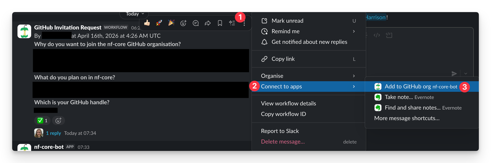

This page provides detailed procedures for nf-core core team administrative tasks.
Core team members rotate week 'on-call' duties to manage community operations and support pipeline development.

## Review and onboard new pipelines

To approve and setup a new [nf-core pipeline](https://github.com/nf-core/proposals):

1. **Core**: Update the _project status_ on the issue to 'Proposed'
1. **Community**: Discuss benefits and limitations of the proposal:
    - Emphasise collaboration

        :::note
        nf-core prefers to have more developers working on fewer pipelines, rather than many pipelines with a single developer.
        :::

    - Ensure proposal follows [nf-core pipeline guidelines](/docs/guidelines/pipelines/overview)
    - In some cases, promote 'partial acceptance', i.e., if upstream steps already covered in another pipeline, propose new pipeline of just non-overlapping steps

1. **Core**: Check proposal has received approval in [nf-core/proposals](https://github.com/nf-core/proposals) from either:
    - Two members of the core team
    - One member of the core team and one member of the maintainers team
1. **Core**: Make final decision:
    - If accepted: update the Project status on the issue to 'Accepted'
    - If not accepted: update the project status to 'Turned down' (process ends here)
1. **Core**: Verify that the pipeline name follows the [pipeline naming guidelines](/docs/guidelines/pipelines/requirements/workflow_name)
1. **Core**: Create a slack channel with approved pipeline name:
    - Invite the Slack bot to the channel (`/invite @Full test notifications`).
      This is required for CI/CD Slack notifications via the [nf-slack plugin](https://github.com/seqeralabs/nf-slack).
      The bot **will silently fail** if not invited.
    - Inform the new developer of the [next steps](https://nf-co.re/docs/tutorials/adding_a_pipeline/creating_a_pipeline#create-the-pipeline)
1. **Core**: Add the main developer(s) to:
    - [#pipeline-maintainers](https://nfcore.slack.com/archives/C04QR0T3G3H)
    - [#release-review-trading](https://nfcore.slack.com/archives/C08K66XCZSL)
1. **Core**: Create a branch with the pipeline name in the [nf-core/test-datasets](https://github.com/nf-core/test-datasets) repository
1. **Core/Dev**: Set up the pipeline repository:
    - If development started in a custom (non-nf-core) repo, [transfer the repository](https://nf-co.re/docs/checklists/community_governance/core_team#repository-transfer-to-nf-core-organisation) to nf-core
    - If starting fresh, create a new GitHub repository with the name of the pipeline
    - In both cases, [configure the repository settings](#pipeline-repository-settings)
1. Add the pipeline name to the [website YAML file](https://github.com/nf-core/website/blob/75a92b76129b0e2c3f644bf26482142ba9e41f6f/sites/main-site/src/config/ignored_repos.yaml) designated to ignore this repository when building the website pipeline list (until the pipeline is in advanced development or there is a need to surface it already).
1. **Core/Dev**: After first release, remove the pipeline name from the [website YAML file](https://github.com/nf-core/website/blob/75a92b76129b0e2c3f644bf26482142ba9e41f6f/sites/main-site/src/config/ignored_repos.yaml) ignoring this pipeline from the build, if it is there.
1. **Core/Dev**: Sync the nf-co.re pipelines page by triggering the [GitHub action](https://github.com/nf-core/website/actions/workflows/build-json-files.yml)
    - **Website repo > Actions > Build json files and md-cache > Run workflow > From main**

## Upload test data to a S3 bucket

To upload full-test AWS files for to a S3 bucket:

1. Check the test data is valid.

    :::note
    Small input data may be unreliable when downloaded from other repositories (e.g., limit total file size to < 10 GB total).
    :::

1. Check that large files cannot be reduced or subset
1. Select Amazon S3-managed keys (SSE-S3) and create the pipeline directory in the S3 bucket

## Transfer a repository to nf-core

To transfer an existing repository to the nf-core GitHub organisation:

1. Request repository ownership transfer from the developer
    - If the repository is under an organisation account, ask the developer to add a core team member as a co-owner
    - If the repository is under a personal user account, ask the developer to transfer ownership directly to a core team member's personal account
1. Transfer the repository to the nf-core organisation
    - In the repository, go to **Settings**, scroll to the bottom of the **General** page, and select **Transfer**
    - Confirm or update the repository name if needed
1. [Configure the repository settings](#pipeline-repository-settings) in the nf-core organisation

## Pipeline repository settings

After creating a new pipeline repository or transferring an existing one to the nf-core organisation, configure the following settings.

### General settings

1. [ ] In the repository, go to **Settings** > **General**.
2. [ ] Add a description, the https://nf-co.re URL, and relevant topic keywords.
3. [ ] Under **Features**, disable **Wikis** and **Projects**.
4. [ ] Under **Pull Requests**, enable **Always suggest updating pull request branches**.
5. [ ] Under **Pull Requests**, enable **Automatically delete head branches**.

### Team access

1. [ ] Go to **Settings** > **Collaborators and teams**.
2. [ ] Add the **contributors** team with **Write** access.
3. [ ] Add the **core** team with **Admin** access.

### Rulesets

1. [ ] Apply the 4 repository ruleset JSON files: `main`/`master`, `dev`, `TEMPLATE` and tag creation (these are pinned in the core channel).
2. [ ] Go to **Settings** > **Rules** (under Code and automation).
3. [ ] Select **New ruleset**.
4. [ ] Select **Import a ruleset**, then select one of the JSON files.
5. [ ] Select **Create** at the bottom of the page. Do not modify any fields.
6. [ ] Repeat the import (step 4) and create (step 5) steps for each JSON file provided.

## Create custom Docker containers for modules

To add a custom docker containers to the nf-core [https://quay.io](https://quay.io/organization/nf-core) organisation:

:::note
The person building the container must have organisation push rights.
**Only core members may have this access**.
New core members should request access from existing members.
:::

1. Check with the module author to ensure there is no available solution via Conda, Bioconda, or BioContainers
1. Ask the module author to:
    - Place a `Dockerfile` alongside the module (sub)directories
    - Add a `README.md` describing why the container is needed, and provide instructions for building the container
    - (Optional) add a `.gitignore` file to ensure build artifacts are not pushed with the `Dockerfile` and `README.md`
1. Ensure Docker is correctly authenticated for pushing to `quay.io`

    ```bash
    docker login --username <QUAY-USER-NAME> quay.io
    ```

1. Build the Docker image locally and tag it appropriately:

    ```bash
    docker build . -t quay.io/nf-core/<TOOL>:<VERSION>
    ```

1. Push the built container image:

    ```bash
    docker push quay.io/nf-core/<TOOL>:<VERSION>
    ```

1. Share the container reference with the module author so they can update the module:

    ```groovy
    container "nf-core/<TOOL>:<VERSION>"
    ```

    :::note
    This replaces the entire Docker/Singularity condition in the module.
    :::

## Activate Zenodo archiving of a new pipeline

To set up up Zenodo DOI:

:::note
It's recommended that a core team member transfers the DOI to the nf-core Zenodo community.
:::

1.  Before release:
    1.  Sign up and log in to [Zenodo](https://zenodo.org/)
    1.  Select **GitHub -> Connect Account** in the dropdown menu of your account and connect your GitHub account
    1.  Select **GitHub** in the dropdown menu of your account once connected
    1.  Toggle the **On** switch of the pipeline to enable Zenodo archiving

            :::note
            It's a good idea to enable this for all active pipelines, as DOIs will only be assigned upon release.
            :::

            :::note
            Some repositories (e.g., `nf-core/exoseq`) may not be activated as they are archived.
            :::

    1.  Inform the pipeline developers to make a release

1.  Post release:
    1. Select **Github** in the dropdown menu of your account in Zenodo and find the relevant repository
    1. Click the Zenodo **Record** page for the release
    1. Find the **Communities** box on the record page and submit the record to the nf-core community

        :::tip
        Google Chrome contains a graphical bug causing the **Communities** box not to show up, please use another browser if this happens to you.
        :::

    1. Copy the DOI for **Cite all versions?** in the **Versions** tab
    1. Update files on the pipeline master branch:
        - `README.md`: Add the Zenodo Badge and update the **If you use this pipeline cite** section
        - `Nextflow.config`: Update the manifest block to include the DOI
        - Commit these changes with the message "Add Zenodo ID after first release"

## Add new community members to the GitHub organisation

New members request access to the nf-core GitHub organisation via a Slack workflow in the [#github-invitations](https://nfcore.slack.com/archives/CEB982K2T) channel.
The **nf-core-bot** can process these requests directly from Slack:

1.  Verify the request is reasonable (i.e., clearly not spam)
2.  Click the **more actions** menu (three dots **⋮**) on the workflow message
3.  Select **Connect to apps** > **Add to GitHub org nf-core-bot**
    - This might be buried the first time. Once you've done it once, it'll float to the top in future.



The bot automatically extracts the GitHub username from the workflow message and sends them an organisation invitation with membership in the **Collaborators** team.
The bot will post a visible reply in the message thread confirming the invitation.

Alternatively, you can use the slash command anywhere in Slack:

```
/nf-core github add @slack-user
/nf-core github add github-username
```

## Updating online bingo cards

To update the [bingo cards](https://nfcore-bingo.web.app/) to ensure they are relevant:

To update the bingo cards:

1.  Ask for the outreach google account credentials from `@core-team`
1.  Log in to [Firebase Dashboard](https://console.firebase.google.com/)
1.  Select **nfcore-bingo**
1.  Select **Realtime Database**
1.  Select **games** and navigate down the tree until you reach **lexicon**
1.  Hover over **lexicon** and select **+** to add entries:
    - Key: Number
    - Value: New board entry
1.  Select the trash bin next to the given entry to remove it

## Make backups

The following items should be regularly backed up by a member of core team with admin access to the relevant service:

- **HackMD**: backup to Google Drive (Outreach)
- **Bingo cards rules JSON (realtime database)**: backup to Google Drive (Outreach)

## Onboard a core team member

To onboard a new core team member:

1.  Add to core team Slack channel
1.  Add to GitHub core team
1.  Add as owners on the GitHub organisation
1.  Add to `@core-team` `@outreach-team` slack teams
1.  Add as owner on Slack
1.  Add to hackMD team as Admin
1.  Add to `quay.io` in team owners
1.  Add to the Seqera Platform organisation as owner
1.  Add to nf-core google calendar(s)
1.  Add to `core@nf-co.re` forwarder
1.  Add to [Zenodo community](https://zenodo.org/communities/nf-core/records?q=&l=list&p=1&s=10) as admin
1.  Update **Website / About** (get new member to check)
1.  Ask new member to add nf-core apple core emoji as Status
1.  Make Slack announcement
1.  Make Social media announcement

## Complete on-call duties

Duties for core team weekly 'on-call' rotation:

- Distribute first release reviews => [Slack](https://nfcore.slack.com/archives/C08K66XCZSL)
- Facilitate discussions and handling acceptance/rejection procedures on nf-core/proposals (pipelines, RFCs, SIGs, etc.) => [Github](http://github.com/nf-core/proposals) and [Slack](https://nfcore.slack.com/archives/CE6SDEDAA)
- Add new community members to the GitHub organisation => [Github](http://github.com/orgs/nf-core/people) and [Slack](https://nfcore.slack.com/archives/CEB982K2T)
- Monitor [#request-core](https://nfcore.slack.com/archives/C09H6NYHR9T) channel for requests to:
    - Upload test data to AWS S3 nf-core-awsmegatest buckets for new pipelines
    - Upload containers to [quay.io](https://quay.io/)
    - Activate Zenodo via the [Zenodo Github settings](https://zenodo.org/account/settings/github/)
    - Transfer pipeline repositories
