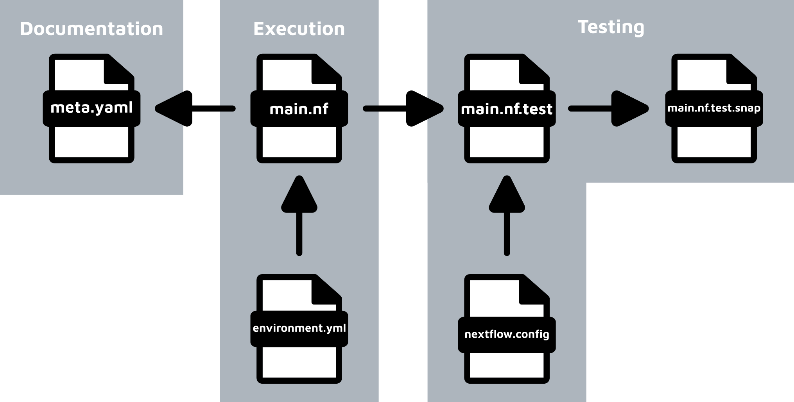

An nf-core module is an opinionated, open-source Nextflow wrapper around a single command-line tool or script. The [central community repository](https://github.com/nf-core/modules) holds more than [1800 modules](https://nf-co.re/modules) that you can reuse in your own pipelines.

This page describes what an nf-core module is and what distinguishes it from a standard Nextflow process.

## Contents of an nf-core module

An nf-core module usually wraps one tool command, or one tool with a single subcommand.

:::info{collapse title="Comparison with Nextflow modules"}
A Nextflow process or module has no restrictions on the number of tools or subcommands it can execute.

An nf-core module aims for a single analysis command per module.
This atomic design supports lego-block construction of pipelines and makes modules easier to understand, share, and test, although it is not always the most resource-efficient approach.
:::

Each nf-core module follows strict [specifications](../../../specifications/components/overview) agreed by community consensus. The specifications cover:

- [Naming](../../../specifications/components/modules/naming-conventions) and [formatting](../../../specifications/components/modules/formatting) conventions.
- [Software environments](../../../specifications/components/modules/software-requirements).
- [Standardised tags](../../../specifications/components/modules/testing#tags).
- [Input and output channels](../../../specifications/components/modules/input-output-options).
- [Tool parameters](../../../specifications/components/modules/module-parameters) configurable by pipeline developers.
- Use of [meta maps](../../../specifications/components/modules/general#use-of-meta-maps).
- Use of [stubs](../../../specifications/components/modules/general#stubs).

The specifications also expand the minimum required single file from a single Nextflow `.nf` script to five required files.
This reflects the nf-core focus on standardisation, reproducibility, and high-quality documentation.

A complete nf-core module directory can contain up to six files:

```tree
├── environment.yml
├── main.nf
├── meta.yml
└── tests/
    ├── main.nf.test
    ├── main.nf.test.snap
    └── nextflow.config ## optional!
```

These files fall into three categories:

- Module execution
- Module documentation
- Module testing

The following diagram shows how these files relate to each other:



_Schematic diagram showing the relationship between the three main categories of files in an nf-core module._

- `main.nf` defines the Nextflow process that the module executes.
- `environment.yml` is a Conda environment file loaded by `main.nf`. It specifies the software dependencies used when a pipeline runs with `-profile conda`.
- `meta.yml` documents the contents of `main.nf`, including tool metadata and input and output specifications.
- `main.nf.test` describes an nf-test unit test for the `main.nf` process.
- `main.nf.test.snap` is a snapshot file generated by nf-test. It compares the output of one test run with another to confirm reproducibility.
- `nextflow.config` is an optional Nextflow configuration file used when `main.nf.test` executes.

Writing an nf-core module means creating these files and populating them with content that follows the nf-core specifications.

The [next chapter](./4-boilerplate) goes into more detail about the contents of each file.

The [next chapter](./4-boilerplate) goes into more detail about the contents of each file.
