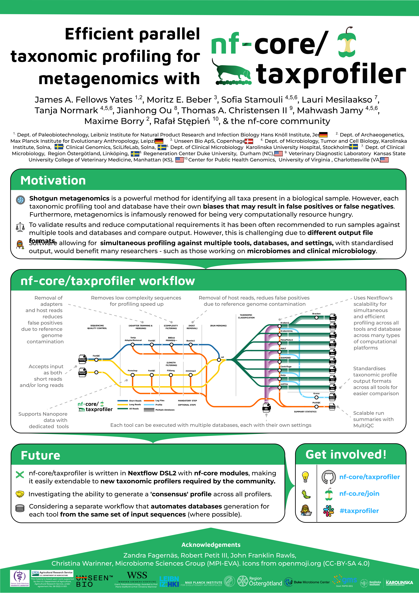

The community is welcome to present various aspects of nf-core, e.g. as posters or oral presentations at conferences.

We don't have strict guidelines on how this should be done, but at a minimum acknowledging the community and a link to the nf-core website.
You're welcome to use the nf-core logo when presenting nf-core.

We would also love to know about your presentations and posters, so please let us know on the `#graphics` nf-core Slack channel!

## Posters

Examples of previously presented posters can be seen below.
Anyone is welcome to make a PR adding a PNG and PDF/SVG/Vector version to the website, and adding them to the table.

| Poster                                                                                                                                                                                      | Author                           | Presented at               | Template for reuse? | Vector image available?                                                                                                                 |
| ------------------------------------------------------------------------------------------------------------------------------------------------------------------------------------------- | -------------------------------- | -------------------------- | ------------------- | --------------------------------------------------------------------------------------------------------------------------------------- |
|              | James A. Fellows Yates (@jfy133) | Applied Hologenomics 2022  | No                  |                                                                                                                                         |
|              | James A. Fellows Yates (@jfy133) | Nextflow Summit 2022       | Yes                 | [Download](../../../../assets/images/graphic_design_assets/poster_examples/FELLOWS_YATES_James-2022-NextflowSummit-Poster_v2.svg)       |
|  | James A. Fellows Yates (@jfy133) | Clinical Metagenomics 2024 | Yes                 | [Download](../../../../assets/images/graphic_design_assets/poster_examples/FELLOWS_YATES_James-2024-ClinicalMetagenomics-Poster_v1.svg) |
|         | James A. Fellows Yates (@jfy133) | NFDI4Microbiota 2024       | Yes                 | [Download](../../../../assets/images/graphic_design_assets/poster_examples/FELLOWS_YATES_James-2024-NFDI4Microbiota2024-Poster_v1.svg)  |
