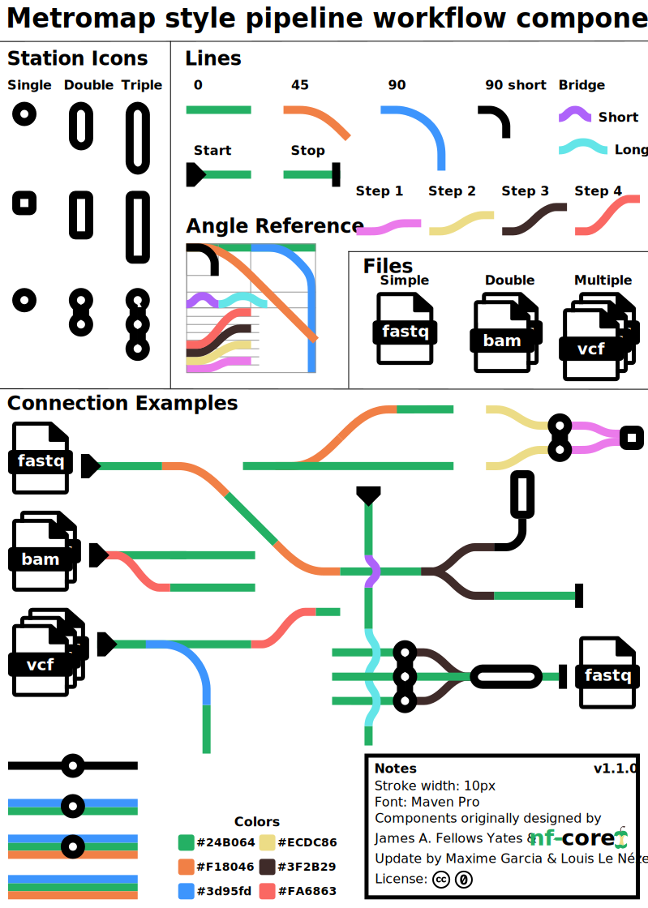

It is often useful to have simplified diagrams that outline the main functionality and steps of a pipeline.
This helps new users get an overview of a workflow when visiting a pipeline webpage or repository for the first time.

Most workflow diagrams are made by hand using vector image editors such as the open-source [Inkscape](https://inkscape.org/) or commercial suites such as [Adobe Illustrator](https://www.adobe.com/products/illustrator.html). Useful tools for collaborative prototyping include [Google Drawings](https://docs.google.com/drawings/) or [LucidChart](https://www.lucidchart.com/pages/). All examples and components below can be opened in these editors, and various parts borrowed and/or modified as necessary.

The components are also made available on [bioicons](https://bioicons.com/icons/cc-0/Chemo-_and_Bioinformatics/James-A--Fellows-Yates/metromap_style_pipeline_workflow_components.svg), which offers extensions for [Inkscape](https://inkscape.org/) and [draw.io](https://app.diagrams.net/) to directly import them there.

### Examples

See below for some examples of nf-core workflow schematics that can be re-used and modified for your own pipeline.

:::warning
Please make sure to check for any attributions to be included within any derivative images, as defined by the corresponding license! We provide suggestions below.
:::

Click the schematic image to see the original.

|                                                             Workflow Example                                                             | nf-core Pipeline                                  | License/Publication                                                                                                                                                      | Suggested attribution                           |
| :--------------------------------------------------------------------------------------------------------------------------------------: | ------------------------------------------------- | ------------------------------------------------------------------------------------------------------------------------------------------------------------------------ | ----------------------------------------------- |
|                                   | [nf-core/sarek](https://nf-co.re/sarek)           | From [Garcia _et al._ (2020, F1000 Research)](https://doi.org/10.12688/f1000research.16665.1) under a [CC-BY 4.0](https://creativecommons.org/licenses/by/4.0/) license. |                                                 |
|            | [nf-core/eager](https://nf-co.re/eager)           | From [Fellows Yates _et al._ (2021, PeerJ)](https://doi.org/10.7717/peerj.10947) under a [CC-BY 4.0](https://creativecommons.org/licenses/by/4.0/) license               | CC-BY 4.0. Design originally by Zandra Fagernäs |
|  | [nf-core/eager](https://nf-co.re/eager)           | From [Fellows Yates _et al._ (2021, PeerJ)](https://doi.org/10.7717/peerj.10947) under a [MIT](https://github.com/nf-core/dualrnaseq/blob/master/LICENSE) license        |                                                 |
|   | [nf-core/dualrnaseq](https://nf-co.re/dualrnaseq) | By Regan Hayward under [MIT](https://github.com/nf-core/dualrnaseq/blob/master/LICENSE) license                                                                          |                                                 |
|                        | [nf-core/circrna](https://nf-co.re/circrna)       | By Barry Digby under [MIT](https://github.com/nf-core/circrna/blob/master/LICENSE) license                                                                               |                                                 |
|                           | [nf-core/mag](https://nf-co.re/mag)               | By Sabrina Krakau under [MIT](https://github.com/nf-core/mag/blob/master/LICENSE) license                                                                                | CC-BY 4.0. Design originally by Zandra Fagernäs |
|                                  | [nf-core/bactmap](https://nf-co.re/bactmap)       | By Anthony Underwood under [MIT](https://github.com/nf-core/mag/blob/master/LICENSE) license                                                                             |                                                 |
|        | [nf-core/cutandrun](https://nf-co.re/cutandrun)   | By Chris Cheshire under [MIT](https://github.com/nf-core/cutandrun/blob/master/LICENSE) license                                                                          |                                                 |
|                           | [nf-core/sarek](https://nf-co.re/sarek)           | By Maxime U Garcia under [MIT](https://github.com/nf-core/sarek/blob/master/LICENSE) license                                                                             |                                                 |
|   | [nf-core/rnaseq](https://nf-co.re/rnaseq)         | By Sarah Guinchard under [MIT](https://github.com/nf-core/sarek/blob/master/LICENSE) license                                                                             |                                                 |
|                 | [nf-core/isoseq](https://nf-co.re/isoseq)         | By Sébastien Guizard under [MIT](https://github.com/nf-core/isoseq/blob/master/LICENSE) license                                                                          |                                                 |

### Components Cheatsheets

|                                                                                         Object                                                                                         | Description                                        | Link                                                                                                                                                                                                                                                                                                                                                                                                                                                                                                                                                                                                                                                                                                  | Source                                                                                                                                                                    |
| :------------------------------------------------------------------------------------------------------------------------------------------------------------------------------------: | -------------------------------------------------- | ----------------------------------------------------------------------------------------------------------------------------------------------------------------------------------------------------------------------------------------------------------------------------------------------------------------------------------------------------------------------------------------------------------------------------------------------------------------------------------------------------------------------------------------------------------------------------------------------------------------------------------------------------------------------------------------------------- | ------------------------------------------------------------------------------------------------------------------------------------------------------------------------- |
|  | Components for a metro-map style pipeline workflow | [SVG](https://raw.githubusercontent.com/nf-core/website/main/sites/docs/src/assets/images/graphic_design_assets/workflow_schematics_components/generic/metromap_style_pipeline_workflow_components.svg) <br> [PDF](https://raw.githubusercontent.com/nf-core/website/main/sites/docs/src/assets/images/graphic_design_assets/workflow_schematics_components/generic/metromap_style_pipeline_workflow_components.pdf) <br> [DRAW.IO](https://app.diagrams.net/?src=about#Uhttps%3A%2F%2Fraw.githubusercontent.com%2Fnf-core%2Fwebsite%2Frefs%2Fheads%2Fmain%2Fpublic%2Fimages%2Fgraphic_design_assets%2Fworkflow_schematics_components%2Fgeneric%2Fmetromap_style_pipeline_workflow_components.drawio) | James A. Fellows Yates, Maxime Garcia, Louis Le Nézet & nf-core; under a [CC0](https://creativecommons.org/publicdomain/zero/1.0/?ref=chooser-v1) license (public domain) |

### Use draw.io

The web app [draw.io](https://app.diagrams.net/) helps you create, render and export different diagrams including metro-maps.
For even more convenience you can use the following asset library [nf-core xml item library](https://raw.githubusercontent.com/nf-core/website/refs/heads/main/sites/docs/src/assets/images/graphic_design_assets/workflow_schematics_components/generic/nf-core_components.xml). It contains all of the components from the cheatsheet above.
To import it to draw.io use "File / Open library from / URL..." and paste:

```bash
https://raw.githubusercontent.com/nf-core/website/refs/heads/main/sites/docs/src/assets/images/graphic_design_assets/workflow_schematics_components/generic/nf-core_components.xml
```

Additionally, the components can be used via [bioicons](https://bioicons.com/icons/cc-0/Chemo-_and_Bioinformatics/James-A--Fellows-Yates/metromap_style_pipeline_workflow_components.svg).
