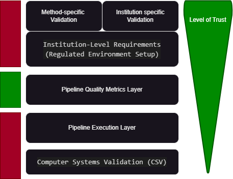

# Introduction

nf-core aims to produce high-quality Nextflow pipelines that facilitate validation and regulatory compliance through a comprehensive metrics-based approach. The community is organized around the [regulatory special interest group](https://nf-co.re/special-interest-groups/regulatory), where stakeholders collaborate to define and implement validation standards.

## Document version

2.0.0 draft

## nf-core validation strategy

nf-core has developed a systematic approach to pipeline validation that balances community-driven quality assurance with institutional flexibility:

### Our approach

- **Metrics collection**: nf-core automatically collects and maintains comprehensive quality metrics for all pipelines through the nf-core/stats service
- **Validation readiness reports**: Each pipeline release includes an automated PDF report containing validation-relevant metrics and quality indicators
- **Community standards**: The nf-core community maintains consistent quality standards across all pipelines through established guidelines and testing frameworks
- **User flexibility**: Institutions use nf-core reports as a foundation for their own validation processes, tailored to specific regulatory requirements and infrastructure

### What nf-core provides

- **Comprehensive metrics collection** via nf-core/stats
- **Automated validation readiness reports** with each pipeline release
- **Quality assurance frameworks** (testing, documentation, versioning)
- **Implementation guidance** for institutional validation
- **Continuous improvement** through gap identification and community feedback

### What users are responsible for

- **Institution-specific validation** within their target environment
- **Regulatory compliance** according to applicable standards
- **Infrastructure validation** (CSV and system-level requirements, aka IQ/PQ/OQ)
- **Risk assessment** for their specific use cases
- **Ongoing maintenance** and re-validation as needed

:::note
nf-core provides the foundation for validation through standardized metrics and quality assurance, but cannot provide complete "off-the-shelf" validation reports. Each institution must perform their own validation according to their specific regulatory requirements and risk assessment.
:::

A simplistic diagram of what you as a user intending to work under regulation would provide compared to what nf-core can provide you with is outlined below in the figure:

## nf-core metrics and reporting system

### nf-core/stats service

The [nf-core/stats](https://github.com/nf-core/stats) service serves as the central repository for collecting, storing, and analyzing pipeline quality metrics. This system automatically:

- **Tracks pipeline metrics** across all nf-core pipelines and releases
- **Monitors community engagement** (contributors, users, issue resolution)
- **Assesses code quality** (testing coverage, documentation completeness)
- **Evaluates pipeline maturity** (release history, stability indicators)
- **Provides historical data** for trend analysis and continuous improvement

### Automated validation reports

Each nf-core pipeline release automatically generates a comprehensive PDF validation readiness report containing:

#### Pipeline overview

- Release information and semantic versioning details
- Community metrics (contributors, users, maintenance activity)
- Licensing and governance information

#### Quality metrics

- **Testing coverage**: Functional and integration test results
- **Documentation quality**: Completeness and clarity assessments
- **Code quality**: Linting, standards compliance, security scanning
- **Dependency management**: Tool versions, container specifications

#### Community indicators

- **Maintenance Activity**: Issue resolution rates, update frequency
- **User Adoption**: Download statistics, citation metrics
- **Contributor Engagement**: Review processes, contribution patterns

#### Risk Assessment Factors

- **Complexity Analysis**: Pipeline complexity scoring
- **Stability Indicators**: Error rates, failure patterns
- **Change Management**: Update frequency and impact analysis

### Gap Identification and Improvement

The nf-core community continuously evaluates and enhances the metrics collection system:

- **Community feedback**: Regular review of validation requirements across different domains
- **Standards evolution**: Adaptation to changing regulatory landscapes
- **Metric enhancement**: Addition of new quality indicators based on community needs
- **Tooling development**: Improvement of automated collection and reporting systems

:::note
To request additional metrics or report enhancements, please engage with the [regulatory special interest group](https://nf-co.re/special-interest-groups/regulatory) or open an issue in the [nf-core/stats repository](https://github.com/nf-core/stats).
:::

## Regulatory Context

### Risk-Based Validation Principles

Pipeline validation follows risk-based approaches that consider the development, implementation, and integration of analysis pipelines as potential sources of risk. Common risks include:

- **Execution Failures**: Risk of pipeline not producing expected outputs
- **Data Integrity**: Risk of data corruption or loss during processing
- **Analytical Accuracy**: Risk of incorrect or inconsistent results
- **Reproducibility**: Risk of inability to replicate results across runs
- **Security**: Risk of unauthorized access or data breaches

These risks are mitigated through appropriate measures such as comprehensive testing, documentation, version control, and quality assurance processes.

### Applicable Standards

Regulatory requirements vary by jurisdiction and intended use. Common standards that may apply to bioinformatics pipelines include:

#### Software as Medical Device (SaMD)

- [FDA SaMD Guidance](https://www.fda.gov/medical-devices/digital-health-center-excellence/software-medical-device-samd)
- [SaMD General Guidelines](https://www.greenlight.guru/blog/samd-software-as-a-medical-device)

#### Laboratory Developed Tests (LDT)

- [FDA LDT Regulations](https://www.fda.gov/medical-devices/in-vitro-diagnostics/laboratory-developed-tests)
- [CLIA Validation Requirements](https://www.cms.gov/regulations-and-guidance/legislation/clia/downloads/6064bk.pdf)

#### Medical Device Registration

- [CE Mark Registration](https://europa.eu/youreurope/business/product-requirements/labels-markings/ce-marking/index_en.htm)
- [EU Medical Device Guidelines](https://health.ec.europa.eu/system/files/2021-10/mdcg_2021-24_en_0.pdf)

#### Harmonization Efforts

- [FDA Consensus Standards](https://www.fda.gov/regulatory-information/search-fda-guidance-documents/appropriate-use-voluntary-consensus-standards-premarket-submissions-medical-devices)
- [EU Harmonized Standards](https://single-market-economy.ec.europa.eu/single-market/european-standards/harmonised-standards_en)

:::note
Computerized Systems Validation (CSV) requirements for infrastructure and IT systems are outside the scope of this guidance. Please consult with your IT and compliance teams for CSV requirements.
:::

## Using nf-core Validation Reports

### Interpreting the Automated Reports

The validation readiness reports provide a standardized foundation for institutional validation. Key sections to review include:

#### 1. **Executive Summary**

- Overall pipeline maturity score
- Critical risk indicators
- Recommended validation approach

#### 2. **Quality Metrics Analysis**

- Testing coverage and pass rates
- Documentation completeness scores
- Code quality indicators
- Community engagement metrics

#### 3. **Risk Assessment Matrix**

- Identified risk factors specific to the pipeline
- Severity and likelihood assessments
- Recommended mitigation strategies

#### 4. **Compliance Readiness**

- Alignment with common regulatory requirements
- Gap analysis for specific use cases
- Documentation and traceability indicators

### Institution-Specific Validation Process

Using the nf-core report as a foundation, institutions should follow these steps:

#### Phase 1: Initial Assessment

1. **Review nf-core validation report** for the target pipeline version
2. **Define intended use** and applicable regulatory requirements
3. **Conduct risk assessment** based on institutional context
4. **Identify validation scope** and required evidence

#### Phase 2: Gap Analysis

1. **Compare nf-core metrics** against institutional requirements
2. **Identify additional testing** needs for specific use cases
3. **Assess infrastructure requirements** and CSV considerations
4. **Plan integration testing** with institutional data and systems

#### Phase 3: Validation Execution

1. **Perform functional verification** in target environment
2. **Execute integration testing** with representative datasets
3. **Validate analytical performance** against established criteria
4. **Document evidence** of compliance and performance

#### Phase 4: Ongoing Maintenance

1. **Monitor pipeline updates** and assess impact
2. **Maintain validation status** through change control
3. **Update validation** as requirements evolve
4. **Participate in community** feedback and improvement

### Infrastructure Considerations

#### Computing Environment

- **Reproducibility**: Ensure consistent execution across runs
- **Security**: Implement appropriate access controls and audit trails
- **Performance**: Validate pipeline performance under expected loads
- **Backup/Recovery**: Establish data protection and recovery procedures

#### Data Management

- **Input Validation**: Verify data integrity and format compliance
- **Output Verification**: Confirm expected outputs and quality metrics
- **Traceability**: Maintain complete audit trails of data processing
- **Retention**: Implement appropriate data retention policies

:::warning
The nf-core validation report provides a foundation, but each institution must validate the pipeline within their specific environment, with their data, and according to their regulatory requirements.
:::

## Community Standards and Guidelines

### Pipeline Quality Requirements

All nf-core pipelines must meet standardized quality criteria that support validation efforts:

#### Development Standards

- **Semantic Versioning**: Clear version management with defined backward compatibility [Semantic Versioning Guideline](https://nf-co.re/docs/guidelines/pipelines/requirements/semantic_versioning)
- **Code Quality**: Adherence to coding standards and automated linting [Linting Guideline](https://nf-co.re/docs/guidelines/pipelines/requirements/linting)
- **Testing Framework**: Comprehensive functional and integration tests
- **Documentation**: Complete usage instructions and parameter documentation [Docs Guideline](https://nf-co.re/docs/guidelines/pipelines/requirements/docs)

#### Change Management

- **Pull Request Process**: Mandatory peer review for all changes [Release Pull Request Guideline](https://nf-co.re/docs/checklists/reviews/pipeline_release_pr)
- **Automated Testing**: CI/CD pipeline validation for every change [CI Testing Guidelines](https://nf-co.re/docs/guidelines/pipelines/requirements/ci_testing)
- **Release Process**: Structured release workflow with quality checkpoints [Release Process Guideline](https://nf-co.re/docs/checklists/pipeline_release)
- **Issue Tracking**: Transparent bug reporting and feature request management (entirely open, on respective Github repository of each pipeline)

#### Security and Compliance

- **Dependency Management**: Fixed software versions in containerized environments [Software containerization guidelines](https://nf-co.re/docs/guidelines/pipelines/requirements/docker)
- **Vulnerability Scanning**: Regular security assessment of dependencies (responsibility of user/institution, as not easily generalizable). Containers hosted at Seqera Containers are automatically scanned.
- **License Compliance**: Clear licensing for all components [Licence Guidelines](https://nf-co.re/docs/guidelines/pipelines/requirements/mit_license)
- **Access Control**: Controlled access to pipeline repositories and releases [Governance at nf-core](https://nf-co.re/governance)

### Testing Framework

nf-core provides comprehensive testing at multiple levels to ensure pipeline quality. Some aspects however are too specific to individual methodology, institutional requirements, so these are not covered by the nf-core community per se. Particularly the integration testing and performance testing of nf-core pipelines is considered out of scope for the regulatory readiness documentation for each pipeline as this is highly dependent on the individual infrastructure and thus falls under either Computer Systems Validation (CSV) and/or local integration.

#### Functional Testing

- **Module Tests**: Validate individual pipeline components using [nf-test](https://www.nf-test.com/)
- **Subworkflow Tests**: Test combined modules and workflow sections
- **Pipeline Tests**: End-to-end testing with multiple test profiles
- **Regression Testing**: Automated testing to prevent functional regressions

#### Performance Testing

- **Resource usage**: Monitor computational requirements and efficiency
- **Scalability**: Test pipeline performance across different dataset sizes
- **Benchmarking**: Track performance metrics over time

#### Integration Testing

- **Environment Testing**: Validate execution across different computing environments
- **Data Format Testing**: Ensure compatibility with various input formats
- **Output Validation**: Verify expected outputs and quality metrics

### Documentation Standards

Comprehensive documentation supports validation and ensures consistent usage:

#### User Documentation

- **Usage Instructions**: Clear step-by-step execution guidance
- **Parameter Documentation**: Complete description of all configurable options
- **Output Documentation**: Description of all pipeline outputs and their interpretation
- **Troubleshooting Guides**: Common issues and resolution strategies

#### Technical documentation

- **Architecture overview**: Pipeline structure and workflow design
- **Module documentation**: Individual component specifications
- **Dependency documentation**: Complete list of software dependencies and versions
- **Configuration guidelines**: Environment setup and configuration requirements

## Implementation guidance

### Validation Process Overview

The validation process for nf-core pipelines follows a structured approach across five key phases:

#### 1. Preparation Phase

Begin by obtaining the nf-core validation readiness report for your target pipeline version. Define your intended use case and identify applicable regulatory requirements (e.g., FDA SaMD, CLIA, CE Mark, LDT). Assemble a validation team with appropriate expertise and establish validation protocols and acceptance criteria aligned with your institutional needs.

#### 2. Risk Assessment

Review the risk indicators provided in the nf-core validation report and conduct an institution-specific risk analysis. Identify critical control points related to execution failures, data integrity, analytical accuracy, reproducibility, and security. Document your risk mitigation strategies and establish ongoing monitoring procedures appropriate for your risk profile.

#### 3. Validation Execution

Set up your validated computing environment and execute the nf-core test profiles to verify functional performance. Perform integration testing with institutional data and validate analytical performance against your established specifications. Document all testing evidence and results comprehensively to support your validation package.

#### 4. Operational Validation

Establish standard operating procedures (SOPs) for consistent pipeline operation, train personnel on validated procedures, and implement quality control measures. Set up data management and retention procedures, and create incident response and change control processes appropriate for your regulatory context.

#### 5. Ongoing Maintenance

Monitor pipeline updates and security advisories from the nf-core community. Assess the impact of changes through your change control process, maintain validation status through periodic review, and update procedures as requirements evolve. Participate in community feedback to contribute to continuous improvement.

:::tip
For a detailed, actionable checklist covering each phase of the validation process, refer to the [Pipeline Validation Checklist](./checklist).
:::

### Gap Analysis and Improvement

#### Identifying Validation Gaps

- **Regulatory Requirements**: Compare nf-core metrics against specific compliance needs
- **Technical Requirements**: Assess infrastructure and integration requirements
- **Analytical Requirements**: Evaluate performance specifications and acceptance criteria
- **Documentation Requirements**: Identify additional documentation needs

#### Improvement Pathways

- **Community Engagement**: Participate in nf-core regulatory working groups
- **Metric Enhancement**: Propose additional metrics through nf-core/stats
- **Documentation Contributions**: Contribute to pipeline documentation and guides
- **Testing Contributions**: Develop and share additional test cases

### Maintenance and Continuous Improvement

#### Change Management

- **Version Updates**: Systematic evaluation of pipeline updates
- **Impact Assessment**: Risk-based analysis of changes
- **Re-validation**: Appropriate level of testing for changes
- **Documentation Updates**: Maintain current validation documentation

#### Quality Monitoring

- **Performance Tracking**: Monitor pipeline performance over time
- **Issue Resolution**: Track and resolve validation-related issues
- **Trend Analysis**: Analyze patterns in pipeline usage and performance
- **Continuous Improvement**: Regular review and enhancement of validation processes

:::info
By following this structured approach and leveraging nf-core's comprehensive metrics and reporting system, institutions can efficiently validate nf-core pipelines while maintaining the flexibility to meet their specific regulatory and operational requirements.
:::
