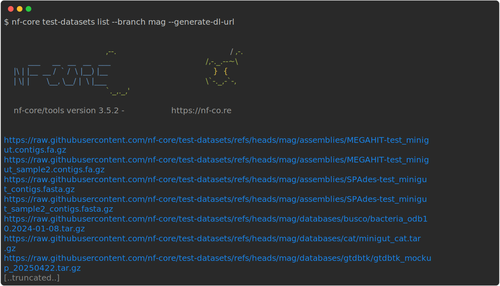
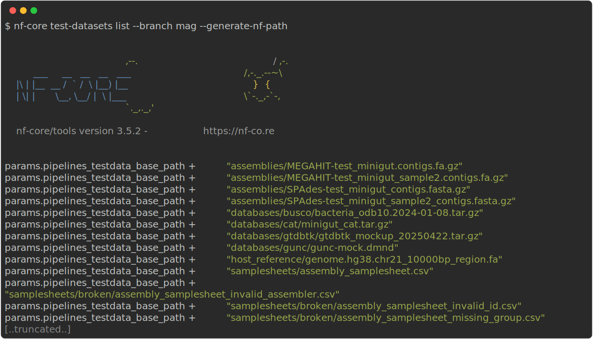

import { YouTube } from "@astro-community/astro-embed-youtube";

The `nf-core test-datasets list` subcommand provides functionality to list existing test-datasets for pipelines and modules from the commandline.
Test-datasets are hosted on the on the [nf-core/test-datasets](https://github.com/nf-core/test-datasets/) github repository.

:::note
Not all files found on github can be listed with this subcommand.
Some auxiliary files like `README`, or `LICENSE` as well as all files starting with `.` are always ignored.
:::

## Video walk-through of the test-datasets commands

<YouTube id="xGTqpiapn14" />

## Listing a file tree

The following example lists the first entries of the file tree with test inputs for a pipeline (cut off after 25 lines of output).
A branch name is always required to avoid a high number of requests against the github API.
If no branch name is specified via the command line, the user will be prompted to enter one.

:::note
To improve usability branch names can be entered via a tab-autocompletion. Alternatively, to list all branches see the [`list_branches` subcommand](/docs/nf-core-tools/test-datasets/list_branches).
:::

## Output options

As default output, a table listing the filenames is printed, but download urls or nextflow import statements to reuse the test files can also be generated.
This is possible via the flags `-u`/`--generate-dl-url` and `-p`/`--generate-nf-path` as in the [`search` subcommand](/docs/nf-core-tools/test-datasets/search).

