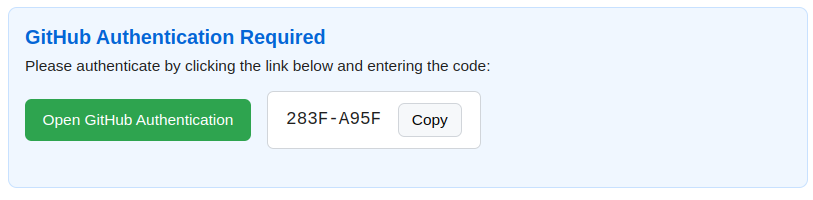
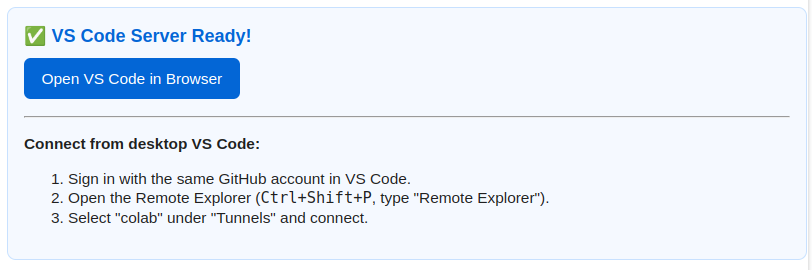

## Running nf-core Pipelines in Google Colab

Running nf-core pipelines can be computationally intensive, requiring resources not easily available to students, newcomers, or participants in hands-on training workshops.

Colab offers an affordable and accessible platform ideal for learning, teaching, and prototyping workflows in resource-constrained environments.
However out of the box it does have a few limitations, such as session timeouts and a lack of root access, which means a user needs correctly configure and setup their instance for an optimal experience.

This tutorial shows two ways in which you can use Google Colab to run nf-core pipelines entirely in the cloud, either in a browser-based execution or connected to VS Code via the `vscode-colab` package for a full development experience.

Make sure to also checkout this [blogpost](https://nf-co.re/blog/2025/nf-core-colab-guide) on this topic for more background on running nf-core pipelines using Colab.

## Setting up the environment in Google Colab

If you are new to Google Colab, you can follow the official [Google Colab Getting Started guide](https://research.google.com/colaboratory/faq.html) or the [Colab Welcome Notebook](https://colab.research.google.com/notebooks/intro.ipynb) for instructions on how to register for an account and set up your first notebook.

After opening a Colab notebook with the machine type of your choice, the first step is to install Nextflow and its dependencies. Since Colab does not provide root access, you will need to install Nextflow in your home directory.

### Setting up Java for Nextflow

Before installing Nextflow, you must install Java.

In Colab, run the following commands in a notebook code cell using the `%` and `!` prefixes, or run them directly in your terminal (without the prefixes).

```python
%cd .. # use '%'before cd to make a permanent change of directories
!apt update
!apt install openjdk-17-jdk
!export JAVA_HOME=/usr/lib/jvm/java-17-openjdk-amd64
!export PATH=$JAVA_HOME/bin:$PATH
!source ~/.bashrc
```

### Installing and Setting up Nextflow

Next, install Nextflow and make it executable by running the following commands in a code cell as before:

```python
!wget -qO- https://get.nextflow.io | bash # Download Nextflow
!mv nextflow /usr/bin/nextflow # Move to a path Colab can access
!chmod +x /usr/bin/nextflow # Make it executable
!nextflow -v # Test it
```

### Setting Up Conda for Google Colab

Due to a lack of root access, it is not possible to run nf-core, or any Nextflow pipelines, using the `-profile docker` or `-profile singularity` container based configuration profiles.

That leaves the `conda` profile as the only way to run pipelines.

However, as Google Colab does not natively support conda, you need to install the [condacolab](https://pypi.org/project/condacolab/) package, which will set up Conda for you by running the following commands:

```python
!pip install -q condacolab # -q here means quite
import condacolab
condacolab.install()
```

Make sure to set the conda defaults as follows for smooth pipeline execution:

```python
!conda config --add channels bioconda
!conda config --add channels conda-forge
!conda config --set channel_priority strict
```

## Running a test pipeline

...and you're ready to go!

Yes, the setup is that simple!

Now that the main parts of the environment are all set up, we can run the demo pipeline [nf-core/demo](https://nf-co.re/demo/).
To install the pipeline, run:

```python
! nextflow pull nf-core/demo
```

Now you can finally run your pipeline!

```python
! nextflow run nf-core/demo -profile conda,test --outdir demo-results
```

## Running and Editing Pipelines in VS Code via Colab

While you could get away with editing existing pipelines inside Colab's built-in terminal using editors like vim or nano, a VS Code integrated development environment (IDE) offers a more robust and richer environment for development.

If you use VS Code as your normal IDE, thankfully the [vscode-colab](https://github.com/EssenceSentry/vscode-colab) Python library provides just the toolkit you need to take advantage of Colab's hardware in the comfort of the popular VSCode software suite.

It allows you to securely and reliably connect a local instance of VS Code to Google Colab's servers through the use of the official [VS Code Remote Tunnels](https://code.visualstudio.com/docs/remote/tunnels) package.

You can read more about the library and even help contribute to new features on its [GitHub repository](https://github.com/EssenceSentry/vscode-colab).

:::note
If you decide to use this approach, it is best to run this immediately after setting up the other dependencies that require installation by running inside Colab cells to avoid any connection issues.
:::

The first step is to install and import the library, which can easily be done by running the following command in your Colab code cell:

```python title="Install vscode-colab"
!pip install vscode-colab
import vscode_colab
```

Next, authenticate the connection using your GitHub credentials:

```python
vscode_colab.login()
```



Follow the displayed instructions to authorize the connection.

When starting the tunnel, you can configure some optional settings that may come handy for advanced use cases.

```python
vscode_colab.connect(
    name="my-tunnel",
    git_user_name="Your Name",
    git_user_email="you@example.com",
    setup_python_version="3.13",  # Optional: Specify Python version to install with pyenv
    create_new_project="my_new_project"  # Optional: Create a new project directory
)
```



The above step allows for a lot more customization than shown here. Please refer to the library's [vignette](https://github.com/EssenceSentry/vscode-colab) to see if any of these options will suit your needs.

Then, in VS Code on your desktop:

1. Ensure the [Remote Tunnels extension](https://marketplace.visualstudio.com/items?itemName=ms-vscode.remote-server) is installed.
2. Sign in with the same GitHub account used in the notebook.
3. Open Command Palette (`Ctrl+Shift+P` or `Cmd+Shift+P`).
4. Run `Remote Tunnels: Connect to Tunnel...` and select your notebook's tunnel.

You're now seamlessly connected to Colab through VS Code and can develop Nextflow pipelines more flexibly from just about any computer.

## Final tips for a Smooth Experience

Google Colab's storage is temporary and limited to around 100GB in most cases.
Therefore it is important to regularly back up your results to avoid data loss.

For small to moderate outputs, mounting your personal Google Drive is convenient, but may not be suitable for large workflow results, which can reach hundreds of gigabytes.

```python
from google.colab import drive
drive.mount('/content/drive')
```

For larger datasets, consider syncing to external cloud storage or transferring results to institutional or project-specific storage solutions.

:::tip
If you plan to also write and develop pipelines in Google Colab, make sure to use `git` and regularly commit and push your code, or alternatively, test in Colab but save changes from your local PC and commit to prevent loss of your progress after the notebook instance shuts down.
:::

### Limitations to Note

And remember, while Google Colab is a powerful and accessible platform, it does have some constraints:

- Session timeouts and limited runtime duration
- No root access for system-level changes
- Limited resources compared to dedicated cloud VMs

## Conclusion

In this guide, we covered:

- Setting up Nextflow and dependencies in Google Colab
- Running nf-core pipelines in a cloud environment
- Connecting Colab to VS Code for a richer development experience
