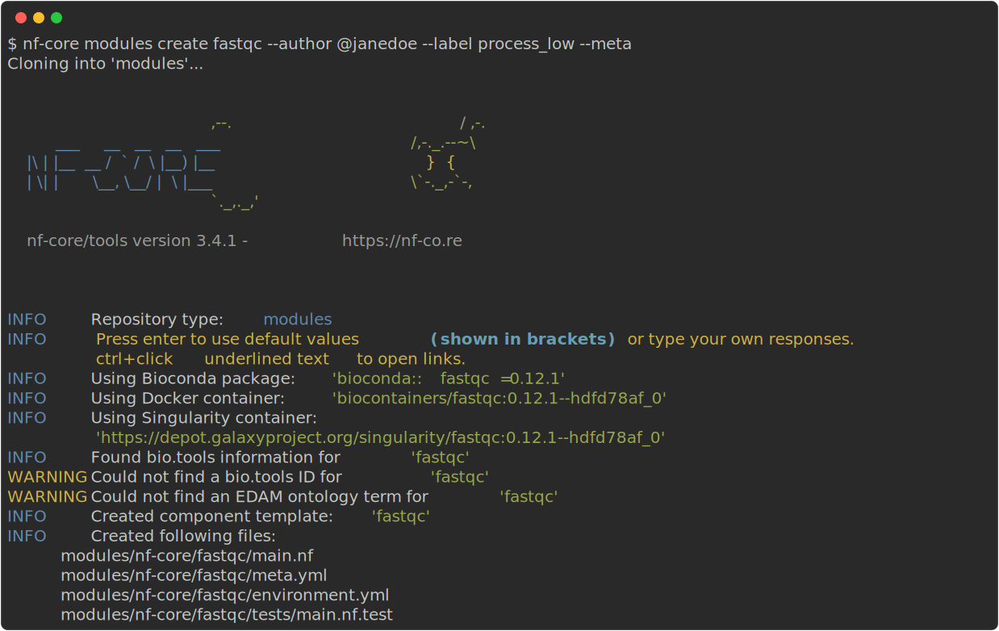

import Tabs from "@components/Tabs.svelte";
import TabItem from "@components/TabItem.svelte";

If you decide to upload a module to `nf-core/modules` then this will ensure that it will become available to all nf-core pipelines, and to everyone within the Nextflow community! See [`modules/`](https://github.com/nf-core/modules/tree/master/modules) for examples.

## Writing a new module reference

### Before you start

Please check that the module you wish to add isn't already on [`nf-core/modules`](https://github.com/nf-core/modules/tree/master/modules):

- Use the [`nf-core modules list`](https://github.com/nf-core/tools#list-modules) command
- Check [open pull requests](https://github.com/nf-core/modules/pulls)
- Search [open issues](https://github.com/nf-core/modules/issues)

If the module doesn't exist on `nf-core/modules`:

- Please create a [new issue](https://github.com/nf-core/modules/issues/new?assignees=&labels=new%20module&template=new_nodule.md&title=new%20module:) before adding it
- Set an appropriate subject for the issue e.g. `new module: fastqc`
- Add yourself to the `Assignees` so we can track who is working on the module

### New module workflow

We have implemented a number of commands in the `nf-core/tools` package to make it incredibly easy for you to create and contribute your own modules to nf-core/modules.

1. Install any of [`Docker`](https://docs.docker.com/engine/installation/), [`Singularity`](https://www.sylabs.io/guides/3.0/user-guide/) or [`Conda`](https://conda.io/miniconda.html)

:::tip{title="Single step conda installation" collapse}
If you use the conda package manager you can setup a new environment and install all dependencies for the new module workflow in one step with:

```bash
conda create -n nf-core -c bioconda "nextflow>=21.04.0" "nf-core>=2.7" nf-test
conda activate nf-core
```

and proceed with Step 5.
:::

2. Install [`Nextflow`](https://www.nextflow.io/docs/latest/getstarted.html#installation) (`>=21.04.0`)
3. Install the latest version of [`nf-core/tools`](https://github.com/nf-core/tools#installation) (`>=2.7`)
4. Install [`nf-test`](https://code.askimed.com/nf-test/installation/)
5. [Fork and clone the nf-core/modules repo locally](#uploading-to-nf-coremodules)
6. Setup up [pre-commit](https://pre-commit.com/) (comes packaged with [`nf-core/tools`](https://github.com/nf-core/tools#installation), watch the [pre-commit bytesize talk](https://www.youtube.com/watch?v=08d6zv6zvdM&t=215) if you want to know more about it) to ensure that your code is linted and formatted correctly before you commit it to the repository

    ```bash
    pre-commit install
    ```

<Tabs names={["modules","subworkflows"]}  icons={['<i class="far fa-xs fa-code-commit me-2"></i>','<i class="far fa-code-fork  fa-rotate-90 me-2"></i>']} client:idle>
<TabItem name={"modules"} client:idle>
7. Set up git on your computer by adding a new git remote of the main nf-core git repo called `upstream`

    ```bash
    git remote add upstream https://github.com/nf-core/modules.git
    ```

    Make a new branch for your module and check it out

    ```bash
    git checkout -b fastqc
    ```

8. Create a module using the [nf-core DSL2 module template](https://github.com/nf-core/tools/blob/master/nf_core/module-template/main.nf):

    

    All of the files required to add the module to `nf-core/modules` will be created/edited in the appropriate places. There are at most 3 files to modify:
    1. [`./modules/nf-core/fastqc/main.nf`](https://github.com/nf-core/modules/blob/master/modules/nf-core/fastqc/main.nf)

        This is the main script containing the `process` definition for the module. You will see an extensive number of `TODO` statements to help guide you to fill in the appropriate sections and to ensure that you adhere to the guidelines we have set for module submissions.

    2. [`./modules/nf-core/fastqc/meta.yml`](https://github.com/nf-core/modules/blob/master/modules/nf-core/fastqc/meta.yml)

        This file will be used to store general information about the module and author details - the majority of which will already be auto-filled. However, you will need to add a brief description of the files defined in the `input` and `output` section of the main script since these will be unique to each module. We check its formatting and validity based on a [JSON schema](https://github.com/nf-core/modules/blob/master/modules/meta-schema.json) during linting (and in the pre-commit hook).

    3. [`./modules/nf-core/fastqc/tests/main.nf.test`](https://github.com/nf-core/modules/blob/master/modules/nf-core/fastqc/tests/main.nf.test)

        Every module MUST have a test workflow. This file will define one or more Nextflow `workflow` definitions that will be used to unit test the output files created by the module. By default, one `workflow` definition will be added but please feel free to add as many as possible so we can ensure that the module works on different data types / parameters e.g. separate `workflow` for single-end and paired-end data.

        Minimal test data required for your module may already exist within the [nf-core/modules repository](https://github.com/nf-core/modules/blob/master/tests/config/test_data.config), in which case you may just have to change a couple of paths in this file - see the [Test data](#test-data) section for more info and guidelines for adding new standardised data if required.

        Refer to the section [writing nf-test tests](/docs/tutorials/tests_and_test_data/nf-test_writing_tests) for more information on how to write nf-tests

9. Populate the versions topic channel

    Use the eval output qualifier to obtain the version of the tool(s) used in this module and emit the version and populate the versions topic channel. Check the fastqc module for an example [here](https://github.com/nf-core/modules/blob/0c47e4193ddde2c5edbc206b5420cbcbee5c9797/modules/nf-core/fastqc/main.nf#L16).

10. Create a snapshot of the tests
    

    :::note
    See the [nf-test docs](https://code.askimed.com/nf-test/) if you would like to run the tests manually.
    :::

11. Check that the new module you've added follows the [module specifications](/docs/guidelines/components/modules)

12. Lint the module locally to check that it adheres to nf-core guidelines before submission

    

13. Once ready, the code can be pushed and a pull request (PR) created

    On a regular basis you can pull upstream changes into this branch and it is recommended to do so before pushing and creating a pull request. Rather than merging changes directly from upstream the rebase strategy is recommended so that your changes are applied on top of the latest master branch from the nf-core repo. This can be performed as follows

```bash
git pull --rebase upstream master
```

Once you are ready you can push the code and create a PR

```bash
git push -u origin
```

Once the PR has been accepted you should delete the branch and checkout master again.

```bash
git checkout master
git branch -d fastqc
```

</TabItem>
<TabItem name={"subworkflows"} client:idle>
7. Set up git on your computer by adding a new git remote of the main nf-core git repo called `upstream`

    ```bash
    git remote add upstream https://github.com/nf-core/modules.git
    ```

    Make a new branch for your subworkflow and check it out

    ```bash
    git checkout -b bam_sort_stats_samtools
    ```

8. Create a subworkflow using the [nf-core DSL2 subworkflow template](https://github.com/nf-core/tools/blob/master/nf_core/subworkflow-template/main.nf) in the root of the clone of the nf-core/modules repository:

    

    All of the files required to add the subworkflow to `nf-core/modules` will be created/edited in the appropriate places. There are at most 3 files to modify:
    1. [`./subworkflows/nf-core/bam_sort_stats_samtools/main.nf`](https://github.com/nf-core/modules/blob/master/subworkflows/nf-core/bam_sort_stats_samtools/main.nf)

        This is the main script containing the `workflow` definition for the subworkflow. You will see an extensive number of `TODO` statements to help guide you to fill in the appropriate sections and to ensure that you adhere to the guidelines we have set for module submissions.

    2. [`./subworkflows/nf-core/bam_sort_stats_samtools/meta.yml`](https://github.com/nf-core/modules/blob/master/subworkflows/nf-core/bam_sort_stats_samtools/meta.yml)

        This file will be used to store general information about the subworkflow and author details. You will need to add a brief description of the files defined in the `input` and `output` section of the main script since these will be unique to each subworkflow.

    3. [`./subworkflows/nf-core/bam_sort_stats_samtools/tests/main.nf.test`](https://github.com/nf-core/modules/blob/master/subworkflows/nf-core/bam_sort_stats_samtools/tests/main.nf.test)

        Every subworkflow MUST have a test workflow. This file will define one or more Nextflow `workflow` definitions that will be used to unit test the output files created by the subworkflow. By default, one `workflow` definition will be added but please feel free to add as many as possible so we can ensure that the subworkflow works on different data types / parameters e.g. separate `workflow` for single-end and paired-end data.

        Minimal test data required for your subworkflow may already exist within the [nf-core/modules repository](https://github.com/nf-core/modules/blob/master/tests/config/test_data.config), in which case you may just have to change a couple of paths in this file - see the [Test data](#test-data) section for more info and guidelines for adding new standardised data if required.

        Refer to the section [writing nf-test tests](docs/contributing/writing-nf-test-tests) for more information on how to write nf-tests

9. Create a snapshot of the tests

    

    :::note
    See the [nf-test docs](https://code.askimed.com/nf-test/) if you would like to run the tests manually.
    :::

10. Check that the new subworkflow you've added follows the [subworkflow specifications](/docs/guidelines/components/subworkflows)

11. Lint the subworkflow locally to check that it adheres to nf-core guidelines before submission


12. Once ready, the code can be pushed and a pull request (PR) created

On a regular basis you can pull upstream changes into this branch and it is recommended to do so before pushing and creating a pull request - see below. Rather than merging changes directly from upstream the rebase strategy is recommended so that your changes are applied on top of the latest master branch from the nf-core repo. This can be performed as follows:

```bash
git pull --rebase upstream master
```

Once you are ready you can push the code and create a PR

```bash
git push -u origin bam_sort_stats_samtools
```

Once the PR has been accepted you should delete the branch and checkout master again.

```bash
git checkout master
git branch -d bam_sort_stats_samtools
```

</TabItem>
</Tabs>

### Test data

In order to test that each component added to `nf-core/modules` is actually working and to be able to track any changes to results files between component updates we have set-up a number of Github Actions CI tests to run each module on a minimal test dataset using Docker, Singularity and Conda.

Please adhere to the [test-data specifications](/docs/guidelines/components/test_data) when adding new test-data

If a new test dataset is added to [`tests/config/test_data.config`](https://github.com/nf-core/modules/blob/master/tests/config/test_data.config), check that the config name of the added file(s) follows the scheme of the entire file name with dots replaced with underscores.

For example: the [nf-core/test-datasets](https://github.com/nf-core/test-datasets) file `genomics/sarscov2/genome/genome.fasta` labelled as `genome_fasta`, or `genomics/sarscov2/genome/genome.fasta.fai` as `genome_fasta_fai`.

<Tabs names={["modules","subworkflows"]}  icons={['<i class="far fa-xs fa-code-commit me-2"></i>','<i class="far fa-code-fork  fa-rotate-90 me-2"></i>']}  client:idle>
<TabItem name={"modules"} client:idle>
#### Using a stub test when required test data is too big

If the module absolute cannot run using tiny test data, there is a possibility to add [stub-run](https://www.nextflow.io/docs/edge/process.html#stub) to the test.yml. In this case it is required to test the module using larger scale data and document how this is done. In addition, an extra script-block labeled `stub:` must be added, and this block must create dummy instances of all expected output files.

In the `test.yml` the `-stub-run` argument is written as well as the md5sums for each of the files that are added in the stub-block. This causes the stub-code block to be activated when the unit test is run ([see for example](https://github.com/nf-core/modules/blob/master/tests/modules/nf-core/ascat/test.yml)):

```console
nextflow run tests/modules/<nameofmodule> -entry test_<nameofmodule> -c tests/config/nextflow.config -stub-run
```

</TabItem>
<TabItem name={"subworkflows"} client:idle>
#### Using a stub test when required test data is too big

If the subworkflow absolute cannot run using tiny test data, there is a possibility to add [stub-run](https://www.nextflow.io/docs/edge/process.html#stub) to the test.yml. In this case it is required to test the subworkflow using larger scale data and document how this is done. In addition, an extra script-block labeled `stub:` must be added, and this block must create dummy instances of all expected output files.

In the `test.yml` the `-stub-run` argument is written as well as the md5sums for each of the files that are added in the stub-block. This causes the stub-code block to be activated when the unit test is run ([see for example](https://github.com/nf-core/modules/blob/71b1180a5a3de6398eb0eb4d55424cbda36f52d8/subworkflows/nf-core/fasta_explore_search_plot_tidk/tests/main.nf.test#L55-L80))

```console
nextflow run tests/subworkflows/nf-core/<nameofsubworkflow> -entry test_<nameofsubworkflow> -c tests/config/nextflow.config -stub-run
```

</TabItem>
</Tabs>

### Uploading to `nf-core/modules`

When you are happy with your pull request, please <span class="x x-first x-last">select </span>the `Ready for Review` label on the GitHub PR tab, and providing that everything adheres to nf-core guidelines we will endeavour to approve your pull request as soon as possible. We also recommend to request reviews from the `nf-core/modules-team`<span class="x x-first x-last"> so </span>a core team of volunteers <span class="x x-first x-last">can try</span> to <span class="x x-first x-last">review </span>your <span class="x x-first x-last">PR</span> as fast as possible.

Once you<span class="x x-first x-last"> are </span>familiar with the module submission process, please consider joining the<span class="x x-first x-last"> reviewing</span> team by asking on the `#modules` slack channel.

### Writing tests

nf-core components are tested using [nf-test](https://code.askimed.com/nf-test/). See the page on [writing nf-test tests](/docs/tutorials/tests_and_test_data/nf-test_writing_tests) for more information and examples.

### Publishing results

Results are published using Nextflow's native [`publishDir`](https://www.nextflow.io/docs/latest/process.html#publishdir) directive defined in the `modules.config` of a workflow (see [here](https://github.com/nf-core/rnaseq/blob/f7702d5b76a1351e2e7796a5ed3f59943a139fbf/conf/modules.config#L100-L106) for an example.)

## Help

For further information or help, don't hesitate to get in touch on [Slack `#modules` channel](https://nfcore.slack.com/channels/modules) (you can join with [this invite](https://nf-co.re/join/slack)).
