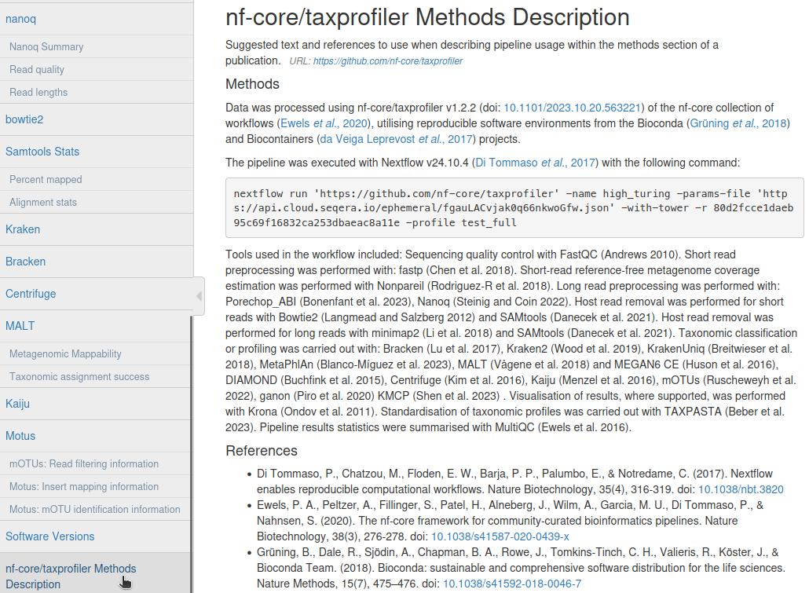

## Background

One of the ways that nf-core pipelines support reproducible analysis and providing proper credit to the wider bioinformatics community is by providing automation for the generation of 'methods texts' that can be used in scientific publications.

At the end of every nf-core pipeline's MultiQC report, you will find a section entitled _nf-core/<pipeline> Methods description_.


_Example screenshot of the automated methods text from [nf-core/taxprofiler](https://nf-co.re/taxprofiler/1.2.2/results/taxprofiler/results-80d2fcce1daeb95c69f16832ca253dbaeac8a11e/multiqc/?file=multiqc_report.html)_

This section of the report has a text in typical scientific 'materials and methods' style prose (a methods text and a references section) that a user can directly copy and pasted into draft scientific journal articles.
It includes the pipeline name and version, the exact command executed, and when supported by a pipeline, a dynamically generated text of all the citation information of the tools used in that particular run of the pipeline.

By providing the exact command and version, we improve user reproducibility when reporting their methods (instead of vaguely saying we executed pipeline X with version Y, without any parameter information).
Furthermore, providing the text with relevant citations for the user 'out of the box' also increases the chance of the authors of every tool in the pipeline receiving credit where credit is due.

This guide describes how a pipeline developer can customise this text snippet so that the text and citations of only the executed tools in the run are added to the text.

## Overview

Within the nf-core template, boilerplate code for a minimal version of this section of the MultiQC report (pipeline name and version, nf-core/Nextflow citations, and the run command) is included.

This boilerplate code comes from two sections in the nf-core pipeline structure:

- [`assets/methods_description_template.yml`](https://github.com/nf-core/tools/blob/af02d91fdafd5937c658a837fa868cc8ad7de4fb/nf_core/pipeline-template/assets/methods_description_template.yml)
- [`subworkflows/local/utils_nfcore_<pipeline_name>/main.nf`](https://github.com/nf-core/tools/blob/059473c2e138aecfb451f2f848265767761d798a/nf_core/pipeline-template/subworkflows/local/utils_nfcore_pipeline_pipeline/main.nf)

The `methods_description_template.yml` is the main MultiQC compatible YAML file that gets processed within the pipeline.
This contains the basic overall information about the pipeline run (name, run, version, nf-core and Nextflow citations).

However inside this YAML file, customised text gets 'injected' into parts of this file with strings that are generated from the `utils_nfcore_<pipeline_name>` subworkflow.
A pipeline developer updates the `utils_nfcore_<pipeline_name>` subworkflow to dynamically generate the text that gets injected depending on the pipeline pipelines (e.g., to add citation information for tools used in the particular run).

## General text

In most cases a pipeline developer does not need to edit this file, unless they wish to provide additional text.

The developer should NOT edit the [MultiQC header tags](https://github.com/nf-core/tools/blob/e6497bcdf8660b7029bd739f890c2d73e87dd867/nf_core/pipeline-template/assets/methods_description_template.yml#L1-L5).
If changes or additional information is required to the main text of the methods description, a pipeline developer can modify or add additional HTML text and code to the [`data:` section](https://github.com/nf-core/tools/blob/e6497bcdf8660b7029bd739f890c2d73e87dd867/nf_core/pipeline-template/assets/methods_description_template.yml#L8-L29) of this file for rendering.
The dynamic text strings that come from the `utils_nfcore_<pipeline_name>` subworkflow are 'imported' via the `${tool_citations}` and `${tool_bibliography}` variables and should not be removed or modified.

Importantly, compared to the subworkflow, the text in this YAML file will be rendered in every single MultiQC run - no dynamic text construction code be used within this file.

## Subworkflow-generated citation text

The more useful file for most developers is the tool citation and bibliography [sections of the subworkflow](https://github.com/nf-core/tools/blob/e6497bcdf8660b7029bd739f890c2d73e87dd867/nf_core/pipeline-template/subworkflows/local/utils_nfcore_pipeline_pipeline/main.nf#L256-L305).

Here, a pipeline developer can access pipeline-level parameters to dynamically construct sentence strings that then are pulled into the YAML file as described above.

Typically, the pipeline developer will write an overall sentence in string fragments in the [`toolCitationText()` function](https://github.com/nf-core/tools/blob/e6497bcdf8660b7029bd739f890c2d73e87dd867/nf_core/pipeline-template/subworkflows/local/utils_nfcore_pipeline_pipeline/main.nf#L240-L254) that describes the different sections of the pipeline, and then, based on different `params` set by the user, will add additional information to this string.

In parallel, the same conditions will be replicated in the [`toolBibliographyText()` function](https://github.com/nf-core/tools/blob/e6497bcdf8660b7029bd739f890c2d73e87dd867/nf_core/pipeline-template/subworkflows/local/utils_nfcore_pipeline_pipeline/main.nf#L256-L268)

### Simple example

For example, lets say a pipeline uses the tool `fastp` for the preprocessing of input files.

By default, the boilerplate text will simply say:

```groovy title="utils_nfcore_pipeline_<pipeline_name>.nf"
def toolCitationText() {
    def citation_text = [
            "Tools used in the workflow included:",
            "MultiQC (Ewels et al. 2016)",
            "."
        ].join(' ').trim()

    return citation_text
}
```

Which will be rendered in the MultiQC report as:

> Tools used in the workflow included: MultiQC (Ewels et al. 2016).

However a pipeline developer can update this to instead say:

```nextflow
def toolCitationText() {
    def citation_text = [
            "Tools used in the workflow included:",
            params.run_fastp ? 'fastp (Chen et al. 2023),' : '',
            "MultiQC (Ewels et al. 2016)",
            "."
        ].join(' ').trim()

    return citation_text
}
```

So that when a user specifies `--run_fastp` in their pipeline run, the methods description text will rendered in the final MultiQC report to say:

> Tools used in the workflow included: fastp (Chen et al. 2023), MultiQC (Ewels et al. 2016).

It is critical that for any time a citation is added to `toolCitationText()`, the complementary full actual bibliographic reference text is also added tool `toolBibliographyText()`.

For example, the boilerplate:

```groovy title="utils_nfcore_pipeline_<pipeline_name>.nf"
def toolBibliographyText() {
    def reference_text = [
            "<li>Ewels, P., Magnusson, M., Lundin, S., & Käller, M. (2016). MultiQC: summarize analysis results for multiple tools and samples in a single report. Bioinformatics , 32(19), 3047–3048. doi: /10.1093/bioinformatics/btw354</li>"
        ].join(' ').trim()

    return reference_text
}
```

Becomes:

```groovy title="utils_nfcore_pipeline_<pipeline_name>.nf"
def toolBibliographyText() {
    def reference_text = [
            params.run_fastp ? "<li>Chen, S., Zhou, Y., Chen, Y., & Gu, J. (2018). fastp: an ultra-fast all-in-one FASTQ preprocessor. Bioinformatics , 34(17), i884–i890. <a href=\"https://doi.org/10.1093/bioinformatics/bty560\">10.1093/bioinformatics/bty560</a></li>" : "",
            "<li>Ewels, P., Magnusson, M., Lundin, S., & Käller, M. (2016). MultiQC: summarize analysis results for multiple tools and samples in a single report. Bioinformatics , 32(19), 3047–3048. doi: /10.1093/bioinformatics/btw354</li>"
        ].join(' ').trim()

    return reference_text
}
```

:::warning
Each entry to `toolBibliographyText()` MUST be a wrapped in a HTML `<li>` tag, to ensure it is listed as a bullet point entry when rendered.
:::

### Complex sentence

The leading sentence and condition can also be made more descriptive for more complex pipelines.

For example, in a case where there were three different preprocessing steps, and there were mutually exclusive options for some of these preprocessing steps, the text could instead read:

```groovy title="utils_nfcore_pipeline_<pipeline_name>.nf"
def toolCitationText() {
    def text_seq_qc = [
        "Sequencing quality control with",
        params.preprocessing_qc_tool == "falco" ? "Falco (de Sena Brandine and Smith 2021)." : "FastQC (Andrews 2010)."
    ].join(' ').trim()

    def text_shortread_qc = [
        "Short read preprocessing was performed with:",
        params.shortread_qc_tool == "adapterremoval" ? "AdapterRemoval (Schubert et al. 2016)." : "",
        params.shortread_qc_tool == "fastp" ? "fastp (Chen et al. 2018)." : "",
    ].join(' ').trim()


    def text_shortread_redundancy = [
        "Short-read reference-free metagenome coverage estimation was performed with Nonpareil (Rodriguez-R et al. 2018)."
    ].join(' ').trim()

    def citation_text = [
        "Tools used in the workflow included:",
        text_seq_qc,
        params.perform_shortread_qc                     ? text_shortread_qc : "",
        params.perform_shortread_redundancyestimation   ? text_shortread_redundancy : "",
        "Pipeline results statistics were summarised with MultiQC (Ewels et al. 2016)."
    ].join(' ').trim().replaceAll("[,|.] +\\.", ".")

    return citation_text
}
```

Where the three different processing sentences are prepared independently, and then conditionally joined together in the final `citation_text` string when the particular step was used.

So if a user specified `--preprocessing_qc_tool falco`, `--shortread_qc_tool adapterremoval`, but did not specify `--perform_shortread_redundancyestimation`, the resulting text would be rendered as:

> Tools used in the workflow included: Sequencing quality control with Falco (de Sena Brandine and Smith 2021). Short read preprocessing was performed with AdapterRemoval (Schubert et al. 2016). Pipeline results statistics were summarised with MultiQC (Ewewls et al. 2016).

The corresponding `toolBibliographyText()` function would be:

```groovy title="utils_nfcore_pipeline_<pipeline_name>.nf"
def toolBibliographyText() {
    def text_seq_qc = [
        params.preprocessing_qc_tool == "falco"  ? "<li>de Sena Brandine, G., & Smith, A. D. (2021). Falco: high-speed FastQC emulation for quality control of sequencing data. F1000Research, 8(1874), 1874.  <a href=\"https://doi.org/10.12688/f1000research.21142.2\">10.12688/f1000research.21142.2</li>" : "",
        params.preprocessing_qc_tool == "fastqc" ? "<li>Andrews S. (2010) FastQC: A Quality Control Tool for High Throughput Sequence Data, URL: <a href=\"https://www.bioinformatics.babraham.ac.uk/projects/fastqc/\">https://www.bioinformatics.babraham.ac.uk/projects/fastqc/</a></li>" : "",
    ].join(' ').trim()

    def text_shortread_qc = [
        params.shortread_qc_tool == "adapterremoval" ? "<li>Schubert, M., Lindgreen, S., & Orlando, L. (2016). AdapterRemoval v2: rapid adapter trimming, identification, and read merging. BMC Research Notes, 9, 88. <a href=\"https://doi.org/10.1186/s13104-016-1900-2\">10.1186/s13104-016-1900-2</a></li>" : "",
        params.shortread_qc_tool == "fastp" ? "<li>Chen, S., Zhou, Y., Chen, Y., & Gu, J. (2018). fastp: an ultra-fast all-in-one FASTQ preprocessor. Bioinformatics , 34(17), i884–i890. <a href=\"https://doi.org/10.1093/bioinformatics/bty560\">10.1093/bioinformatics/bty560</a></li>" : "",
    ].join(' ').trim()

    def text_shortread_redundancy = [
        "<li>Rodriguez-R, L. M., Gunturu, S., Tiedje, J. M., Cole, J. R., & Konstantinidis, K. T. (2018). Nonpareil 3: Fast Estimation of Metagenomic Coverage and Sequence Diversity. mSystems, 3(3). <a href=\"https://doi.org/10.1128/mSystems.00039-18\">10.1128/mSystems.00039-18</a></li>",
    ].join(' ').trim()

    def reference_text = [
        text_seq_qc,
        params.perform_shortread_qc               ? text_shortread_qc : "",
        params.perform_longread_qc                ? text_longread_qc : "",
        params.perform_shortread_complexityfilter ? text_shortreadcomplexity : "",
        "<li>Ewels, P., Magnusson, M., Lundin, S., & Käller, M. (2016). MultiQC: summarize analysis results for multiple tools and samples in a single report. Bioinformatics , 32(19), 3047–3048. <a href=\"https:/doi.org/10.1093/bioinformatics/btw354\">10.1093/bioinformatics/btw354.</a></li>"
    ].join(' ').trim().replaceAll("[,|.] +\\.", ".")

    return reference_text
}
```

A full highly complex example can be seen in the nf-core/taxprofiler pipeline [here](https://github.com/nf-core/taxprofiler/blob/970bdc21556eb98135a0abe4766580b8d8556895/subworkflows/local/utils_nfcore_taxprofiler_pipeline/main.nf#L155-L240).

## Activated rendering of text in MultiQC

Once the pipeline developer has built the dynamic text strings (and optionally updated the boilerplate YAML code), they can activate the functionality by uncommenting the [two lines](https://github.com/nf-core/tools/blob/059473c2e138aecfb451f2f848265767761d798a/nf_core/pipeline-template/subworkflows/local/utils_nfcore_pipeline_pipeline/main.nf#L294-L296) that includes `meta["tool_citations"]` and `meta["tool_bibliography"]` in the subworkflow.

To test, simply run the pipeline, and check the end of the MultiQC report!

## Summary

This short document describes how nf-core pipelines generate methods texts that can improve both user reproducibility and fair bioinformatic citating of software used in pipelines.
