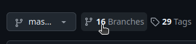
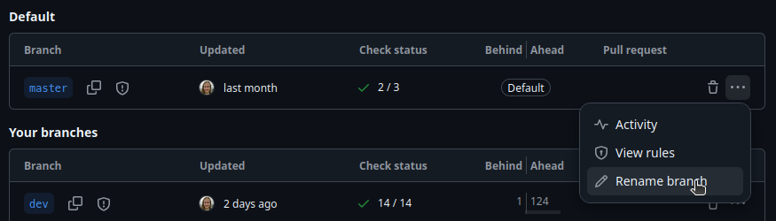
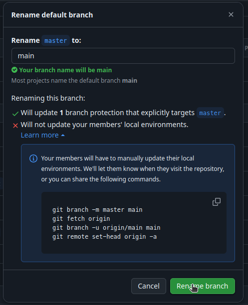

This guide shows you how to change your pipeline default branch from `master` to `main`.

## Prerequisites

- Admin privileges for the GitHub repository where the change is taking place
- nf-core tools

:::warning
Ensure that your version of `nf-core/tools` matches the pipeline's template version by checking the `.nf-core.yml` file. This prevents introducing unrelated changes and keeps the update limited to switching the default branch from `master` to `main`.
:::

## Instructions

1. Open your repository on GitHub. Make sure you're viewing the `master` branch.
2. Select **Branches**. It's located to the right of the branch dropdown that shows `master`.



3. In the **Default** branch section, find the `master` branch and select the **More options** (three-dot) menu, then select **Rename branch**.

:::note
You will need permissions to change this setting. If you don't have permission, ask the @core-team for help on Slack.
:::



4.  Rename `master` to `main`.
5.  Select the **learn more**, then copy the displayed instructions and save them somewhere safe.

:::note
These instructions will be useful for all pipeline contributors, so keep this to one side until the end of this tutorial!
:::



6. Select **Rename branch**.
7. Select the **Code** tab and verify you are now on `main`.
8. In your local IDE (e.g., VS Code), ensure you are on the `dev` branch.
9. Run `git fetch upstream` to ensure you have the `main` branch locally.
10. Run `git config --global init.defaultBranch main` to change your `git` config to `main`.
11. Run `git config --global init.defaultBranch` to check your `git` config again, it should now report `main`.
12. While still on `dev`, run `nf-core pipelines sync`.
13. Run `git switch -c default-branch-change` to switch to a new branch.
14. Run `git merge TEMPLATE`.

:::note
If you don't want any other template changes, make sure to use the `nf-core/tools` version that matches the template version in your pipeline.
:::

15. Resolve merge conflicts.

:::tip
If it's the ROcrate JSON file, you can accept all incoming change.
:::

16. Run a global repository search in your IDE to check that references of your pipelines `master` are now `main`.

:::warning
Make sure not to modify references of master in links to other repositories!
If in doubt, ask on the nf-core Slack!
:::

17. Run `nf-core pipelines lint` to check you didn't break anything.
18. Run `git add -am 'Change default branch'` to commit and merge.
19. Run `git push` to push changes.
20. On GitHub, make a new PR against `dev`.
21. Review the PR to check all relevant links and the `nextflow.config` manifest say `main`.
22. Request a community review on #request-review on Slack, and once you have an approval...
23. ... merge! :tada:

## Post-change instructions

1. Inform all your collaborators (on Slack, etc.) that the default branch has changed, and that they should update their clones and forks, i.e.:

   ```bash
   git branch -m master main
   git fetch origin
   git branch -u origin/main main
   git remote set-head origin -a
   ```

2. Update your own clones and forks using the above commands.
