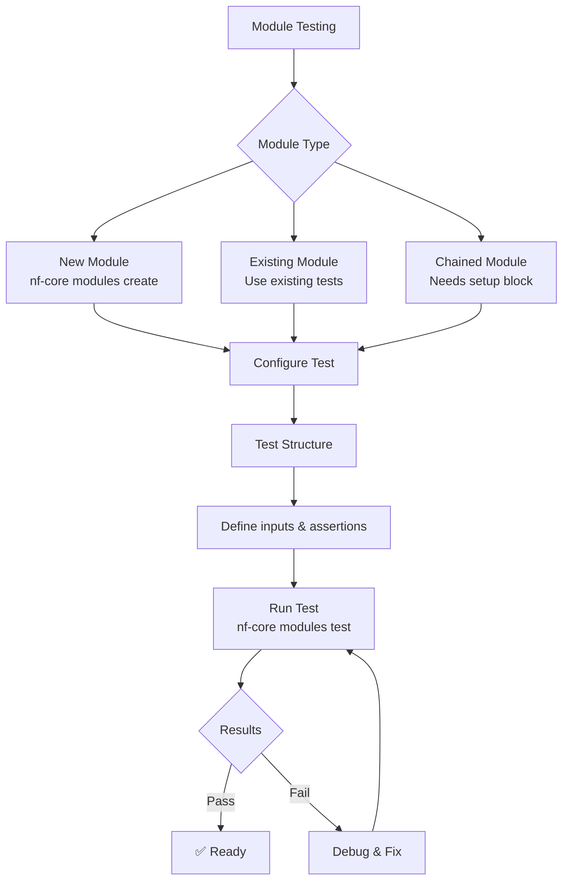

## Process Testing with nf-test

nf-test allows you to test each process defined in a module file. The following diagram illustrates the complete module testing workflow:



The basic syntax for a process test follows this structure:

```groovy
nextflow_process {
    name "<NAME>"
    script "<PATH/TO/NEXTFLOW_SCRIPT.nf>"
    process "<PROCESS_NAME>"

    test("<TEST_NAME>") {
        // Test implementation
    }
}
```

**Key Points:**

- Script paths starting with `./` or `../` are relative to the test script location
- Use relative paths to reference files within the same directory or parent directories

### Essential Assertions

Process tests commonly use these assertions:

```groovy
// Process status
assert process.success
assert process.exitStatus == 0

// Output channels
assert process.out.my_channel != null
assert process.out.my_channel.size() == 3
assert process.out.my_channel.get(0) == "expected_value"

// For unnamed channels, use index notation
assert process.out[0] != null
assert process.out[0].size() == 3
```

## Philosophy of nf-test for nf-core Components

Following the [nf-core testing guidance](https://nf-co.re/docs/tutorials/tests_and_test_data/nf-test_writing_tests), each nf-core module should include comprehensive tests that:

- Each module should contain a `tests/` folder alongside its `main.nf` file.
- Test files come with snapshots of component output channels
- Tests verify both functionality and expected outputs
- Support both regular and stub testing modes

## 1. Creating a New Module with Tests

Creating a new module automatically creates a test file based on the template.

```bash
# Create a new module using nf-core tools
cd path/to/modules
nf-core modules create seqtk/sample

# This creates the module structure:
# modules/nf-core/seqtk/sample/
# ├── main.nf
# ├── meta.yml
# └── tests/
#     ├── main.nf.test
#     └── tags.yml
```

The generated test file (`tests/main.nf.test`) will look like this:

```groovy
nextflow_process {

    name "Test Process SEQTK_SAMPLE"
    script "../main.nf"
    process "SEQTK_SAMPLE"

    tag "modules"
    tag "modules_nfcore"
    tag "seqtk"
    tag "seqtk/sample"

    test("sarscov2 - fastq") {

        when {
            process {
                """
                input[0] = [
                    [ id:'test', single_end:false ], // meta map
                    file(params.modules_testdata_base_path + 'genomics/sarscov2/illumina/fastq/test_1.fastq.gz', checkIfExists: true)
                ]
                input[1] = 10  // Number of reads to sample
                """
            }
        }

        then {
            assertAll(
                { assert process.success },
                { assert snapshot(process.out).match() }
            )
        }
    }

    test("sarscov2 - fastq - stub") {

        options "-stub"

        when {
            process {
                """
                input[0] = [
                    [ id:'test', single_end:false ], // meta map
                    file(params.modules_testdata_base_path + 'genomics/sarscov2/illumina/fastq/test_1.fastq.gz', checkIfExists: true)
                ]
                input[1] = 10
                """
            }
        }

        then {
            assertAll(
                { assert process.success },
                { assert snapshot(process.out).match() }
            )
        }
    }
}
```

After providing the right test data, running the test as shown below will create a snapshot of the output.

Run the tests:

```bash
nf-core modules test seqtk/sample --profile docker
```

### Adding Parameters to Tests

For modules requiring additional parameters, create a `nextflow.config` file in the `tests/` directory:

```bash
# Create config file for parameter testing
touch modules/nf-core/seqtk/sample/tests/nextflow.config
```

Add the configuration:

```groovy
process {
    withName: 'SEQTK_SAMPLE' {
        ext.args = params.module_args
    }
}
```

Then reference the config in your test:

```groovy
nextflow_process {
    name "Test Process SEQTK_SAMPLE"
    script "../main.nf"
    process "SEQTK_SAMPLE"
    config "./nextflow.config"
}
```

## 2. Testing an Existing Module

Let's examine testing the `bedtools/bamtobed` module, which is a simple un-chained module:

```groovy
nextflow_process {

    name "Test Process BEDTOOLS_BAMTOBED"
    script "../main.nf"
    process "BEDTOOLS_BAMTOBED"

    tag "modules"
    tag "modules_nfcore"
    tag "bedtools"
    tag "bedtools/bamtobed"

    test("sarscov2 - bam") {

        when {
            process {
                """
                input[0] = [
                    [ id:'test', single_end:false ], // meta map
                    file(params.modules_testdata_base_path + 'genomics/sarscov2/illumina/bam/test.paired_end.sorted.bam', checkIfExists: true)
                ]
                """
            }
        }

        then {
            assertAll(
                { assert process.success },
                { assert snapshot(process.out).match() }
            )
        }
    }

    test("sarscov2 - bam - stub") {

        options "-stub"

        when {
            process {
                """
                input[0] = [
                    [ id:'test', single_end:false ],
                    file(params.modules_testdata_base_path + 'genomics/sarscov2/illumina/bam/test.paired_end.sorted.bam', checkIfExists: true)
                ]
                """
            }
        }

        then {
            assertAll(
                { assert process.success },
                { assert snapshot(process.out).match() }
            )
        }
    }
}
```

### Running the Tests

```bash
# Run all tests for the module
nf-core modules test bedtools/bamtobed --profile docker
```

## 3. Testing Chained Modules

For modules that depend on outputs from other modules, use the [setup](https://www.nf-test.com/docs/testcases/setup/) method. Here's an example for `abricate/summary`, which requires output from `abricate/run`:

```groovy
nextflow_process {

    name "Test Process ABRICATE_SUMMARY"
    script "../main.nf"
    process "ABRICATE_SUMMARY"

    tag "modules"
    tag "modules_nfcore"
    tag "abricate"
    tag "abricate/summary"

    test("bacteroides_fragilis - genome_fna_gz") {

        setup {
            run("ABRICATE_RUN") {
                script "../../run/main.nf"
                process {
                    """
                    input[0] = Channel.fromList([
                        tuple([ id:'test1', single_end:false ], // meta map
                            file(params.modules_testdata_base_path + 'genomics/prokaryotes/bacteroides_fragilis/genome/genome.fna.gz', checkIfExists: true)),
                        tuple([ id:'test2', single_end:false ],
                            file(params.modules_testdata_base_path + 'genomics/prokaryotes/haemophilus_influenzae/genome/genome.fna.gz', checkIfExists: true))
                    ])
                    """
                }
            }
        }

        when {
            process {
                """
                input[0] = ABRICATE_RUN.out.report.collect{ meta, report -> report }.map{ report -> [[ id: 'test_summary'], report]}
                """
            }
        }

        then {
            assertAll(
                { assert process.success },
                { assert snapshot(process.out).match() }
            )
        }
    }
}
```

Run the tests:

```bash
nf-core modules test abricate/summary --profile docker
```

## 4. Updating Module Snapshots

When module outputs change (e.g., due to version bumps), you need to update snapshots:

```bash
nf-core modules test abricate/summary --profile docker --update
```

---

Read more nf-test assertion patterns in the [nf-test assertions examples doc](07_assertions.md)

---

## Next Steps

Continue to [Testing Subworkflows](./04_testing_subworkflows.md) to learn about testing more complex multi-module components.
