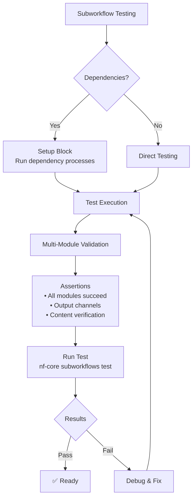

## Workflow Testing with nf-test

nf-test allows you to test specific workflows defined in a workflow file. Subworkflows combine multiple modules and require comprehensive testing strategies to ensure proper integration:



The basic syntax for a workflow test follows this structure:

```groovy
nextflow_workflow {
    name "<NAME>"
    script "<PATH/TO/NEXTFLOW_SCRIPT.nf>"
    workflow "<WORKFLOW_NAME>"

    test("<TEST_NAME>") {
        // Test implementation
    }
}
```

**Key Points:**

- Script paths starting with `./` or `../` are relative to the test script location
- Use relative paths to reference files within the same directory or parent directories

### Essential Assertions

Workflow tests commonly use these assertions:

```groovy
// Workflow status
assert workflow.success
assert workflow.exitStatus == 0

// Error handling
assert workflow.errorReport.contains("....")

// Trace analysis
assert workflow.trace.succeeded().size() == 3  // succeeded tasks
assert workflow.trace.failed().size() == 0     // failed tasks
assert workflow.trace.tasks().size() == 3      // all tasks

// Output validation
assert workflow.stdout.contains("Hello World") == 3
```

## Philosophy of nf-test for nf-core Subworkflows

Following the [nf-core testing guidelines](https://nf-co.re/docs/tutorials/tests_and_test_data/nf-test_writing_tests), each nf-core subworkflow should include comprehensive tests that:

- Each subworkflow should contain a `tests/` folder alongside its `main.nf` file.
- Test files come with snapshots of subworkflow output channels
- Tests verify both functionality and expected outputs of all included modules
- Support testing with different parameter combinations
- Include proper setup blocks for complex dependencies

## 1. Creating a New Subworkflow with Tests

Creating a new subworkflow automatically creates a test file based on the template.

```bash
# Create a new subworkflow using nf-core tools
cd path/to/subworkflows
nf-core subworkflows create fastq_align_qc

# This creates the subworkflow structure:
# subworkflows/nf-core/fastq_align_qc/
# ├── main.nf
# ├── meta.yml
# └── tests/
#     ├── main.nf.test
#     ├── nextflow.config
#     └── tags.yml
```

The generated test file (`tests/main.nf.test`) will include comprehensive tagging for all modules in the subworkflow:

```groovy
nextflow_workflow {
    name "Test Subworkflow FASTQ_ALIGN_QC"
    script "../main.nf"
    workflow "FASTQ_ALIGN_QC"
    config "./nextflow.config"

    tag "subworkflows"
    tag "subworkflows_nfcore"
    tag "subworkflows/fastq_align_qc"
    tag "fastqc"
    tag "trimgalore"
    tag "bwa/mem"
    tag "samtools/sort"
    tag "samtools/index"
    tag "samtools/stats"
    tag "samtools/flagstat"
    tag "picard/markduplicates"

    test("BWA alignment single-end | default") {
        when {
            workflow {
                """
                input[0] = Channel.of([
                            [ id:'test', single_end:true ],
                            file(params.modules_testdata_base_path + 'genomics/sarscov2/illumina/fastq/test_1.fastq.gz', checkIfExists: true)
                ])
                input[1] = Channel.of([
                            [ id:'test' ],
                            file(params.modules_testdata_base_path + 'genomics/sarscov2/genome/genome.fasta', checkIfExists: true)
                ])
                input[2] = Channel.of([
                            [ id:'test' ],
                            file(params.modules_testdata_base_path + 'genomics/sarscov2/genome/bwa/genome.fasta.{amb,ann,bwt,pac,sa}', checkIfExists: true)
                ])
                """
            }
        }

        then {
            assertAll(
                { assert workflow.success },
                { assert snapshot(workflow.out).match() }
            )
        }
    }
}
```

Run the tests:

```bash
nf-core subworkflows test fastq_align_qc --profile docker
```

## 2. Testing Subworkflows with Setup Dependencies

For subworkflows that require setup (like index generation), use setup blocks. Here's an example for a BWA alignment subworkflow:

```groovy
nextflow_workflow {
    name "Test Subworkflow FASTQ_ALIGN_QC"
    script "../main.nf"
    workflow "FASTQ_ALIGN_QC"
    config "./nextflow.config"

    tag "subworkflows"
    tag "subworkflows_nfcore"
    tag "subworkflows/fastq_align_qc"
    tag "bwa/mem"
    tag "samtools/sort"
    tag "samtools/index"

    setup {
        run("BWA_INDEX") {
            script "../../../../modules/nf-core/bwa/index/main.nf"
            process {
                """
                input[0] = [
                    [ id:'test' ],
                    file(params.modules_testdata_base_path + 'genomics/sarscov2/genome/genome.fasta', checkIfExists: true)
                ]
                """
            }
        }
    }

    test("BWA alignment single-end | default") {
        when {
            workflow {
                """
                input[0] = Channel.of([
                            [ id:'test', single_end:true ],
                            file(params.modules_testdata_base_path + 'genomics/sarscov2/illumina/fastq/test_1.fastq.gz', checkIfExists: true)
                ])
                input[1] = Channel.of([
                            [ id:'test' ],
                            file(params.modules_testdata_base_path + 'genomics/sarscov2/genome/genome.fasta', checkIfExists: true)
                ])
                input[2] = BWA_INDEX.out.index
                """
            }
        }

        then {
            assertAll(
                { assert workflow.success },
                { assert snapshot(
                    workflow.out.bam.collect { meta, bamfile -> bam(bamfile).getReadsMD5() },
                    workflow.out.bai.collect { meta, bai -> file(bai).name },
                    workflow.out.stats.collect { meta, stats -> file(stats).name },
                    workflow.out.flagstat.collect { meta, flagstat -> file(flagstat).name },
                    workflow.out.versions
                    ).match() }
            )
        }
    }
}
```

## 4. Testing Parameter Variations

Test different parameter combinations that affect subworkflow behavior:

### Creating Parameter-Specific Configuration

Create `tests/nextflow.config` for subworkflow-specific process configuration:

```groovy
params {
    aligner            = "bismark"
    cytosine_report    = false
    skip_deduplication = false
}

process {
    withName: 'BISMARK_ALIGN' {
        ext.args = { params.aligner == 'bismark_hisat' ? ' --hisat2' : ' --bowtie2' }
    }

    withName: 'SAMTOOLS_SORT' {
        ext.prefix = { "${meta.id}.sorted" }
    }
}
```

## 5. Testing Output Channels Comprehensively

### BAM File Testing with MD5 Checksums

Always use MD5 checksums for BAM files to ensure content consistency:

```groovy
{ assert snapshot(
    workflow.out.bam.collect { meta, bamfile -> bam(bamfile).getReadsMD5() },
    workflow.out.bai.collect { meta, bai -> file(bai).name },
    workflow.out.stats.collect { meta, stats -> file(stats).name },
    workflow.out.flagstat.collect { meta, flagstat -> file(flagstat).name },
    workflow.out.versions
    ).match() }
```

### File Name Testing for Stable Names

For files with stable names but variable content:

```groovy
workflow.out.bai.collect { meta, bai -> file(bai).name },
workflow.out.picard_metrics.collect { meta, metrics -> file(metrics).name },
workflow.out.multiqc.flatten().collect { path -> file(path).name }
```

---

Read more nf-test assertion patterns in the [nf-test assertions examples doc](./06_assertions.md)

---

## Next Steps

Continue to [Testing Pipelines](./05_testing_pipelines.md) to learn about end-to-end pipeline testing.
