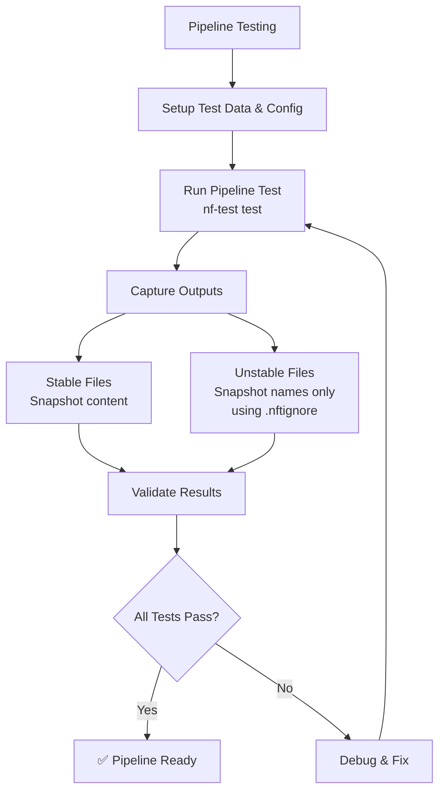

# Pipeline Testing

Pipeline-level testing ensures that your entire nf-core pipeline works correctly from start to finish.
As of nf-core/tools 3.3, pipeline-level nf-test tests have been added to the pipeline template to improve robustness and help developers catch issues early in the development process.

## Pipeline Testing Strategy

The following diagram illustrates the comprehensive pipeline testing approach using nft-utils and various assertion strategies:



## Template Files

When you create a new nf-core pipeline or update an existing one, you'll find these new template files for pipeline testing:

```tree
nf-test.config       # The pipeline-level nf-test configuration file
tests/
├── .nftignore       # ignored files for nf-test
├── default.nf.test  # The default test for the pipeline, loading the parameter configuration from config/test.config
└── nextflow.config  # The nextflow configuration for the pipeline tests
```

## Pipeline Testing

nf-test allows you to test the complete pipeline end-to-end. The basic syntax for a pipeline test follows this structure:

```groovy
nextflow_pipeline {

    name "<NAME>"
    script "<PATH/TO/NEXTFLOW_SCRIPT.nf>"

    test("<TEST_NAME>") {

    }
}
```

The workflow object can be used in asserts to check its status, error messages or traces.

```groovy
// workflow status
assert workflow.success
assert workflow.exitStatus == 0

// workflow error message
assert workflow.errorReport.contains("....")

// trace
//returns a list containing succeeded tasks
assert workflow.trace.succeeded().size() == 3

//returns a list containing failed tasks
assert workflow.trace.failed().size() == 0

//returns a list containing all tasks
assert workflow.trace.tasks().size() == 3
```

---

## Running a pipeline test

To list all available tests, use the following command:

```bash
nf-test list tests/
```

This will list all available tests in the `tests/` directory.

To run a pipeline test, use the following command:

```bash
nf-test test tests/default.nf.test --profile test,docker
```

This will run the test with the `test` profile and the `docker` profile.

> add `--update-snapshot` to update the snapshot
> add `--verbose` to see the verbose output
> add `--debug` to see the debug output

---

## Using nft-utils Plugin

The nft-utils plugin provides additional utilities for pipeline testing.

[nft-utils documentation](https://github.com/nf-core/nft-utils/blob/main/docs/usage.md)

### Key Concepts

#### Stable Files vs Stable Names

When testing pipelines, we need to distinguish between two types of outputs:

- **Stable Names**: Files and directories that have consistent names across different test runs, but whose content may vary (e.g., due to timestamps, random seeds, or system-specific information). These are tracked by their relative paths within the output directory.

- **Stable Files**: Files that have both consistent names AND consistent content across test runs. These files can be safely included in snapshots for content comparison.

#### .nftignore File

The `.nftignore` file works similarly to `.gitignore` but for nf-test snapshots. It allows you to exclude files with unstable content from being included in snapshot comparisons while still tracking their presence by name. This is essential for:

- Log files with timestamps
- HTML reports with dynamic content
- Binary files that may have slight variations
- Files containing system-specific paths or information

Files listed in `.nftignore` will be excluded from `stable_path` snapshots but can still be tracked in `stable_name` snapshots for structural verification.

### Installing and Configuring nft-utils

Add to your `nf-test.config`:

```groovy
config {
    plugins {
        load "nft-utils@0.0.4" // Check https://plugins.nf-test.com/ for the latest version
    }
}
```

### Essential Pipeline-Level Snapshot Pattern

This is the **recommended pattern** for comprehensive pipeline testing:

```groovy
nextflow_pipeline {
    name "Test Pipeline Default"
    script "main.nf"
    tag "pipeline"
    tag "default"

    test("Pipeline with stable snapshots") {
        when {
            params {
                input = 'tests/samplesheet.csv'
                outdir = "$outputDir"
                genome = 'GRCh37'
            }
        }
        then {
            // stable_name: All files + folders in ${params.outdir}/ with stable names
            def stable_name = getAllFilesFromDir(
                params.outdir,
                relative: true,
                includeDir: true,
                ignore: ['pipeline_info/*.{html,json,txt}', 'pipeline_info/execution_*.{html,txt}'] // Use 'ignore' parameter for ad-hoc exclusions, or .nftignore for persistent exclusions
            )

            // stable_path: All files in ${params.outdir}/ with stable content
            def stable_path = getAllFilesFromDir(
                params.outdir,
                ignoreFile: 'tests/.nftignore'
            )

            assertAll(
                { assert workflow.success },
                { assert snapshot(
                    // Number of successful tasks
                    workflow.trace.succeeded().size(),
                    // Pipeline versions.yml file with Nextflow version removed
                    removeNextflowVersion("$outputDir/pipeline_info/nf_core_*_software_mqc_versions.yml"),
                    // All stable file/folder names (relative paths)
                    stable_name,
                    // All files with stable contents
                    stable_path
                ).match() }
            )
        }
    }
}
```

### Setting up .nftignore for Unstable Files

Create `tests/.nftignore` to exclude files with unstable content but stable names. Here's an example:

```nftignore
.DS_Store
*/alignments/logs/*.txt
*/{alignments,deduplicated}/*.{bam,bam.bai}
*/deduplicated/logs/*.txt
*/{reports,summary}/*.{html,txt}
*/deduplicated/picard_metrics/*.txt
fastqc/*.html
fastqc/zips/*.zip
multiqc/*/multiqc_data/*.{log,json}
multiqc/*/multiqc_data/multiqc_fastqc.txt
multiqc/*/multiqc_data/multiqc_general_stats.txt
multiqc/*/multiqc_data/multiqc_qualimap_bamqc_genome_results.txt
multiqc/*/multiqc_data/multiqc_software_versions.txt
multiqc/*/multiqc_data/multiqc_sources.txt
multiqc/*/multiqc_report.html
multiqc/*/multiqc_plots/{pdf,png,svg}/*.{pdf,png,svg}
pipeline_info/*.{html,json,txt,yml}
*/qualimap/bamqc/*/qualimapReport.html
*/qualimap/bamqc/**/*.{pdf,png,svg}
*/qualimap/bamqc/*/css/*
qualimap/**/images_qualimapReport/*
qualimap/**/raw_data_qualimapReport/*
trimgalore/fastqc/*.html
trimgalore/fastqc/zips/*.zip
trimgalore/logs/*.txt
enrichment_metrics/*
```

### Advanced nft-utils Usage

[Sarek is doing it](https://github.com/nf-core/sarek/blob/dev/tests%2Fdefault.nf.test#L38-L47)

This example demonstrates an **advanced pattern** for testing specific file types using dedicated nft plugins. Here's how the file channels were generated and what the pattern achieves:

```groovy
// Generate file channels for specific file types using getAllFilesFromDir with include patterns
def bam_files = getAllFilesFromDir(params.outdir, include: ['**/*.bam'])
def cram_files = getAllFilesFromDir(params.outdir, include: ['**/*.cram'])
def vcf_files = getAllFilesFromDir(params.outdir, include: ['**/*.vcf.gz'])
def fasta = getAllFilesFromDir(params.outdir, include: ['**/*.fa']).first()

// Advanced pattern: Create file-specific snapshots with content validation
```

The pattern below creates **content-aware snapshots** that validate not just file presence, but also file integrity through format-specific checksums:

```groovy
                { assert snapshot(
                    // Number of successful tasks
                    workflow.trace.succeeded().size(),
                    // pipeline versions.yml file for multiqc from which Nextflow version is removed because we tests pipelines on multiple Nextflow versions
                    removeNextflowVersion("$outputDir/pipeline_info/nf_core_sarek_software_mqc_versions.yml"),
                    // All stable path name, with a relative path
                    stable_name,
                    // All files with stable contents
                    stable_path.isEmpty() ? 'No stable content' : stable_path,
                    // All cram files
                    bam_files.isEmpty() ? 'No BAM files' : bam_files.collect { file -> file.getName() + ":md5," +  bam(file.toString()).readsMD5 },
                    // All cram files
                    cram_files.isEmpty() ? 'No CRAM files' : cram_files.collect { file -> file.getName() + ":md5," +  cram(file.toString(), fasta).readsMD5 },
                    // All vcf files
                    vcf_files.isEmpty() ? 'No VCF files' : vcf_files.collect { file -> file.getName() + ":md5," + path(file.toString()).vcf.variantsMD5 }
                ).match() }
```

**What this pattern achieves:**

- **BAM files**: Uses `nft-bam` plugin to generate `readsMD5` - validates the sequence data content, not just file presence
- **CRAM files**: Uses `nft-bam` plugin with reference FASTA to generate `readsMD5` for compressed alignment data
- **VCF files**: Uses `nft-vcf` plugin to generate `variantsMD5` - validates the actual variant calls, ignoring metadata differences
- **Conditional logic**: `isEmpty() ? 'No files' : files.collect{}` handles cases where expected file types might not be present
- **Filename + content**: Each snapshot includes both the filename and content hash, providing traceable validation

### More examples of combining nft-utils with other plugins.

!!! info "don't forget to update the `nf-test.config`"

````groovy
      config {
               plugins {
                   load "nft-bam@0.5.0"
                   load "nft-utils@0.0.4"
                   load "nft-csv@0.1.0"
                   load "nft-vcf@1.0.7"
               }
         }
 ```

When wanting the validate the output samplesheets, we can use `nft-csv` where we isolate the index columns like `["sample"]` or `["index"]`. To check if we consistenly return the  same number of output samples as that we provided in the input.

 ```groovy
 then {
         def stable_name = getAllFilesFromDir(params.outdir, relative: true, includeDir: true, ignore: ['pipeline_info/*.{html,json,txt}'])
         def stable_path = getAllFilesFromDir(params.outdir, ignoreFile: 'tests/.nftignore')
         def output_samples_csv = path(params.outdir + '/overview-tables/samples_overview.tsv').csv(sep:"\t")
         def output_contigs_csv = path(params.outdir + '/overview-tables/contigs_overview.tsv').csv(sep:"\t")
         def stable_bam_files = getAllFilesFromDir(params.outdir, include: ['**/*.bam'])
         def stable_vcf_files = getAllFilesFromDir(params.outdir, include: ['**/*.vcf.gz'])

         assertAll(
             { assert workflow.success},
             { assert snapshot(
                 workflow.trace.succeeded().size(),
                 stable_name,
                 stable_path,
                 stable_bam_files.collect{ file -> [ file.getName(), bam(file.toString()).getStatistics() ] },
                 stable_vcf_files.collect{ file -> [ file.getName(), path(file.toString()).vcf.getVariantsMD5() ] }
             ).match() },
             { assert snapshot(
                 output_samples_csv.columnNames,
                 output_samples_csv.columns["sample"].sort(),
                 output_contigs_csv.columnNames,
                 output_contigs_csv.columns["index"].sort(),
             ).match("output samplesheets")}
         )
     }

### Best Practices for nft-utils

1. **Always set outdir to `$outputDir`** - ensures consistent test directory structure
2. **Use meaningful snapshot tags** - helps identify specific test scenarios
3. **Separate stable names from stable content** - provides better debugging when tests fail
4. **Include task count verification** - `workflow.trace.succeeded().size()` ensures execution completeness
5. **Remove version dependencies** - use `removeNextflowVersion()` for reproducible tests
6. **Maintain .nftignore files** - keep them updated as pipeline outputs evolve

### Troubleshooting nft-utils

#### When snapshots fail to match:

1. **Check .nftignore patterns** - ensure unstable files are properly excluded
2. **Verify wildcard patterns** - make sure they match your actual file structure
3. **Review relative vs absolute paths** - use `relative: true` for portable tests
4. **Update ignore patterns** - add new unstable files discovered during testing


## Testing expected file contents

Often, we will know more about the contents of a file than just whether it is stable or not. For example, a TSV file summarising per-sample information might reasonably be expected to contain one row per input sample - asserting that there is one row per input sample is a good way to check that all samples have made it through the pipeline correctly and that the per-sample processing logic is working correctly. This can catch errors in a pipeline where, for example, the final output file depends on the joining of two channels based on a key - key mismatches will result in fewer downstream samples than expected from the inputs.

This can also be particularly helpful where a pipeline is running a filtering step on the input samples - for example, discarding samples which do not meet quality thresholds. In this case, re-implementing the filter as an nf-test assertion and checking that the number of rows in a final summary file is correct is a good way to catch errors in the filtering logic within the pipeline.

#### Considerations for file contents checking

- `nf-test` plugins are very useful here - there are a plethora of plugins for processing specific file types which can be used to make assertions about file contents
 - For flat summary files, `nft-csv` is very powerful and can be used to make powerful assertions about file contents

#### Example patterns for checking expected file contents

- Check that the number of samples in the input samplesheet matches the number of samples in the output summary
- If it is known a-priori which samples are expected to pass QC, check that expected failing samples are not in the final summary files
- If a pipeline produces some countable number of outputs from each individual sample (for example, FASTA files), count these and ensure that they are all represented in downstream results files
## Next Steps

Continue to [nf-test Assertions](./07_assertions.md) to learn about comprehensive assertion patterns and verification techniques.
````
