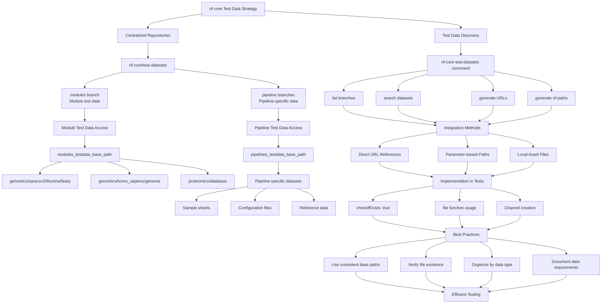

## Test Data Strategy

Understanding how test data flows through the nf-core ecosystem is crucial for effective testing. The following diagram illustrates the complete test data management strategy:



### nf-core Test Data Repository

nf-core maintains centralized test datasets:

- **Modules test data**: `https://github.com/nf-core/test-datasets/tree/modules`
- **Pipeline test data**: `https://github.com/nf-core/test-datasets/tree/<pipeline-name>`

```groovy
// Standard nf-core test data reference
file(params.modules_testdata_base_path + 'genomics/sarscov2/illumina/fastq/test_1.fastq.gz', checkIfExists: true)
```

### New nf-core test-datasets Command

> **New in nf-core/tools 3.3**: The `nf-core test-datasets` command provides streamlined functionality for dataset discovery and integration.

#### Available Commands

```bash
# List available subcommands
nf-core test-datasets --help

# List remote branches with test data
nf-core test-datasets list-branches

# List files on a specific branch
nf-core test-datasets list --branch <branch-name>

# Search for specific datasets
nf-core test-datasets search <query> --branch <branch-name>
```

#### Dataset Discovery Examples

```bash
# List all datasets for a specific pipeline
nf-core test-datasets list --branch mag

# Search for specific test data
nf-core test-datasets search minigut_reads --branch mag

# Get download URLs for integration
nf-core test-datasets list --branch mag --generate-dl-url

# Get Nextflow-compatible paths
nf-core test-datasets list --branch mag --generate-nf-path
```

#### Command Options

The `list` and `search` commands support these options:

- `--branch`, `-b`: Specify the branch in test-datasets repository
- `--generate-nf-path`, `-p`: Auto-generate file paths for Nextflow code
- `--generate-dl-url`, `-u`: Auto-generate GitHub download URLs

## Next Steps

Continue to [CI/CD Integration](./09_cicd_integration.md) to learn about integrating tests with continuous integration.
