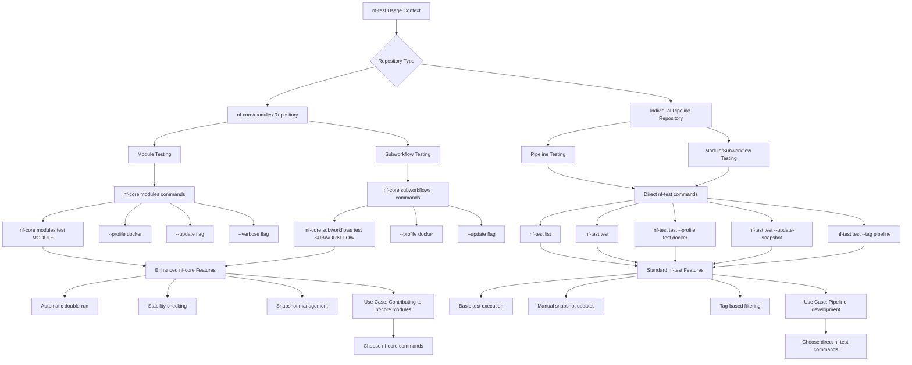

## Prerequisites

Before running these commands, ensure you have:

- nf-test installed (see [Installation Guide](./01_installation.md))
- An nf-core pipeline or nf-core/modules repo set up
- Access to (nf-core) test data (local or remote)

## Understanding Testing Contexts

There are **two main contexts** for running nf-test commands in the nf-core ecosystem. The following diagram helps you choose the right commands for your situation:



### 1. nf-core/modules Repository Context

When working in the **nf-core/modules repository**, use `nf-core` tools commands if you are:

- Testing individual modules and subworkflows
- Contributing to the shared nf-core modules library
- Use `nf-core modules test` and `nf-core subworkflows test`

nf-core tools modules and subworkflow testing has extra functionality that aids setting up the tests and snapshots (e.g. automatically running a second test to check stability of the output files of a module).

### 2. Individual Pipeline Context

When developing **individual nf-core pipelines**, use `nf-test` commands directly, if you are:

- Testing complete pipeline workflows
- Pipeline-specific test configurations
- Use `nf-test test` commands

nf-core tools does not currently provide additional functionality for testing pipeline level tests.

---

## nf-core/modules Repository Reference Commands

> **Note**: These commands only work within the nf-core/modules repository

### Module Testing

These commands will tell nf-core to run the test files of `bedtools/bamtobed` module twice, and compare the results to see if they change.
By giving `--update`, this will update the 'snapshot' that records the state of the results files (in cases where you have made changes to the module).
By giving `--verbose`, the command will print the Nextflow logging information to console, which is useful for debugging.

```bash
# Test a specific module
nf-core modules test bedtools/bamtobed --profile docker

# Update module test snapshots
nf-core modules test bedtools/bamtobed --profile docker --update

# Test with verbose output
nf-core modules test bedtools/bamtobed --profile docker --verbose
```

### Subworkflow Testing

These commands are functionally the same as above, but with subworkflows.

```bash
# Test a subworkflow
nf-core subworkflows test vcf_impute_glimpse --profile docker

# Update subworkflow snapshots
nf-core subworkflows test vcf_impute_glimpse --profile docker --update
```

---

## Individual Pipeline Commands

> **Note**: Use these commands when working on individual nf-core pipelines. You can use `nf-core/sarek`, `nf-core/methylseq`, `nf-core/rnaseq` as examples.

### Basic Testing

```bash
# List all available tests
nf-test list

# Run all available tests (modules, workflow, pipeline etc.) within the repository
nf-test test --profile test,docker

# Run specific test file
nf-test test tests/default.nf-test --profile test,docker

# Update snapshots
nf-test test --profile test,docker --update-snapshot

# Run tests with verbose output
nf-test test --profile test,docker --verbose

# Run specific test by tag
nf-test test --tag pipeline --profile test,docker
```

### Understanding Profile Behavior

When working with nf-test profiles, it's important to understand how they interact:

- **Default profile**: nf-test uses `test` as the default profile when no profile is specified
- **Profile override**: If you specify profile tags in your `*.nf.test` files, these will completely override the default `test` profile
- **Profile combination**: Using `--profile test,docker` explicitly sets both profiles, ensuring consistent behavior regardless of what's defined in individual test files
- **Profile addition**: You can use `--profile +docker` to add the `docker` profile to whatever profiles are already configured (either the default `test` or those specified in test files)

This is why most examples use `--profile test,docker` to ensure both the test configuration and Docker execution environment are active.

For more detailed information about profile configuration and priority order, see the [nf-test documentation on managing profiles](https://www.nf-test.com/docs/configuration/#combining-profiles-with).

---

## Next Steps

Continue to [Project Setup](./03_project_setup.md) to configure your testing environment.
