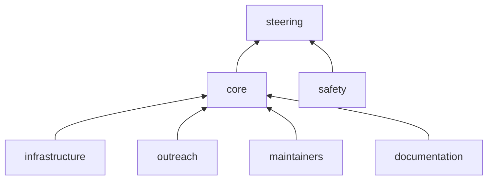

import Profile from "@components/GitHubProfilePictureExtended.astro";
import ProfileListing from "@components/ProfileListing.astro";

# Governance

nf-core is committed to being an open, inclusive, productive, and open-source community.
Anyone interested in the project can join the community and contribute to the project.
All community members must comply with the Code of Conduct (CoC) at all times.

To help manage the project, nf-core has teams that are made up of community members that oversee core activities.

This page describes the structure of the nf-core community, including how governance teams are elected, their responsibilities, and how decisions are made.

## Steering committee

Changes impacting the community require decisions informed by extensive experience with the nf-core project and the larger ecosystem.
The steering committee is responsible for overseeing the running of the nf-core project.

The steering committee is made up of representatives from the core team and outside advisors who are familiar with the project.
The steering committee is not a fixed size with its members being elected by the current steering committee.
The steering committee will meet regularly to discuss the project, funding and personnel.

##### Responsibilities

- Guiding project initiatives
- Making decisions about the project, funds, and personnel

##### Members

    <Profile username="apeltzer">Alexander Peltzer</Profile>
    <Profile username="cnotred">Cedric Notredame</Profile>
    <a class="btn btn-light rounded-pill mb-2 px-3 align-middle" style="height:50px;line-height:35px;">
        Ellen Sherwood
    </a>
    <Profile username="evanfloden">Evan Floden</Profile>
    <Profile username="ggabernet">Gisela Gabernet</Profile>
    <Profile username="drpatelh">Harshil Patel</Profile>
    <Profile username="ewels">Phil Ewels</Profile>
    <Profile username="svennahnsen">Sven Nahnsen</Profile>

## Core team

The core team ensures the day-to-day running of the nf-core project and oversees the activities of governance teams.

The core team is made up of community members that have demonstrated a continued commitment to the nf-core community.
New members will be invited to join the core team based on contributions, experience, and engagement with the community.
The core team will aim to have representation from different genders, geography, and employers (e.g., academia, clinical and industry).
Significant community decisions will be made by vote with any decision without a clear majority being passed to the steering committee to resolve.
Core team members will appear as organization members on the GitHub organization and have administrator access to repositories.

##### Responsibilities

- Day-to-day community decisions and coordination
- Day-to-day tasks requiring elevated permissions
    - Adding new community members to the GitHub organisation
    - Leading pipeline proposal evaluations and tracking
    - Facilitating pipeline repository transfers into nf-core organisation
    - Pipeline GitHub repository setting configuration
    - Uploading larger test-data to AWS bucket
    - Uploading pipeline megatest data to AWS bucket
    - Adding community members to the nf-core Seqera Platform workspace
    - First pipeline release reviews
    - Activating pipeline Zenodo archiving
- Attendance at the core team annual meeting
- Regular attendance at monthly core team meetings
- Sub-roles within the nf-core governance teams
- A strong community presence

##### Members

<ProfileListing
    profiles={[
        { name: "Chris Hakkaart", username: "christopher-hakkaart" },
        { name: "Edmund Miller", username: "edmundmiller" },
        { name: "Franziska Bonath", username: "FranBonath" },
        { name: "Friederike Hanssen", username: "FriederikeHanssen" },
        { name: "James A. Fellows Yates", username: "jfy133" },
        { name: "Jose Espinosa-Carrasco", username: "JoseEspinosa" },
        { name: "Júlia Mir Pedrol", username: "mirpedrol" },
        { name: "Ken Brewer", username: "kenibrewer" },
        { name: "Matthias Hörtenhuber", username: "mashehu" },
        { name: "Maxime U. Garcia", username: "maxulysse" },
        { name: "Marcel Ribeiro-Dantas", username: "mribeirodantas" },
        { name: "Nicolas Vannieuwkerke", username: "nvnieuwk" },
        { name: "Phil Ewels", username: "ewels" },
        { name: "Sateesh Peri", username: "sateeshperi" },
    ]}
/>
##### Alumni
<ProfileListing
    profiles={[
        { name: "Alexander Peltzer", username: "apeltzer" },
        { name: "Geraldine Van der Auwera", username: "vdauwera" },
        { name: "Gisela Gabernet", username: "ggabernet" },
        { name: "Harshil Patel", username: "drpatelh" },
        { name: "Johannes Alneberg", username: "alneberg" },
        { name: "Kevin Menden", username: "KevinMenden" },
        { name: "Olga Botvinnik", username: "olgabot" },
        { name: "Sven F.", username: "sven1103" },
    ]}
/>

## Safety

The nf-core community should feel comfortable contributing to the project without the risk of harassment or abuse.
The safety team is responsible for ensuring the community is a safe place and responding to instances of misconduct.

The safety team is made up of community members who have displayed integrity, strong communication, and a genuine concern for community welfare.
The safety team is elected by the core team, is not a fixed size, and will scale as the community grows.
The safety team is not a part of the core team and can report directly to the steering committee.

##### Responsibilities

- Be responsible for the nf-core code of conduct
- Be available for nf-core events (online or in person)
- Promptly respond to reports of misconduct and escalate to the core team or steering committee as necessary

##### Members

<ProfileListing
    profiles={[
        { name: "Cris Tuñí", username: "ctuni" },
        { name: "Michael Heuer", username: "heuermh" },
        { name: "Saba Nafees", username: "snafees" },
    ]}
/>

## Infrastructure

Tooling is a fundamental part of the nf-core community.
The infrastructure team is responsible for the development and implementation of the nf-core tooling framework.

The infrastructure team will have one or more leads who are responsible for overseeing infrastructure efforts.
The infrastructure team is elected by the core team, is not a fixed size, and will scale as the community grows.
The infrastructure team will have administrator access to repositories.

##### Responsibilities

- Development and maintenance of nf-core tools, website, and mega tests
- Maintenance of CI testing and GitHub Action runners
- Regular attendance at maintenance team meetings

##### Leads

<Profile username="ewels">Phil Ewels</Profile>

##### Members

<ProfileListing
    profiles={[
        { username: "edmundmiller", name: "Edmund Miller" },
        { username: "mirpedrol", name: "Júlia Mir Pedrol" },
        { username: "julianflesch", name: "Julian Flesch" },
        { username: "mashehu", name: "Matthias Hörtenhuber" },
        { username: "ningyuxin1999", name: "Yuxin Ning" },
    ]}
/>

## Outreach

Outreach is an important part of any community project.
The outreach team is responsible for overseeing the organization and running community outreach efforts, including, but not limited to, hackathons, and the `#bytesize` seminar series.

The outreach team will have one or more leads who are responsible for overseeing outreach efforts.
New members will be invited to be a part of the outreach team based on experience and outreach activity.
The outreach team is not a fixed size and will scale as the community grows.
The outreach leads will have access to community social media and YouTube accounts (e.g., Twitter and YouTube).

##### Responsibilities

- Organizing and running the `#bytesize` seminar series
- Co-organisation of the hackathons and other outreach events
- Contact for creating and sharing community content
- Co-organizing of the help-desk together with the maintainers
- Regular attendance at outreach team meetings

##### Leads

<ProfileListing
    profiles={[
        { username: "FranBonath", name: "Franziska Bonath" },
        { username: "mribeirodantas", name: "Marcel Ribeiro-Dantas" },
        { username: "maxulysse", name: "Maxime U. Garcia" },
    ]}
/>
##### Members
<ProfileListing
    profiles={[
        { username: "abhi18av", name: "Abhinav Sharma" },
        { username: "christopher-hakkaart", name: "Chris Hakkaart" },
        { username: "chriswyatt1", name: "Chris Wyatt" },
        { username: "flowuenne", name: "Florian Wuennemann" },
        { username: "vdauwera", name: "Geraldine Van der Auwera" },
        { username: "kenibrewer", name: "Ken Brewer" },
        { username: "KurayiChawatama", name: "Kurayi Chawatama" },
        { username: "yuukiiwa", name: "Yuk Kei" },
    ]}
/>
##### Alumni
<ProfileListing
    profiles={[
        { username: "edmundmiller", name: "Edmund Miller" },
        { username: "pcantalupo", name: "Paul Cantalupo" },
        { username: "Xesus-Abalo", name: "Xesús M. Abalo" },
        { username: "renbot-bio", name: "Renuka Kudva" },
    ]}
/>
## Maintainers

nf-core test data, modules, and pipeline repositories require regular upkeep and maintenance.
The maintainers team takes an active role in managing nf-core repositories in collaboration with the wider nf-core community.

The maintainers team will have one or more leads who are responsible for overseeing maintenance efforts.
New members are invited to join the maintainers team by current maintainers based on experience and activity in the community.
The maintainers team is not a fixed size and will scale as the community grows.
nf-core maintainers will have write access to repositories.

##### Responsibilities

- Respond to `#github-invitations`
- Assist in evaluating new pipeline proposals
- Review regularly 'common' repositories: module, subworkflow, and pipeline release pull requests
- Manage repository access for community developers
- Manage test data
- Enable and promote nf-core community values

##### Leads

<ProfileListing
    profiles={[
        { username: "FriederikeHanssen", affiliation: "Seqera", name: "Friederike Hanssen" },
        {
            username: "SPPearce",
            affiliation: "NeoGenomics Laboratories",
            name: "Simon Pearce",
        },
        { username: "maxulysse", affiliation: "Seqera", name: "Maxime U. Garcia" },
    ]}
/>

##### Members

<ProfileListing
    profiles={[
        { username: "adamrtalbot", affiliation: "Seqera", name: "Adam Talbot" },
        { username: "aratz", affiliation: "Pixelgen Technologies", name: "Adrien Coulier" },
        { username: "atrigila", affiliation: "ZS", name: "Anabella Trigila" },
        { username: "edmundmiller", affiliation: "University of Texas at Dallas", name: "Edmund Miller" },
        { username: "vagkaratzas", affiliation: "EMBL-EBI", name: "Evangelos Karatzas" },
        {
            username: "famosab",
            affiliation:
                "Quantitative Biology Center, QBiC, University of Tübingen & Translational Bioinformatics, University Hospital Tübingen",
            name: "Famke Bäuerle",
        },
        { username: "felix-kummer", affiliation: "Humboldt-Universität zu Berlin", name: "Felix Kummer" },
        { username: "FloWuenne", affiliation: "Seqera", name: "Florian Wuennemann" },
        { username: "itrujnara", affiliation: "Centre for Genomic Regulation (CRG)", name: "Igor Trujnara" },
        {
            username: "jfy133",
            affiliation:
                "Leibniz Institute for Natural Product Research and Infection Biology Hans Knöll Institute & Max Planck Institute - for Evolutionary Anthropology",
            name: "James A. Fellows Yates",
        },
        {
            username: "jasmezz",
            affiliation: "Leibniz Institute for Natural Product Research and Infection Biology Hans Knöll Institute",
            name: "Jasmin Frangenberg",
        },
        { username: "prototaxites", affiliation: "Wellcome Sanger Institute", name: "Jim Downie" },
        { username: "mirpedrol", affiliation: "Centre for Genomic Regulation (CRG)", name: "Júlia Mir Pedrol" },
        { username: "pinin4fjords", affiliation: "Seqera", name: "Jon Manning" },
        {
            username: "jonasscheid",
            affiliation:
                "Quantitative Biology Center, QBiC, University of Tübingen & Department of Peptide-based Immunotherapy, Institute of Immunology, University and University Hospital Tübingen",
            name: "Jonas Scheid",
        },
        { username: "Joon-Klaps", affiliation: "KU Leuven", name: "Joon Klaps" },
        {
            username: "JoseEspinosa",
            affiliation: "Centre for Genomic Regulation (CRG)",
            name: "Jose Espinosa-Carrasco",
        },
        { username: "lpantano", affiliation: "Harvard Chan School of Public Health", name: "Lorena Pantano" },
        {
            username: "LouisLeNezet",
            affiliation: "Institute Genetics & Development of Rennes",
            name: "Louis Le Nézet",
        },
        { username: "luisas", affiliation: "Centre for Genomic Regulation (CRG)", name: "Luisa Santus" },
        {
            username: "mahesh-panchal",
            affiliation: "National Bioinformatics Infrastructure Sweden",
            name: "Mahesh Binzer-Panchal",
        },
        { username: "matthdsm", affiliation: "Center For Medical Genetics Ghent", name: "Matthias De Smet" },
        { username: "mashehu", affiliation: "Science for Life Laboratory", name: "Matthias Hörtenhuber" },
        { username: "nictru", affiliation: "Technical University of Munich", name: "Nico Trummer" },
        {
            username: "nvnieuwk",
            affiliation: "Center For Medical Genetics Ghent",
            name: "Nicolas Vannieuwkerke",
        },
        {
            username: "pontus",
            affiliation: "National Bioinformatics Infrastructure Sweden",
            name: "Pontus Freyhult",
        },
        { username: "ramprasadn", affiliation: "Science for Life Laboratory", name: "Ramprasad Neethiraj" },
        { username: "sateeshperi", affiliation: "PeriMatrix IT Consultancy", name: "Sateesh Peri" },
        {
            username: "gallvp",
            affiliation: "The New Zealand Institute for Plant and Food Research Limited",
            name: "Usman Rashid",
        },
    ]}
/>

##### Alumni

<ProfileListing
    profiles={[
        { username: "apeltzer", affiliation: "Boehringer Ingelheim", name: "Alex Peltzer" },
        { username: "jemten", affiliation: "Science for Life Laboratory", name: "Anders Jemt" },
        { username: "asp8200", affiliation: "Danish National Genome Center", name: "Anders Sune Pedersen" },
        { username: "CarsonJM", affiliation: "University of Washington", name: "Carson Miller" },
        { username: "christopher-mohr", affiliation: "Boehringer Ingelheim", name: "Christopher Mohr" },
        { username: "erikrikarddaniel", affiliation: "Linnaeus University", name: "Daniel Lundin" },
        {
            username: "ggabernet",
            affiliation: "Quantitative Biology Center, QBiC, University of Tübingen",
            name: "Gisela Gabernet",
        },
        { username: "drpatelh", affiliation: "Seqera", name: "Harshil Patel" },
        {
            username: "LilyAnderssonLee",
            affiliation: "Karolinska Institute & Karolinska University Hospital",
            name: "Lili Andersson-Li",
        },
        {
            username: "louperelo",
            affiliation: "Quantitative Biology Center, QBiC, University of Tübingen",
            name: "Louisa Perelo",
        },
        { username: "muffato", affiliation: "Wellcome Sanger Institute", name: "Matthieu Muffato" },
        { username: "Midnighter", affiliation: "Unseen Bio ApS", name: "Moritz E. Beber" },
        {
            username: "sofstam",
            affiliation: "Karolinska Institute & Karolinska University Hospital",
            name: "Sofia Stamouli",
        },
        { username: "robsyme", affiliation: "Seqera", name: "Rob Syme" },
    ]}
/>

## Documentation

Clear, consistent, and accessible documentation is essential for the nf-core community to effectively use and contribute to the project.
The documentation team is responsible for maintaining quality and consistency across all nf-core resources.

The documentation team will have one or more leads who are responsible for overseeing documentation efforts.
New members will be invited to join the team based on writing experience, technical communication skills, and engagement with community documentation needs.
The team is not fixed in size and will scale as the community grows.
Documentation team members will have write access to documentation repositories and style guide resources.

##### Responsibilities

- Develop and maintain the nf-core documentation style guide
- Review new and existing documentation for consistency, clarity, and adherence to style standards
- Collaborate with contributors to develop new documentation content
- Design and maintain information architecture across nf-core documentation resources
- Conduct periodic documentation audits to identify gaps and improvement opportunities
- Provide guidance and support to community members creating documentation
- Regular attendance at documentation team meetings
- Collaborate with infrastructure teams to develop and maintain documentation automation

##### Leads

<ProfileListing
    profiles={[
        { username: "christopher-hakkaart", affiliation: "Seqera", name: "Chris Hakkaart" },
        {
            username: "jfy133",
            affiliation:
                "Leibniz Institute for Natural Product Research and Infection Biology Hans Knöll Institute & Max Planck Institute - for Evolutionary Anthropology",
            name: "James A. Fellows Yates",
        },
    ]}
/>

##### Members

<ProfileListing
    profiles={[
        { username: "chriswyatt1", affiliation: "University College London", name: "Chris Wyatt" },
        { username: "mirpedrol", affiliation: "Centre for Genomic Regulation (CRG)", name: "Júlia Mir Pedrol" },
        {
            username: "mahesh-panchal",
            affiliation: "National Bioinformatics Infrastructure Sweden",
            name: "Mahesh Binzer-Panchal",
        },
        { username: "FriederikeHanssen", affiliation: "Seqera", name: "Friederike Hanssen" },
    ]}
/>

_We are recruiting! Join the [#team-docs](https://nfcore.slack.com/archives/C09H9L3R614) channel to see what we're up to, and reach out to [Chris](https://nfcore.slack.com/team/U024MM1DRKL) or [James](https://nfcore.slack.com/team/D040CUQM72B) on Slack to find out more._

## Support

We thank all the institutions and companies of the maintainers team for their support of nf-core.
