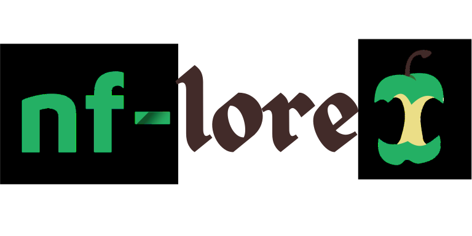

import { Image } from "astro:assets";
import DarkModeImage from "@components/DarkModeImage.astro";
import loreSvg from "../../assets/images/nf-lore/lore.svg";
import socksEmoji from "../../assets/images/nf-lore/nf-core-socks_360.png";
import socksCollection from "../../assets/images/nf-lore/nf-core-socks.jpg";
import sarekExpedition from "../../assets/images/nf-lore/sarek4_720.jpg";



# nf-core Lore

Welcome to the nf-core lore page - a collection of the stories, traditions, and beloved artifacts that have shaped our community over the years.

## The Legend of the Socks

The most iconic piece of nf-core lore centers around our beloved branded socks.

<p>
  In one of the first nf-core hackathons, we gave out nf-core branded socks as free swag. They were{" "}
  <strong>VERY</strong> popular. So popular, in fact, that we created a dedicated nf-core socks emoji on Slack:
  <code>:nf-core-socks:</code>

  <Image
    src={socksEmoji}
    alt="nf-core socks emoji"
    style="float: right; width: 20px; margin-left: 1em;"
  />
</p>

Then COVID-19 happened, and hackathons moved online. For a virtual social event, we hid the nf-core socks emoji throughout the Gather Town maps (similar to the WorkAdventure system we use now). Some of them were hidden in elaborate mazes where you had to walk through invisible gaps in walls and solve puzzles. It got intense.

We've had versions of sock hunts ever since. Even when we returned to in-person hackathons, we continued the tradition by hiding nf-core sock **stickers** in physical locations around the venue. When you attend an in-person or distributed hackathon, be sure to keep your eyes peeled for the infamous nf-core socks!

### nextflow run socks

There exists a [Nextflow workflow](https://github.com/nextflow-io/socks) that you can run called `socks`. This workflow was born out of one round of Nextflow socks which had "nextflow run socks" on their packaging, spurring a brain wave.
While many sock traditions may predate this workflow, it stands as a testament to how deeply embedded sock culture is in our community.

```
nextflow run socks
```

### The Sock Collection

Custom Nextflow and Seqera themed socks continue to be created for major events like the Nextflow Summit. Some community members maintain impressive collections - the "Novelty Nextflow Socks" drawer is a real thing, and it's probably fuller than you think.

<p align="center">
    <Image src={socksCollection} alt="nf-core socks collection" width={200} />
    <br />
    <em>One of our well-loved collections of various nf-core socks</em>
</p>

_One of our well-loved collections of various nf-core socks_

## The Swag Chronicles

Beyond socks, nf-core has produced an impressive array of memorable swag over the years:

- **Mugs** - Still in daily use by many community members. Some folks also have the coveted black Nextflow thermo-mugs from various summits.
- **Aprons** - Given away at the group cooking events (more on that below!)
- **Umbrellas** - Practical, if lacking in amusing backstory
- **Custom beer bottles** - A particular point of pride for event organizers
- **Coasters** - Famous for traveling to the real Sarek (see below)
- **Playing cards** - For those strategic planning sessions
- **Mints** - Minty fresh breath for your code reviews
- **Screen cleaners** - For spotting those bugs more clearly
- **Rubber ducks** - Available in at least three colors (yellow, blue, and red), perfect for debugging

Many of these items are still available in the [nf-core shop](https://nf-co.re/shop/).

### The Stickers

Ah, the stickers. We've created so many pipeline and project stickers over the years that there's been ongoing talk of creating a Panini-style album or large poster to display them all. Some dedicated community members even print and order their own Sarek stickers!

Speaking of stickers, we even have a dedicated [stickers page](https://nf-co.re/stickers/) where you can browse the collection.

## The Barcelona Cooking Events

The early "Nextflow hack" events (predecessors to the Nextflow Summit) pioneered having group-cooking events for the main social activity. These were hugely popular, especially with generous support from AWS who kept funding them, so we continued the tradition at every Barcelona event until we grew too large to fit everyone in a kitchen.

These events were where the nf-core aprons were distributed, and they remain a fond memory for many early community members who participated.

## The Sarek Expedition

[Sarek](https://nf-co.re/sarek) is both a beautiful national park in northern Sweden and an nf-core pipeline for genomic variant calling. Sarek National Park is the most remote place you can visit in Europe - you can be 85km away from any road, with no mobile reception. Digital detox at its finest!

The pipeline was named after the park before it was contributed to nf-core, making it an historical artifact. Because of this somewhat obscure naming choice, newer nf-core pipelines are now discouraged from having names unrelated to their functionality.

To honor this connection, one intrepid community member carried an nf-core coaster in their backpack through the wilderness of northern Sweden for two weeks on a 10-12 day hike, bringing nf-core to the real Sarek. Photos were taken. A Sarek sticker was placed on the backside of the coaster. Legends were made.

<figure style="text-align: center;">
    <Image src={sarekExpedition} alt="sarek expedition 4" width={300} />
    <figcaption>
        <em>The Sarek and nf-core coaster along the northern Sweden wilderness</em>
    </figcaption>
</figure>

_The sarek and nf-core coaster along the northern Sweden wilderness_

## Hackathon Traditions

### The Plank Tradition

At nf-core hackathons, there's a long-standing tradition of "planking" - the art of lying face down in unusual places for photos. While this tradition has existed for years, we're always looking for creative new plank photos at each event!

### The Social Events

Hackathon socials have become legendary for their recurring activities:

- **The Quiz** - A hackathon staple where everyone inevitably gets the markdown link syntax question wrong. Every. Single. Time. `[text](link)` shouldn't be this hard, but here we are.
- **Bingo** - Community bingo has become a beloved tradition at our events
- **The Pizza Ordering Saga** - There's a recurring challenge with getting pizza ordered for large groups, often involving credit card issues and logistical adventures. Getting food for 50+ hungry developers is apparently harder than parallelizing workflows.

## The Music Videos

The nf-core community has created multiple music videos celebrating our culture, inside jokes, and yes, sometimes socks. These productions showcase the creative and fun-loving spirit of the community. You can find the full playlist on [YouTube](https://www.youtube.com/playlist?list=PL3xpfTVZLcNjUDbpwuVPIwLGLd26g1wMx).

There's also an [nf-core Spotify playlist](https://open.spotify.com/playlist/4patiMJMAdEC6gOM1ddwQa) for when you want to code with the community's soundtrack in mind.

## Community Creations

### The Connect Game

Created by Maxime and Florian Wuennemann, the [nf-core Connect Game](https://nf-core.github.io/connectgame/connectgame/) is a playable tribute to our community. Because why not gamify nf-core?

Make sure that you post your best score in the [#connectgame](https://nfcore.slack.com/channels/connectgame) channel on the nf-core Slack!

---

_Have a piece of nf-core lore to add? Join us on [Slack](https://nf-co.re/join/slack) and share your stories!_
