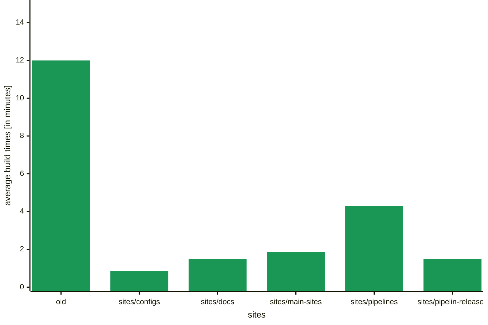
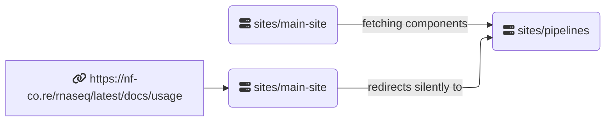

import subsites from '@assets/images/blog/new-website-structure/sub-site-meme.png';
import horsesizedduck from '@assets/images/blog/new-website-structure/horse-sized-duck.jpg';
import harderstronger from '@assets/images/blog/new-website-structure/harder-stronger.gif';
import { Image } from 'astro:assets';

# Build big

Nearly two years ago, we introduced our new website built with the [Astro framework](https://astro.build/). The current website comprises over 6500 pages, featuring documentation for every pipeline release, blog posts, and other content. Twice daily, and with every pull request against the main branch, all these pages are built and deployed to the live server. This process eventually took over 10 minutes, which was longer than we preferred and also wasted a lot of resources.

# Divide and conquer

That's why we came up with a new website structure that will allow us to build the website in a more
modular way. We landed on a monorepo/microsite structure.

<Image
    src={horsesizedduck}
    class="d-block m-auto mb-2"
    width={400}
    density={[1.5, 2]}
    alt="a drawing of a large duck standing next to several tiny horses and the word 'vs' in-between. 
    The duck has the title 'old website structure' and the horses have the title 'new structure'."
/>

The term "monorepo" might seem somewhat misleading, as we already had our entire code in one repository. Typically, it refers to a setup where multiple code bases coexist within a single repository, such as a software library and its accompanying documentation website. We chose to divide our website into several segments, focusing on those that frequently change and operate independently from the rest. For instance, [pipelines](https://github.com/nf-core/website/tree/main/sites/pipelines) form one sub-site, [modules and subworkflows](https://github.com/nf-core/website/tree/main/sites/modules-subworkflows) form another, [documentation](https://github.com/nf-core/website/tree/main/sites/docs) is another subsite, and [configs](https://github.com/nf-core/website/tree/main/sites/configs) are also separate. Moreover, we separated the [pipeline results](https://github.com/nf-core/website/tree/main/sites/pipeline-results), which are server-side rendered per request instead of being generated during the build step like the rest of the pages.

<Image
    src={subsites}
    class="d-block m-auto mb-2"
    width={400}
    density={[1.5, 2]}
    alt="Three headed dragon meme cartoon, with the title 'nf-co.re sub-sites'. The left head looks angry and has the title 'pipelines', the second head has the title 'docs' and looks stern at the third head, which looks very goofy and has the title 'pipeline-results'."
/>

# Results: build fast



# Technical setup

We are using npm workspaces to handle the dependencies in our monorepo structure.
We tried pnpm which should be even faster and better optimized for this task, but never got it to run
compeletly, while npm workspaces worked out of the box.
Every sub-site is a complete Astro project with its own `astro.config.mjs` and `package.json`,
but the components and layouts are shared.
We accomplished this by keeping them in `sites/main-site/src` and setting aliases for the relative links
to `sites/main-site` in the respective sub-sites. This kept the actual needed code changes to a minimum.
Even though each of these sub-sites are their own entity on our host Netlify, they are all reachable under
the same `nf-co.re` domain. This is achieved by setting up a redirect rules with a `200` redirect status,
which is a silent redirect, meaning the URL in the browser does not change.

Data flow for a request to the homepage:


Data flow between sub-sites for a request to a pipeline page:



# Changes to the development workflow

All npm commands now should specify the workspace they are run with.
Instead of running the development server with `npm run dev{:bash}` you need to now run it for a specific sub-site, for example:

```bash
npm run dev -w sites/main-sites
```

if you want to see the changes to a blog entry. Be aware that pages not part of these sub-site will throw a 404 error.

# Additional Changes

We couldn't update to Astro 4 with the old website structure, because it increased the build time to > 20 minutes leading to a timeout on netlify. With the new structure, we are now able to use newer Astro versions and benefit from the new features and optimizations, including [content collection caching](https://astro.build/blog/astro-350/#content-collections-build-cache-experimental), decreasing the build time for repeated builds even more.

<Image
    src={harderstronger}
    class="d-block m-auto mb-2"
    width={600}
    density={[1.5, 2]}
    alt="Flashing words from the Lyrics of Daft Punk's 'Harder, Better, Faster, Stronger' on a black background. The words are 'Work it harder, make it better, do it faster, makes us stronger, more than ever, hour after hour, work is never over.'"
/>
