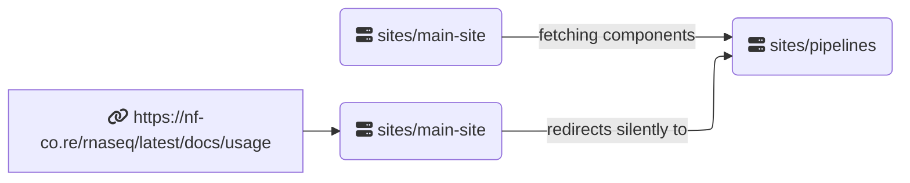

import subsites from "@assets/images/blog/new-website-structure/sub-site-meme.png";
import horsesizedduck from "@assets/images/blog/new-website-structure/horse-sized-duck.jpg";
import harderstronger from "@assets/images/blog/new-website-structure/harder-stronger.gif";
import { Image } from "astro:assets";

# Build big

Nearly two years ago we rebuilt the nf-core website from the ground up with [Astro](https://astro.build/). The website is now comprised of over 6500 pages, featuring content for every pipeline release as well as blog posts, documentation, events and more. All these pages are built and deployed to the live server twice a day, in addition to building previews for every pull request against the main branch. The build process has become longer and longer as the site grows, eventually took over 10 minutes. We could reduce the build time a bit, but more than 5 minutes is an annoyingly long time to wait for a deployment preview, and also a waste a lot of resources when the majority of pages are unchanged.

# Divide and conquer

To address this problem, we came up with a new website structure that will allow us to build the website in a more
modular way. We landed on a monorepo/microsite structure.

<Image
    src={horsesizedduck}
    class="d-block m-auto mb-2"
    width={400}
    density={[1.5, 2]}
    alt="a drawing of a large duck standing next to several tiny horses and the word 'vs' in-between.
    The duck has the title 'old website structure' and the horses have the title 'new structure'."
/>

The term "monorepo" typically refers to a setup where multiple code bases coexist within a single repository. We chose to divide our website into several segments, focusing on those that frequently change and operate independently from the rest.

The website is now really five separate websites:

- [main-site](https://github.com/nf-core/website/tree/main/sites/main-site)
- [pipelines](https://github.com/nf-core/website/tree/main/sites/pipelines)
- [modules and subworkflows](https://github.com/nf-core/website/tree/main/sites/modules-subworkflows)
- [documentation](https://github.com/nf-core/website/tree/main/sites/docs)
- [configs](https://github.com/nf-core/website/tree/main/sites/configs)

These are hosted in separate Netlify deployments which are stitched together with redirect rules. To the end user the experience is the same, but the build steps can now be handled independently from one another.

Finally, we separated the [pipeline results](https://github.com/nf-core/website/tree/main/sites/pipeline-results) pages, which are server-side rendered per request instead of being generated during the build step like the rest of the pages.

<Image
    src={subsites}
    class="d-block m-auto mb-2"
    width={400}
    density={[1.5, 2]}
    alt="Three headed dragon meme cartoon, with the title 'nf-co.re sub-sites'. The left head looks angry and has the title 'pipelines', the second head has the title 'docs' and looks stern at the third head, which looks very goofy and has the title 'pipeline-results'."
/>

# Results: build fast

The results speak for themselves. This plot shows the build times for each sub-site, compared to the old site structure:

```mermaid
---
config:
    xyChart:
        width: 1000
        height: 600
    themeVariables:
        xyChart:
            plotColorPalette: '#495057,#1a9655'
            backgroundColor: 'transparent'
---
xychart-beta
    x-axis "sites" ["old structure", "sites/configs", "sites/docs", "sites/main-sites", "sites/pipelines", "sites/pipelin-releases"]
    y-axis "average build times [in minutes]" 0.5 --> 10
    bar [8, 0.85, 1.5, 1.85, 4.3, 1.5]
    bar [0, 0.85, 1.5, 1.85, 4.3, 1.5]
```



Whilst the total build time is about the same, each sub-site now only builds when needed, and can run in parallel. The end result is that developers only need to wait for a fraction of the time to see their deployment previews.

# Technical setup

We are using [npm workspaces](https://docs.npmjs.com/cli/v7/using-npm/workspaces) to handle the dependencies in our monorepo structure.
We tried [pnpm](https://pnpm.io/) which should be even faster and better optimised for this task, but never got it to run
completely, whilst _npm workspaces_ worked out of the box.

Every sub-site is a complete Astro project with its own `astro.config.mjs` and `package.json`,
but the components and layouts are shared.
We accomplished this by keeping them in `sites/main-site/src` and setting aliases for the relative links
to `sites/main-site` in the respective sub-sites. This kept the required code changes to a minimum.

Even though each of these sub-sites are their own entity on our host Netlify, they are all reachable under
the same `nf-co.re` domain. This is achieved by setting up a redirect rules with a `200` redirect status,
which is a silent redirect, meaning the URL in the browser does not change.

Data flow for a request to the homepage:


Data flow between sub-sites for a request to a pipeline page:



# Changes to the development workflow

All npm commands now should specify the workspace they are run with.
Instead of running the development server with `npm run dev{:bash}` you need to now run it for a specific sub-site.

For example, to see the changes to a blog entry, you should now run:

```bash
npm run dev -w sites/main-sites
```

:::warn
Be aware that pages not part of these sub-site will throw a 404 error.
This only happens when previewing a single sub-site and should not happen on the final built website.
:::

# Additional Changes

We couldn't update to Astro 4 with the old website structure, because it increased the build time to > 20 minutes leading to a timeout on netlify. With the new structure, we are now able to use newer Astro versions and benefit from the new features and optimizations, including [content collection caching](https://astro.build/blog/astro-350/#content-collections-build-cache-experimental), decreasing the build time for repeated builds even more.

<Image
    src={harderstronger}
    class="d-block m-auto mb-2"
    width={600}
    density={[1.5, 2]}
    alt="Flashing words from the Lyrics of Daft Punk's 'Harder, Better, Faster, Stronger' on a black background. The words are 'Work it harder, make it better, do it faster, makes us stronger, more than ever, hour after hour, work is never over.'"
/>
