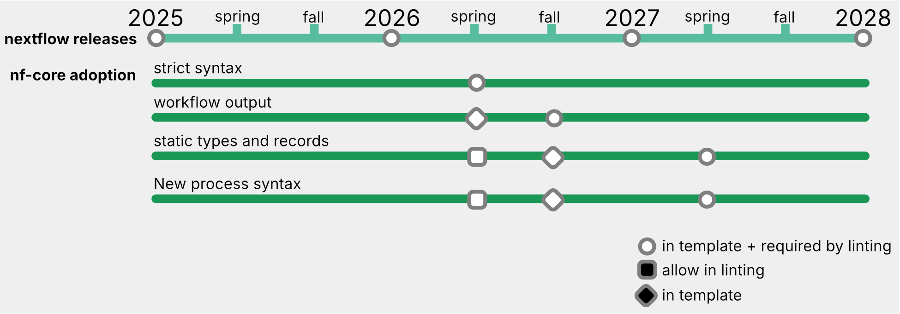

## Upcoming changes to Nextflow syntax

During the Nextflow Summit 2025, Ben Sherman introduced all the changes that are comming to Nextflow with the next versions.
There is also a [Nextflow blogpost](https://seqera.io/blog/nextflow-updates-strict-syntax-data-lineage/) talking about the changes that we will start seeing within the next Nextflow releases.

As always, in nf-core, we try to keep up-to-date with the latest Nextflow features and standards.
For this reason, we have thought of the best way to deliver all these goodies to all our nf-core pipelines through template updates,
but making it as easy as possible for pipeline maintainers to adopt them.

## nf-core syntax adoption

The syntax changes will be introduced into Nextflow gradually, and we will do so in nf-core:

For every one of the changes, we will wait until the following release to adopt the changes in nf-core.

1. First, we will allow the new functionalities in the pipeline template, and nf-core linting will warn you if you are using the old syntax (without failing!).
2. Then, we will switch linting to a failure for old Nextflow syntax, making it mandatory to update your pipeline to the new one.

Here is a detailed roadmap of the incoming changes:

These are the changes that will be (or have been) included in each Nextflow version:

- Nextflow v25.04:
  - topic channels
  - workflow outputs (preview)
- Nextflow v25.10:
  - workflow params
  - workflow outputs
  - workflow `onComplete:` and `onError:` section
  - type annotations
  - typed process inputs/outputs
- Nextflow v26.04:
  - record types
  - dataflow
  - typed processes
  - strict type checking

In nf-core, we will adopt these changes in the following timeline:

- 4th quarter 2025:
  - Topic channels are allowed (nf-core tools version 3.5.0 released in November 2025)
- 2nd quarter 2026:
  - Topic channels are mandatory
  - Strict syntax is mandatory
  - Static types and records are allowed
  - New process syntax is allowed
- 4th quarter 2026:
  - Static types and records are added to the pipeline template
  - New process syntax is added to the pipeline template
- 2nd quarter 2027:
  - Static types and records are mandatory
  - New process syntax is mandatory

## How to adopt all these changes in a pipeline

In order to make it easier for maintainers to adopt Nextflow syntax changes,
we have implemented a couple of new changes to the pipeline template sync process:

1. The template sync PRs that are opened to pipeline repositories with every new nf-core/tools will remain open,
   even if a new tools release is made.
   - This will allow you to choose if you want to add these changes one at a time,
     or wait until you receive multiple tools releases and do a single template update in bulk.
   - We recommend that you keep up to date with template updates,
     to have smaller changes and make the update and review process smother.
2. All sync PRs will include a direct link to the nf-core/tools release blog post.
   - This blog posts include a description of the changes made in this release,
     and a list of tips on how to implemente these changes to your pipeline,
     as well as guidance on how to resolve merge conflicts.

## Where to ask for help

See the following links to learn more or get help with these updates:

- The [nf-core blog post](https://nf-co.re/blog) for each tools release
- The [Nextflow documentation](https://www.nextflow.io/docs/latest/strict-syntax.html)
- The [nf-core help desk hours](https://nf-co.re/blog/2024/helpdesk)
- The [nf-core bytesize talks](https://nf-co.re/events/bytesize)
- The [nf-core slack](https://nf-co.re/join) or [Seqera community](https://community.seqera.io/)
