import { Image } from "astro:assets";
import aifur from "@assets/images/blog/retreat-2025/aifur.jpeg";

Between September 22nd and 26th, the [nf-core core team](https://nf-co.re/governance#core-team) gathered in Stockholm to tackle the big questions facing our growing community.
Over four days, we worked through challenges around scaling, developer experience, and sustainability, and came away with a clear set of priorities for the year ahead.

:::tip{title="TLDR;"}

- Get help writing grants for nf-core work! Join the new [`#grants`](https://nfcore.slack.com/archives/C09JX8L2L5V) Slack channel.
- Pipeline-release PR review requirements dropping to 1 core/maintainer.
- More emphasis on adherence to PR best practices.
- New nf-core governance team: 📚 Documentation! 🎉 Join [`#team-docs`](https://nfcore.slack.com/archives/C09H9L3R614) to get involved.
  :::

# What did we talk about?

We covered a wide range of topics during the retreat, from governance structure and hackathon strategy to documentation overhaul and technical infrastructure.
Here are the key topics we discussed and the initiatives we're launching as a result.

## Governance and teams

As nf-core continues to grow, we need to distribute responsibilities more effectively. We discussed team functions and identified new members to join existing teams, with a particular focus on bringing in contributors from regions underrepresented in the community. We're also establishing an on-call process for core team members to ensure better response times and clearer ownership of ongoing tasks. Spreading the workload more evenly creates more opportunities for upskilling and community leadership across a truly global team, particularly important as we continue to scale.

:::success{.fa-hand-wave title="New team members"}
We would like to welcome [Kurayi](https://github.com/KurayiChawatama) to the outreach team, and [Kübra](https://github.com/kubranarci), [Arthur](https://github.com/awgymer), and [Jim](https://github.com/prototaxites) to the maintainers team!
:::

One major outcome from these discussions was the creation of a new documentation team.
Community feedback made it clear that our documentation is a significant pain point, and we need a dedicated initiative to address this properly. You can read more about the team's mission and the plans for [Documentation: v2](#documentation-v2) below.

```mermaid
flowchart BT
    core --> steering
    infrastructure --> core
    outreach --> core
    maintainers --> core
    safety --> steering
    documentation[documentation ⭐ NEW] --> core

    style documentation fill:#22ae6340,stroke:#22ae63,stroke-width:2px
```

## Documentation: v2

Survey results and community feedback made it clear, our documentation needs work. People told us it's hard to find, sometimes unclear, and occasionally outdated.

We're establishing [`#team-docs`](https://nfcore.slack.com/archives/C09H9L3R614) with a mandate to rebuild our docs from the ground up. This v2 docs project will implement a style guide, create a more effective structure, write new content while selectively migrating existing pages, and explore versioning (e.g., for component specifications) and automation options.

The result will be documentation that's easier to find, more consistent and readable, creates a lower barrier to entry for new users, and provides more stability for experts. This will provide clear answers to common questions and free up our Slack community for more nuanced and/or technical questions and discussions (and memes).

See [Documentation](https://nf-co.re/governance#documentation) for more information about the team.

:::success{.fa-hand-wave title="Join the team!"}
We are actively looking for new documentation team members. Join [`#team-docs`](https://nfcore.slack.com/archives/C09H9L3R614) and reach out to Chris and James to find out more.
:::

## Improving review and development practices

Reviews are critical for maintaining quality, but we've heard your frustration. Overwhelmingly large PRs and multiple rounds of review can slow things down, and reviews often fall on the same people.

We're making several key changes, including:

- Reducing the requirements for pipeline release reviews from two reviewers to one (core team member or maintainer).
- Promoting [conventional](https://www.conventionalcommits.org/en/v1.0.0/) PR titles to enable automated changelogs.
- Adding more release automations.
- Adding CI warnings for excessively large PRs.

These changes will hopefully enable faster development cycles and quicker releases, allowing improvements to reach users more quickly. Review work will be more appealing, distributed more equitably across the community, helping to prevent burnout and ensure a fair workload distribution. New contributors will find it easier to get started and see their contributions merged, while we maintain the quality standards that make nf-core pipelines trustworthy.

See the full [RFC](https://github.com/nf-core/proposals/issues/85) for more information.

:::success{.fa-face-smile title="Thanks"}
A special thank you to Johan Dahlberg from Pixelgen for joining us for these discussions.
:::

## Very Important Pipelines (VIPs)

Some nf-core pipelines address urgent scientific needs and, through sheer popularity, reach a scale where a single maintainer or small team struggles to keep up. We developed the concept of 'VIPs' _(very important pipelines)_, pipelines that adopt team-based development practices, including co-developers, regular development meetings, and documented collaborative maintenance processes.

We're developing guidance for these practices and will reach out to maintainers of widely used pipelines to suggest adopting them. This approach reduces the burden on individual maintainers, creates more sustainable development of critical pipelines, and lowers the bus factor for important infrastructure.

See the full [RFC](https://github.com/nf-core/proposals/issues/89) for more information.

## Setting clearer pipeline development expectations

Several pipeline proposals are getting stuck in review, and some pipelines have gone silent with unclear progress. Whilst people's intentions are unfailingly good, this can have a detrimental effect, as it blocks others from starting a similar pipeline under their own steam.

Pipeline proposals will soon require two new components: a description of the MVP (Minimal Viable Pipeline) and a development plan with defined milestones. The idea of the MVP is to describe the smallest and simplest version that can be released initially, and the development plan puts that in the bigger picture. These requirements help developers release their first version quickly and prevent pipelines from stalling during extended development periods. Starting with smaller initial releases and providing regular updates also makes the review process faster and easier for both developers and reviewers.

## Infrastructure roadmap

The infrastructure team has an ambitious [roadmap](https://github.com/orgs/nf-core/projects/73) for the coming year. Key projects include:

- A new locally-running [schema builder](https://github.com/nextflow-io/schema-builder) with improved privacy.
- A [config builder](https://github.com/nf-core/tools/issues/2731).
- Progressive Nextflow syntax adoption (see below).
- Migration to Seqera Containers across modules (see Migration from Biocontainers to Seqera Containers: [Part 1](https://nf-co.re/blog/2024/seqera-containers-part-1) and [Part 2](https://nf-co.re/blog/2024/seqera-containers-part-2) for details).
- Expanding Pulumi automation for infrastructure and [nf-core operations](https://github.com/nf-core/ops).
- Adding [`nf-prov`](https://registry.nextflow.io/plugins/nf-prov) and [`nf-co2footprint`](https://registry.nextflow.io/plugins/nf-co2footprint) tracking to the pipeline template.
- Battle-testing template updates with volunteer pipelines before wide deployment ⚔️

These improvements will deliver better tooling, clearer migration paths for new features, more reliable infrastructure, and reduced friction when updating templates.

## Adopting new Nextflow syntax

Nextflow is evolving, and we need to strike a balance between timely adoption and not changing requirements too frequently.

To manage this, we've developed a phased rollout plan:

- In October 2025, we'll start to introduce topics for modules and pipelines and strict syntax for modules.
- In March 2026, we'll start to introduce strict syntax for pipelines with workflow outputs and inputs.
- In March 2027, we'll start to introduce static types with the new process syntax.

We'll communicate these changes clearly through blog posts and documentation well in advance. This approach gives visibility into what's changing and when, allowing time to adapt without feeling rushed, while also offering the option to jump ahead with an all-in-one migration.

## Making it easier to ask for help

We've heard from some people that they're able to contribute time, but it comes in short bursts.
They want to contribute, but can't sign up for long-term maintenance.

To help these individuals contribute to nf-core, we're developing an issue template that pipeline maintainers can use specifically for requesting assistance from others, such as for pipeline “stretch goals” or relatively standalone maintenance tasks.

We'll also be looking to better document the various ways people can contribute their time and expertise to nf-core, and exploring AI to facilitate better, more descriptive issue generation.
Taken together, we hope that these efforts will create better visibility of where help is needed, making it easier to match contributors with appropriate tasks, and ensuring that we maintain quality standards while welcoming contributions from anyone with the skills and time to help.

## Funding and grants

There are funding opportunities available for open-source projects, but it's not always clear how to access them to support nf-core activities. We want to empower community members to apply for grants to dedicate focused work to and with nf-core, and support them in doing so.

To this end, we're adding community guidance for applying for grants related to nf-core, including relevant boilerplate stats and text for applications. We are also creating a new [`#grants`](https://nfcore.slack.com/archives/C09JX8L2L5V) Slack channel for funding support, discussions, coordination, and identifying cross-community collaboration opportunities. This creates easier access to funding opportunities and a stronger, more visible community.

# Looking Ahead

These four days in Stockholm were incredibly productive, and we're excited about the changes coming to nf-core. Every initiative we discussed was driven by one goal: making nf-core better for everyone — whether you're a new user trying to run your first pipeline, a developer contributing modules, or a maintainer shepherding a large project.

Stay tuned to the [`#announcements`](https://nfcore.slack.com/archives/CE6P95170) channel in Slack and the blog for updates as these initiatives roll out. And as always, feel free to reach out and thank you to everyone who contributes to making nf-core what it is.

<Image src={aifur} alt="Much fun was had at the viking-themed restaurant Aifur in Stockholm." />

And yes, we maintained the Stockholm tradition of visiting the viking-themed restaurant Aifur. Much planning and some silliness ensued.
