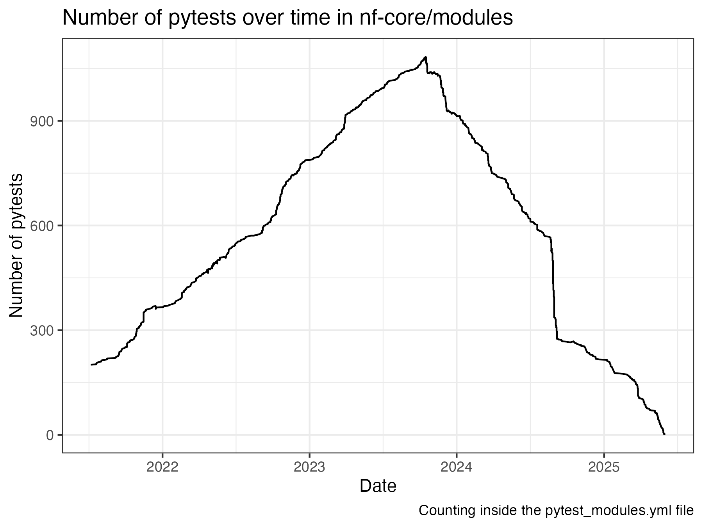

## From pytest to nf-test: a journey toward native testing

Over the past few years, the nf-core community undertook a major effort: migrating all module and subworkflow tests from the Python-based **pytest** framework to the Groovy-based **nf-test** framework. This transition marks a significant improvement in test coverage, reproducibility, and consistency across the entire nf-core ecosystem.

This post celebrates not only the technical achievement but also the incredible collaborative work of the global nf-core community in making this transition a reality. It also reveals that some of us find it easier to spend the time doing this kind of thing, rather than actually posting about it, as this blog post is a long time in the writing.

## Why such a migration

Originally, module tests in nf-core were implemented using pytest, while pipeline-level tests used Nextflow test profiles. This approach worked but came with challenges:

- Different testing frameworks for modules, subworkflows, and pipelines
- Limited ability to test output content reproducibly, checking only md5sums (if the file is stable) or file names
- Separated architecture for test and component code

With the introduction of [nf-test](https://www.nf-test.com/), developed by Lukas Forer and Sebastian Schönherr, a new opportunity emerged: a unified testing framework for all Nextflow components — from functions to full pipelines — using a Groovy-based DSL closely aligned with Nextflow itself. We were excited to start using this in the nf-core/modules repository.

## A massive effort: migration by the numbers

The [first module migration was](https://github.com/nf-core/modules/pull/3938) in October 2023, and we started the process.

At this point, there were over 937 modules/subworkflows in the nf-core/modules repository. Two and a half years later, the [last subworkflow was migrated](https://github.com/nf-core/modules/pull/8962) and the modules repository is now nf-test only!

This plot shows the number of pytests present (data taken from the git history of the `tests/config/pytest_modules.yml` file). You can see there were still new modules being added with pytests for a while:



## Initial steps

We started by manually adding nf-test for some modules, and developing some guidelines. This also included iterations with the nf-test developers to improve some features.
As with everything in nf-core, it required input from those developers of the `nf-core` tooling, to enable linting and adding to the new module template. This also included a

```bash
nf-core modules create <tool>/<subtool> --migrate-pytest
```

This command would create the files required, but not help swap the syntax of the tests themselves. This was helpful, but still a manual process for each module.

But the work continued, steadying migrating each module one at a time. Several nf-core hackathons came and went with groups working on the migration process.

## Automation


@GallVp created an excellent [`pytest2nf-test` tool](https://github.com/GallVp/pytest2nf-test) which automated a lot of the heavy lifting. For modules which didn't use another module in their test setup, this was able to automate the entire process. @GallVp therefore managed over 250 modules within a couple of weeks, with the main limit being as much on the review process as the PRs kept rolling in.

However, there were still another bunch of modules which were using another module in their setup block. These needed some manual work, although @LouisLeNezet did later modify the pytest2nf-test tool to be able to handle single tool setups.

## The Final Push

The March 2025 nf-core hackathon had nf-test conversion as a major part, with a big push to finish the conversion.
Then in the next few months the remaining modules were finished, particularly those were failing for whatever reason.
This was finished in June 2025, with one subworkflow remaining due to questions on its functionality.
That [final subworkflow was removed](https://github.com/nf-core/modules/pull/8962) in January 2026, along with all the remnants of pytest within the nf-core repository.

This was not the work of one person or even one team — it was a global collaboration. Contributions came from maintainers, pipeline developers, new contributors and hackathon participants, and from all over the world.

## Challenges ahead

The focus now shifts to:

- Moving to topics channel for versions emission (a current goal!)
- Ensuring all modules have a `stub`
- Fixing all nextflow linting
- Improving the support for different file formats (e.g. bam, vcf, ...)
 - Establishing record types
- Expanding the features and ensuring the longevity of `nf-test`
- Adding nf-tests to pipelines

## Acknowledgements

This achievement would not have been possible without the commitment of nf-core contributors around the world.

Special thanks to the following top contributors who helped migrate at least 10 modules (note this table is based on who opened the PR, some PRs may have been finished off by someone else):

| Author | Modules Migrated
| Usman Rashid | 285
| Louis Le Nézet | 105
| Simon Pearce | 84
| Nicolas Vannieuwkerke | 51
| Sateesh Peri | 42
| Famke Bäuerle | 40
| Maxime U Garcia | 30
| James A. Fellows Yates | 29
| Matthias De Smet | 28
| Jose Espinosa-Carrasco | 22
| Edmund Miller | 21
| Joon Klaps | 21
| Jasmin Frangenberg | 17
| Damon-Lee Pointon | 14
| Evangelos Karatzas | 13
| Felix Lenner | 13
| Ramprasad Neethiraj | 13
| Jim Downie | 11
| Jonathan Manning | 11
| Koen Bossers | 11
| Simon Heumos | 11
| Carson J Miller | 10
| Kübra Narcı | 10
