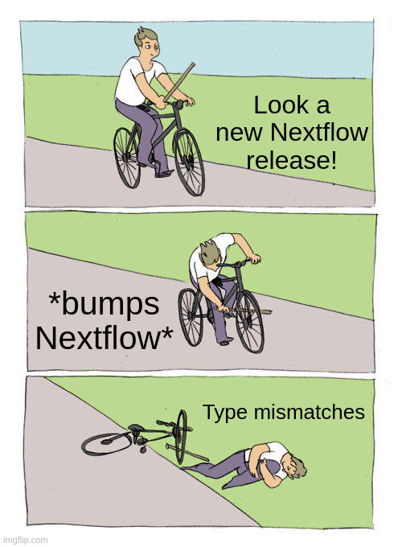
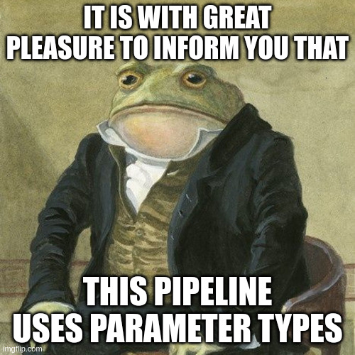

## Introduction

With the release of Nextflow 26.04.0, the default syntax parser has been set to v2. The new syntax parser will make it easier for Nextflow to throw useful errors whenever something breaks in your pipeline. Naturally with any change of this magnitude, stuff will start breaking. One of the most common issues reported in the last couple of weeks is that boolean parameters are suddenly only recognized as string values. In this blog post I will go over some ways to overcome this issue, from simple plugin updates to full parameter typing.



## Background

In syntax parser v1, Nextflow would automatically infer the type of all parameters given via the CLI. For example:

- `--answer_to_everything 42{:bash}` will result in `params.answer_to_everything` to be an integer
- `--am_i_a_teapot false{:bash}` will result in `params.am_i_a_teapot` to be a boolean
- `--hotel trivago{:bash}` will result in `params.hotel` to be a string

In syntax parser v2, this system has been removed and all parameters given via the CLI are now always string values. This is causing some unexpected behaviour in pipelines (especially when using type validation in nf-schema for example). The following error is thus quite common after updating Nextflow to 26.04.0 or higher:

```bash
* --am_i_a_teapot (false): Value is [string] but should be [boolean]
```

## What to do as a pipeline user

As a user you have two options to mitigate the error when bumping Nextflow versions:

### Stop using CLI parameters

The best option as a pipeline user is to not pass any parameters to Nextflow via the CLI, but use a parameters file instead. A parameters file is a JSON or YAML file in which you can specify the parameters to be used by the pipeline. These files have support for simple types (strings, integers, booleans, floats...), thus making sure that Nextflow uses the expected types out of the box.

For example:

```yml title="params.yml"
answer_to_everything: 42,
am_i_a_teapot: false,
hotel: "trivago",
```

This file can then be used with `nextflow run .  -params-file params.yml {:bash}`.

You can read more about the parameters file in the [Nextflow documentation](https://docs.seqera.io/nextflow/cli#pipeline-parameters).

### Bump nf-schema

nf-schema 2.7.2 and higher automatically converts CLI parameters to their correct types as it used to be in syntax parser v1. Keep in mind however that this conversion will only happen inside `validateParameters()` during validation. This function does not write the coerced values back into params. After validation, `params.my_int` is still the string "42", not the integer 42. Code that does arithmetic on `params.my_int`, or relies on `params.my_bool` being a real boolean in a Groovy truthiness check, will still misbehave under syntax parser v2. The nf-schema plugin catches schema violations for you, but it does not restore the old auto-typing of params.

You can bump the plugin via a configuration file:

```groovy title="nextflow.config"
plugins {
    id 'nf-schema@2.7.2'
}
```

or via the CLI with the following option:

```bash
nextflow run . -plugins nf-schema@2.7.2
```

## What to do as a pipeline developer

As a developer you can migrate your pipeline to start using [parameter types](https://docs.seqera.io/nextflow/workflow-typed#typed-parameters). Follow these steps to get an overview of how to do the migration:

1. Open your pipeline directory in VS Code or similar.
1. Make sure the [Nextflow extension](https://marketplace.visualstudio.com/items?itemName=nextflow.nextflow) is installed
1. Open the `main.nf` file located in the root of the repository
1. Open the command options (<kbd>CTRL</kbd>+<kbd>SHIFT</kbd>+<kbd>P</kbd> or <kbd>CMD</kbd>+<kbd>SHIFT</kbd>+<kbd>P</kbd> for macOS users), search for the `Nextflow: Convert script to static types` options and run it. This will create a `params` block with all types inferred from the `nextflow_schema.json` file
1. Check that all types are correct and that all defaults have been correctly filled in. Boolean values don't need a default as missing booleans will always be `false`.
1. Optionally: Convert the type of all file parameters from `String` to `Path` to let Nextflow automatically convert these parameters to file objects (This will probably need some tweaking in your pipeline code to remove unnecessary `file()` functions).
1. Make sure all parameters without a default that are optional have a `?` after the type. e.g. for an optional string parameter you would use the `String?` type if it has no default value. This will automatically assign `null` to that parameter.
1. Remove all parameters that are not used in configs or to define defaults for other parameters from the `nextflow.config` file. Read more about this in the following [section](#remove-parameters-from-nextflowconfig).
1. Bump the minimal Nextflow version of the pipeline to 26.04.0 using `nf-core pipelines bump-version --nextflow 26.04.0{:bash}`

Ideally, the conversion is done now and your pipeline will be fully working again when users use the syntax parser v2. There are, however, some caveats that you will need to take into account to make sure everything works as expected. The following sections explain these caveats and how to resolve them.

### StackoverflowError

When using the `Path` type, you will most likely start seeing a `StackoverflowError` when running your pipeline after the initial conversion. This is caused by a bug in older versions of the nf-schema plugin and `utils_nextflow_pipeline` subworkflow. You can fix this issue by bumping nf-schema to 2.7.1 or higher and by updating the `utils_nextflow_pipeline` and `utils_nfschema_plugin` subworkflows:

```bash
nf-core subworkflows update utils_nextflow_pipeline
nf-core subworkflows update utils_nfschema_plugin
```

You will see that `utils_nfschema_plugin` has a new input called `cli_typecast`. Set this to `false` to make sure nf-schema no longer typecasts parameters given via the CLI.

This should resolve the Stackoverflow errors!

### Remove parameters from `nextflow.config`

All parameter defaults should be removed from the `nextflow.config` file with a few exceptions listed below:

:::note
Don't specify defaults in `main.nf` for these parameters since these will never be used.
:::

#### Parameters that are used for configuration options

These parameters should still be defined in `nextflow.config` as parameter types are only applied after configuration resolution.

This a non-exhaustive list of parameters that belong to this list. This depends a lot from pipeline to pipeline of course:

- `outdir`: used to define the `outputDir` option and set the output directory in `publishDir`
- `publish_dir_mode`: used to define the `workflow.output.mode` and `publishDir mode` options
- `pipelines_testdata_base_path`: used in profiles to define test data
- `trace_report_suffix`: used to define the name of the pipeline reports
- `config_profile_name`, `config_profile_description`, `config_profile_contact` and `config_profile_url`: used by institutional configs
- `custom_config_version` and `custom_config_base`: used to initialize institutional configs
- `igenomes_ignore`: used to fetch the `genomes` block
- `monochrome_logs`: used for the `validation.monochromeLogs` option

:::note
Parameters used for process configuration in `modules.config` should not have defaults in `nextflow.config` as these can be accessed during the pipeline run using closures (`{}`).
:::

#### Parameters that are used to define defaults for other parameters

These parameters need to be set before the params block in `main.nf` is resolved, otherwise all values will be `null`.

This is a non-exhaustive list of parameters that belong to this category. This will of course vary a lot from pipeline to pipeline:

- `igenomes_base`: used to set the base of the igenomes references
- `genome`: used to define from what organisms the igenome references should be used

### Suddenly I can't use igenomes references anymore

Support for nested parameters has been silently 'deprecated' with the introduction of parameter types. This issue can be resolved by migrating `genomes` parameter in `conf/igenomes.config` to a `Map` structure instead of using nested parameters. e.g.:

````groovy title="conf/igenomes.config"
params.genomes {
    'GRCh38' {
        fasta = "..."
        fai = "..."
    }
    'hg19' {
        fasta: "..."
        fai: "..."
    }
}

should become:

```groovy title="conf/igenomes.config"
params.genomes = [
    'GRCh38': [
        fasta: "...",
        fai: "..."
    ],
    'hg19': [
        fasta: "...",
        fai: "..."
    ]
]
````

### nf-core linting is complaining

The tooling does not officially support parameter types at the moment this article was written (tools version 4.0.2). Please check first if the latest available version of nf-core/tools already works with parameter types before implementing the following fix.

To fix the linting failures you need to entirely disable the linting for `nextflow.config` and `nextflow_schema.json`. This can be done by adding the following lines to the `.nf-core.yml` file in the root of the pipeline directory.

```yaml title=".nf-core.yml"
lint:
  nextflow_config: false # TODO: Remove when tools supports parameter types
  schema_params: false # TODO: Remove when tools supports parameter types
```

## Still having some issues?

Feel free to reach out on Slack in the [#help](https://nfcore.slack.com/channels/help) channel if something is still not working after this migration.

After all the hard work done migrating your pipeline to parameter types, you deserve a copy of this meme!


