import { YouTube } from "@astro-community/astro-embed-youtube";

Time for another release of nf-core/tools! The template updates for this release are rather small and mostly clean-ups, instead it focuses more on CLI improvements.

As always, if you have any problems or run into any bugs, reach out on the [#tools slack channel](https://nfcore.slack.com/channels/tools).

# Highlights

- [`nf-core modules containers create` command](#nf-core-modules-containers-create-command): Beta preview of a new command that should make creating Seqera containers for modules a breeze.
- [Faster CLI startup time](#faster-cli-startup-time): a simple `nf-core --help` should now print the result almost instantly.
- [pre-commit hook to avoid large files in your pipeline repos](#pre-commit-hook-to-avoid-large-files-in-your-pipeline-repos)

## `nf-core modules containers create{:bash}` command

Following in the path outlined in [the blog post about migrating modules to Seqera containers](https://nf-co.re/blog/2024/seqera-containers-part-2), we added a new set of sub-sub-commands:

| Command                            | Subcommand          | Aliases | Description                                                                                                                                     |
| ---------------------------------- | ------------------- | ------- | ----------------------------------------------------------------------------------------------------------------------------------------------- |
| `nf-core modules container{:bash}` | `create{:bash}`     | `c`     | Build docker and singularity container files for linux/arm64 and linux/amd64 with wave from `environment.yml` and create container config file. |
|                                    | `list{:bash}`       | `ls`    | Print containers defined in a module `meta.yml`.                                                                                                |
|                                    | `conda-lock{:bash}` |         | Build a Docker linux/arm64 container and fetch the conda lock file for a module.                                                                |

All the create command needs is a valid `environment.yml`. Using [wave](https://seqera.io/wave/) it then tries to create a docker and singularity containers in parallel, both for amd64 and arm64.
Additionally it will add the conda lock file to the module for increased reproducability even with conda.
The command also updates the `main.nf` accordingly and adds all the container information to the `meta.yml`, so that the auto-generated pipeline container configs released with nf-core/tools 4.0.0 pick them up correctly.

This logic is also included in `nf-core modules bump-version`, which now bumps the version of the tool in the `environment.yml` and then goes through the same steps as above to make sure all is in sync and you don't need to fiddle with any CLI or web GUI to get all the right URLs for your container definitions.

This feature touches many things, we therefor decided to be a bit more careful and just release it as a beta for now, to make it clear that it isn't 100% waterproof yet.
We tested it already with different scenarios (e.g. bumping all samtools modules at once with `nf-core m bump samtools` without any problem), but there are many edge cases we still want to test out.

If you find any bugs, please report them in the [#tools](https://nfcore.slack.com/archives/CE5LG7WMB) channel on Slack.

## Faster CLI startup time

So, we rewrote the CLI in Rust and now everything is faster.

Just joking.

Turns out, we wasted a lot of CPU time on loading unneeded modules and similar things with every command.
By moving things around cleverly, we got an ~7x speedup for the initial CLI startup (just running any commands with `--help`).

<div class="d-flex gap-4 justify-content-center font-monospace">
    <span>
        <span class="d-inline-block bg-primary rounded-1 me-2" style="width: 10px; height: 10px;"></span>4.0.0
    </span>
    <span>
        <span class="d-inline-block bg-success rounded-1 me-2" style="width: 10px; height: 10px;"></span>4.1.0
    </span>
</div>



```mermaid
---
config:
  fontFamily: var(--bs-font-monospace)
  themeVariables:
    xyChart:
      plotColorPalette: "var(--bs-primary), var(--bs-success)"
  xyChart:
    chartOrientation: horizontal
    height: 200
---
xychart-beta
    x-axis ["nf-core --help", "nf-core pipelines --help", "nf-core modules --help"]
    y-axis "Time [ms]" 0 --> 650
    bar "4.0.0" [640.7, 641.0, 644.1]
    bar "4.1.0" [89.3, 89.5, 95.0]
```

Heavier commands (real work, not just import cost):

```mermaid
---
config:
  fontFamily: var(--bs-font-monospace)
  themeVariables:
    xyChart:
      plotColorPalette: "var(--bs-primary), var(--bs-success)"
      background: var(--bs-body-bg)

  xyChart:
    chartOrientation: horizontal
    height: 200
---
xychart-beta
    x-axis ["nf-core pipelines create", "nf-core modules install", "nf-core schema lint"]
    y-axis "Time [ms]" 0 --> 9000
    bar "4.0.0" [713.0, 8790, 661.8]
    bar "4.1.0" [563.4, 3170, 228.8]

```



To keep track that we don't move backwards again with this, we added [Codspeed benchmarks](https://app.codspeed.io/nf-core/tools) to our GitHub workflow.
With this we will also look into squeezing out more time improvements from more complex commands.

## Miscellaneous

### pre-commit hook to avoid large files in your pipeline repos

[@MatthiasZepper](https://github.com/MatthiasZepper) noticed that pipeline run outputs kept accidentally ending up in repositories, so he added a new pre-commit hook that stops large files from being committed to your pipeline repo.

### direct links to lint test documentation

We restructured out [module and subworkflow lint documentation](https://nf-co.re/docs/nf-core-tools/api_reference/4.1.0/module_lint_tests/environment_yml), so that you can click on the test names in the CLI log and directly get to the lint documentation for the specific test.

# Changelog

You can find the complete changelog and technical details [on GitHub](https://github.com/nf-core/tools/releases/tag/4.1.0).

# How to resolve common merge conflicts on pipeline sync PRs

All the template changes are listed in [the Template section of the changelog](https://github.com/nf-core/tools/releases/tag/4.0.0).
Below, we have collected the most common merge conflicts that you may find and how to resolve them.

## `subworkflows/local/utils_nfcore_demo_pipeline/main.nf`

The `UTILS_NFSCHEMA_PLUGIN` got a new argument to better handle typing issues with Nextflow 26.04.0 and later.

```diff title="subworkflows/local/utils_nfcore_demo_pipeline/main.nf"
 UTILS_NFSCHEMA_PLUGIN(
        workflow,
        validate_params,
        null,
        help,
        help_full,
        show_hidden,
        before_text,
        after_text,
        command,
+ <<<<<<< HEAD
+         false
+ =======
+ >>>>>>>
    )
```

#### Resolution:

Accept HEAD with `false` as the `use_typing` argument. Or set it to `true` if you are already supporting typing.

## `CHANGELOG.md`

We added a `TODO nf-core` comment to the title field in the `CHANGELOG.md` file, to avoid accidentally releasing without a date.

```diff title="CHANGELOG.md"
<<<<<<< HEAD
## v1.2.1dev - [unreleased<!-- TODO nf-core: replace with date on release -->]
=======
## v1.2.1dev - [unreleased]
```

#### Resolution

Keep dev version, but copy the TODO statement as a reminder
