import { YouTube } from "@astro-community/astro-embed-youtube";

Time for another release of nf-core/tools! The template updates for this release are rather small and mostly clean-ups, instead it focuses more on CLI improvements.

As always, if you have any problems or run into any bugs, reach out on the [#tools slack channel](https://nfcore.slack.com/channels/tools).

# Highlights

- [`nf-core modules containers create` command](#nf-core-modules-containers-create-command): Beta preview of a new command that should make creating Seqera containers for modules a breeze.
- [Faster CLI startup time](#faster-cli-startup-time): a simple `nf-core --help` should now print the result almost instantly.

## `nf-core modules containers create{:bash}` command

Following in the path outlined in [the blog post about migrating modules to Seqera containers](https://nf-co.re/blog/2024/seqera-containers-part-2), we added a new set of sub-sub-commands:

nf-core m container

| Command                            | Subcommand          | Aliases | Description                                                                                                                                     |
| ---------------------------------- | ------------------- | ------- | ----------------------------------------------------------------------------------------------------------------------------------------------- |
| `nf-core modules container{:bash}` | `conda-lock{:bash}` |         | Build a Docker linux/arm64 container and fetch the conda lock file for a module.                                                                |
|                                    | `create{:bash}`     | `c`     | Build docker and singularity container files for linux/arm64 and linux/amd64 with wave from `environment.yml` and create container config file. |
|                                    | `list{:bash}`       | `ls`    | Print containers defined in a module `meta.yml`.                                                                                                |

## Faster CLI startup time

So, we rewrote the CLI in Rust and now everything is faster.

Just joking.

Turns out, we wasted a lot of CPU time on loading unneeded modules and similar things with every command.
By moving things around cleverly, we got an ~7x speedup for the initial CLI startup (just running any commands with `--help`).

    
        4.0.0
    
    
        4.1.0
    

```mermaid
---
config:
  fontFamily: var(--bs-font-monospace)
  themeVariables:
    xyChart:
      plotColorPalette: "var(--bs-primary), var(--bs-success)"
  xyChart:
    chartOrientation: horizontal
    height: 200
---
xychart-beta
    x-axis ["nf-core --help", "nf-core pipelines --help", "nf-core modules --help"]
    y-axis "Time [ms]" 0 --> 650
    bar "4.0.0" [640.7, 641.0, 644.1]
    bar "4.1.0" [89.3, 89.5, 95.0]
```

Heavier commands (real work, not just import cost):

```mermaid
---
config:
  fontFamily: var(--bs-font-monospace)
  themeVariables:
    xyChart:
      plotColorPalette: "var(--bs-primary), var(--bs-success)"
      background: var(--bs-body-bg)

  xyChart:
    chartOrientation: horizontal
    height: 200
---
xychart-beta
    x-axis ["nf-core pipelines create", "nf-core modules install", "nf-core schema lint"]
    y-axis "Time [ms]" 0 --> 9000
    bar "4.0.0" [713.0, 8790, 661.8]
    bar "4.1.0" [563.4, 3170, 228.8]

```

To keep track that we don't move backwards again with this, we added [Codspeed benchmarks](https://app.codspeed.io/nf-core/tools) to our GitHub workflow.
With this we will also look into squeezing out more time improvements from more complex commands.

# Changelog

You can find the complete changelog and technical details [on GitHub](https://github.com/nf-core/tools/releases/tag/4.1.0).
