import { YouTube } from "@astro-community/astro-embed-youtube";

Time for another release of nf-core/tools! The template updates for this release are rather small and mostly clean-ups, instead it focuses more on CLI improvements.

As always, if you have any problems or run into any bugs, reach out on the [#tools slack channel](https://nfcore.slack.com/channels/tools).

# Highlights

- [`nf-core modules containers create` command](#nf-core-modules-containers-create-command): Beta preview of a new command that should make creating Seqera containers for modules a breeze.
- [Faster CLI startup time](#faster-cli-startup-time): a simple `nf-core --help` should now print the result almost instantly.

## `nf-core modules containers create` command

Following in the path outlined in [the blog post about migrating modules to Seqera containers](https://nf-co.re/blog/2024/seqera-containers-part-2), we added a new set of sub-sub-commands:

nf-core m container

| Command                            | Subcommand          | Aliases | Description                                                                                                                                     |
| ---------------------------------- | ------------------- | ------- | ----------------------------------------------------------------------------------------------------------------------------------------------- |
| `nf-core modules container{:bash}` | `conda-lock{:bash}` |         | Build a Docker linux/arm64 container and fetch the conda lock file for a module.                                                                |
|                                    | `create{:bash}`     | `c`     | Build docker and singularity container files for linux/arm64 and linux/amd64 with wave from `environment.yml` and create container config file. |
|                                    | `list{:bash}`       | `ls`    | Print containers defined in a module `meta.yml`.                                                                                                |

## Faster CLI startup time

So, we rewrote the CLI in Rust and now everything is faster.

Just joking.

Turns out, we wasted a lot of CPU time on loading unneeded modules and similar things with every command.
By moving things around cleverly, we got an ~7x speedup for the initial CLI startup (just running any commands with `--help`).
Additionally, we also improved the startup time for

    
        4.0.0
    
    
        4.1.0
    

```mermaid
---
config:
  fontFamily: var(--bs-font-monospace)
  themeVariables:
    xyChart:
      plotColorPalette: "var(--bs-primary), var(--bs-success)"
  xyChart:
    chartOrientation: horizontal
    height: 200
---
xychart-beta
    x-axis ["nf-core --help", "nf-core pipelines --help", "nf-core modules --help"]
    y-axis "Time [ms]" 0 --> 650
    bar "4.0.0" [640.7, 641.0, 644.1]
    bar "4.1.0" [89.3, 89.5, 95.0]
```

Heavier commands (real work, not just import cost):

```mermaid
---
config:
  fontFamily: var(--bs-font-monospace)
  themeVariables:
    xyChart:
      plotColorPalette: "var(--bs-primary), var(--bs-success)"
      background: var(--bs-body-bg)

  xyChart:
    chartOrientation: horizontal
    height: 200
---
xychart-beta
    x-axis ["nf-core pipelines create", "nf-core modules install", "nf-core schema lint"]
    y-axis "Time [ms]" 0 --> 9000
    bar "4.0.0" [713.0, 8790, 661.8]
    bar "4.1.0" [563.4, 3170, 228.8]

```

# Changelog

You can find the complete changelog and technical details [on GitHub](https://github.com/nf-core/tools/releases/tag/4.0.0).

# How to resolve common merge conflicts on pipeline sync PRs

All the template changes are listed in [the Template section of the changelog](https://github.com/nf-core/tools/releases/tag/4.0.0).
Below, we have collected the most common merge conflicts that you may find and how to resolve them.

## CHANGELOG.md

#### Resolution

Nothing was really changed in the template. Just keep your existing version.

## .nf-core.yml

#### Changes

The `nf_core_version` field is updated to reflect the new template version. If your pipeline already carried a newer value (e.g. `3.5.2`) you will see a downward conflict from the template.

#### Resolution

Keep the higher `nf_core_version` value. Remove any duplicate keys from the file.

## README.md

#### Changes

The Nextflow and nf-core template version badges were updated to `25.10.4` and `4.0.1` respectively.

#### Resolution

Keep the newer values. If your pipeline already requires a newer Nextflow version, accept those and discard the older badge URLs from the template.

## assets/multiqc_config.yml

#### Changes

The `report_comment` string was reformatted from a multi-line YAML block scalar to a single-line string.

#### Resolution

Accept the template's single-line format. The content is identical; only the YAML line wrapping changed.

## .gitignore

#### Changes

The template added entries to ignore `.lineage/` directories.

#### Resolution

Accept both template changes and your own additions. You have to have your changes at the end of the file to keep `nf-core pipelines lint` happy (and avoid future merge conflicts).

## .github/workflows/nf-test.yml

#### Changes

- `NFT_VER` was bumped from `0.9.4`.

#### Resolution

Accept the template changes. If your pipeline already requires a higher nf-test version, keep the higher value.

## .github/workflows/awsfulltest.yml

#### Changes

The `seqeralabs/action-tower-launch` action reference was switched from a pinned commit hash to the semantic version tag `@v2` and the nf-slack plugin was added.

#### Resolution

Accept `@v2` from the template. Keep any pipeline-specific customisations to the Slack notification messages and `nextflow_config` block.

## nextflow.config

#### Changes

- In the `manifest` block, `nextflowVersion` was bumped to `'!>=25.10.4'`.

#### Resolution

Accept the new `modules_testdata_base_path` parameter and formatting. Keep the higher `nextflowVersion` value. Be sure to keep your `doi` entry, if you have one.

## ro-crate-metadata.json

#### Changes

Several fields are regenerated from pipeline and template state on every sync.

#### Resolution

Accept all changes from the template branch. The file is fully regenerated by `nf-core pipelines rocrate` and should not contain manual edits.

## modules.json

#### Changes

We updated FastQC and MultiQC to the latest versions in the template.

#### Resolution

Accept the updated sha sums for FastQC and MultiQC, if applicable. Keep your own changes to the file.

## docs/CONTRIBUTING.md

#### Changes

We moved CONTRIBUTING.md from `.github/CONTRIBUTING.md` to `docs/CONTRIBUTING.md` to make them more visible. It also includes the new [AI and LLM contribution guidelines](#ai-and-llm-contribution-guidelines).

#### Resolution

Keep the template version. Merge any pipeline-specific content from your own CONTRIBUTING.md into it.

## workflows/\*.nf — strict syntax process call formatting

#### Changes

The input channels of MultiQC have changed.

#### Resolution

Accept the new MultiQC input channel formatting, but keep your own channels etc.

## modules/nf-core/

#### Changes

We updated the included modules (FastQC and MultiQC) to the latest version.

#### Resolution

Accept all template changes.
