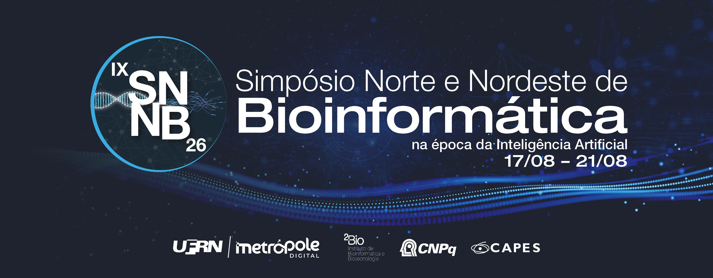

:::info{title="Language & Location Notice"}

Please note that this is an in-person event held in Brazil, designed for the local community. Consequently, all official information and registration materials are provided exclusively in Portuguese. We appreciate your understanding.

::::

# Bem-vindo(a)

Junte-se a nós **presencialmente de 15 a 16 de agosto de 2026** para mais um hackathon do nf-core! 🗓️

Este Hackathon irá ocorrer como parte do IX Simpósio Norte Nordeste de Bioinformática. Para saber mais sobre o evento, visite o site do evento [aqui](https://bioinfo.imd.ufrn.br/snnb).

:::info{title="Datas importantes"}

- **2 de julho de 2026**: Abertura das propostas de projetos
- **2 de julho de 2026**: Abertura das inscrições
- **15 a 16 de agosto de 2026**: Hackathon

## Formato: Presencial

Este hackathon segue o formato **presencial**.

:::warning{title="Importante: Escolhendo seu projeto"}

Existem projetos voltados para resolver tarefas do nf-core e projetos adaptados às necessidades de seus participantes.

**Participação nos projetos:**

- Os líderes dos projetos estarão presentes para ajudar você a se ambientar

**Ao escolher um projeto:**

- Encontre um projeto que seja interessante para você
- Sinta-se à vontade para criar o seu próprio se nada atender aos seus interesses

:::

# Mantendo-se Conectado

Existem algumas plataformas que você usará durante o hackathon:

## Slack

O Slack é nossa principal ferramenta de comunicação. Entre via [nf-co.re/join](https://nf-co.re/join) e certifique-se de estar nestes canais:

- [`#hackathon-aug-2026`](https://nfcore.slack.com/channels/hackathon-aug-2026) - Comunicação principal do hackathon
- [`#github-invitations`](https://nfcore.slack.com/channels/github-invitations) - Solicite acesso à organização do nf-core no GitHub

:::note{title="Fique online!"}
Mesmo estando presencialmente no evento, por favor, mantenha-se ativo no Slack. É onde toda a comunicação do projeto acontece e facilita para que outros acompanhem, pois as instruções para participar do teu projeto ficam disponíveis lá.
:::

# Inscrição

As inscrições para o hackathon estão abertas!
Veja abaixo ou [abra em uma nova aba](https://seqera.typeform.com/hacknatal2026).

    ..loading..

# Cronograma

Mantivemos a programação principal intencionalmente leve para acomodar diferentes projetos e permitir flexibilidade. Embora tenhamos alguns momentos-chave de sincronia e eventos sociais planejados, cada projeto pode estar seguindo suas próprias programações também. Adoraríamos ver o máximo de projetos participando dos resumos diários e no quiz — são ótimas oportunidades para se conectar, compartilhar progresso e se divertir.

- Resumo diário
    - 17h (GMT-3)
- Quiz social
    - Domingo, 16 de agosto, 13h GMT-3

# Como Funciona o Hackathon

## Fluxo de trabalho

1. **Escolha um projeto** - Navegue pelos projetos abaixo e encontre um que lhe interesse
2. **Entre no canal do Slack** - Diga olá, apresente-se, compartilhe seus objetivos
3. **Encontre uma tarefa** - Verifique o [quadro de projetos no GitHub](https://github.com/orgs/nf-core/projects/146/) para issues
4. **Atribua-se** - Reivindique a issue no GitHub (uma de cada vez para evitar duplicação de trabalho)
5. **Programe!** - Escreva código, converse com seu grupo, faça perguntas
6. **Abra um pull request** - Quando terminar, submeta suas alterações
7. **Comemore!** - Compartilhe seu progresso com seu grupo e no resumo diário

:::tip
Não se sinta preso a um único projeto — você pode transitar entre projetos durante o hackathon.
:::

## Para Líderes de Projeto

**Reuniões iniciais:** Grave um pequeno vídeo de introdução explicando os objetivos do seu projeto e publique no canal do Slack. Isso ajuda pessoas que entrarem depois a se atualizarem rapidamente.

**Resumos diários:** Prepare 1 slide por projeto com um resumo de alto nível, fotos ou memes (máximo de 1 minuto). Quanto mais engraçado, melhor! Publique memes em [`#nf-core-memes`](https://nfcore.slack.com/channels/nf-core-memes).

## Ferramentas de Colaboração

**Programação em par:** O VS Code Live Share permite que vocês programem juntos em tempo real — ótimo para começar ou resolver problemas complexos. [Obtenha a extensão](https://marketplace.visualstudio.com/items?itemName=MS-vsliveshare.vsliveshare).

**Revisões de pull request:** Precisa de uma revisão? Publique seu PR em [`#request-review`](https://nfcore.slack.com/channels/request-review) e encontre um "parceiro de revisão" para trocar revisões.

# Projetos

Trabalharemos em projetos durante o hackathon. Os projetos podem ser desde:

- Adicionar novas funcionalidades a pipelines existentes
- Adicionar e melhorar componentes (módulos / subworkflows)
- Melhorar o site e as ferramentas do nf-core
- Criar pipelines totalmente novos
- Discussão e planejamento de iniciativas da comunidade
- Trabalhar em tópicos de grupos de interesse especial
- _...qualquer outra coisa_

Você pode trazer seu próprio tópico favorito ou escolher a partir de uma lista de issues abertas na comunidade.
Cada projeto tem uma pessoa líder que pode orientá-lo na direção certa.

Se você estiver participando online, entre em contato com os líderes de projetos online.

## Submeta um projeto

Se você tem uma ideia para um projeto que acha que seria divertido de realizar durante o hackathon,
adicione-a ao site enviando um pull request para o repositório `nf-core/website`.

Você precisa adicionar um novo arquivo markdown ao diretório
[`sites/main-site/src/content/hackathon-projects/hackathon-august-2026`](https://github.com/nf-core/website/tree/main/sites/main-site/src/content/hackathon-projects/hackathon-august-2026).

Consulte os arquivos existentes como exemplos. Se tiver dúvidas, pergunte no Slack ou no pull request.

## Projetos registrados

Nenhum por hora. Volte mais tarde!

# Atividades Sociais

Durante o hackathon, teremos algumas brincadeiras e jogos leves para você participar!
Prêmios especiais estão disponíveis para os vencedores!

- **Caça ao tesouro** - Desafios postados em [`#hackathon-aug-2026-scavengerhunt`](https://nfcore.slack.com/channels/hackathon-aug-2026-scavengerhunt). Tire fotos criativas e publique-as no tópico!
- **Quiz online** - Quinta-feira, participe pelo Zoom para perguntas de múltipla escolha com tema nf-core. Responda pelo seu celular/notebook. Pessoas da região APAC: uma versão assíncrona será fornecida.
- **Jogo Connect** - Publique suas pontuações máximas em [`#connectgame`](https://nfcore.slack.com/channels/connectgame)

# Segurança & Etiqueta

- Pergunte antes de tirar prints ou fotos de pessoas
- Não troll
- Faça pausas!
- Revise e siga nosso [Código de Conduta](https://nf-co.re/code_of_conduct)

# Lista de verificação pré-hackathon

Certifique-se de ter lido/se inscrito/entrado/instalado os seguintes recursos antes do hackathon.

- [ ] Verifique se você concorda com o [Código de Conduta](https://nf-co.re/code_of_conduct) do evento
- [ ] Crie uma conta no GitHub e [entre na organização nf-core do GitHub](https://nf-co.re/join#github)
- [ ] Entre no [Slack do nf-core](https://nf-co.re/join#slack) e no canal [`#hackathon-aug-2026`](https://nfcore.slack.com/channels/hackathon-aug-2026)
- [ ] Faça login no [WorkAdventure](https://app.hackathon.nf-co.re) (requer associação à org do nf-core no GitHub)
- [ ] Instale o [Nextflow](https://nextflow.io/), o [nf-core/tools](https://nf-co.re/tools/#installation) e um dos seguintes: [Docker](https://docs.docker.com/get-docker/), Singularity, ou [Conda](https://conda.io/projects/conda/en/latest/user-guide/install/index.html)/[Mamba](https://mamba.readthedocs.io/en/latest/installation.html) no seu computador
    - _Ou use o [GitHub Codespaces](https://github.com/features/codespaces) para um ambiente de desenvolvimento em nuvem_
- [ ] Familiarize-se com a [documentação](https://nf-co.re/docs) e os [materiais de treinamento](https://training.nextflow.io/)

# Playlist do hackathon

Uma playlist comunitária do Spotify foi criada durante o primeiro hackathon do nf-core, e muitas músicas foram adicionadas desde então.
Sinta-se à vontade para sintonizar e curtir a mistura eclética!

<a href="https://open.spotify.com/playlist/6LyhtB3bllSwNbK9iDNVgH">
    <picture>
        <source
            media="(prefers-color-scheme: dark)"
            srcset="https://raw.githubusercontent.com/nf-core/logos/master/nf-core-logos/nf-core-hackathon-playlist_dark.png"
        ></source>
        </img>
    </picture>
</a>

# Recursos

Quer você seja novo no Nextflow ou precise apenas de uma atualização, estes recursos podem ajudar:

- **[Treinamento Nextflow](https://training.nextflow.io/)** - Cursos abrangentes incluindo _Hello Nextflow_ (iniciantes) e _Hello nf-core_. Disponível em vários idiomas.
- **[YouTube do nf-core](https://www.youtube.com/c/nf-core)** - Palestras Bytesize e tutoriais sobre tópicos específicos
- **[Blog da Seqera](https://seqera.io/blog/)** & **[Podcast](https://seqera.io/podcast/)** - Postagens e discussões da comunidade

# Próximos Eventos

**[Nextflow Summit Barcelona](https://summit.nextflow.io/)** - 13 a 14 de outubro de 2026

- 13 a 14 de outubro: Nextflow Summit BCN
- 15 a 16 de outubro: Treinamento Nextflow
- 15 a 16 de outubro: Hackathon do nf-core

A chamada para resumos está aberta — adoraríamos saber no que você está trabalhando!
