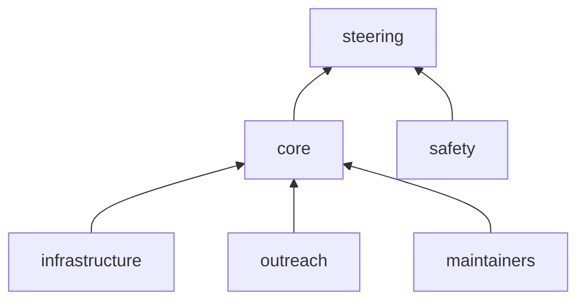

import Profile from '@components/GitHubProfilePictureExtended.svelte';

# Governance

nf-core is committed to being an open, inclusive, productive, and open-source community.
Anyone interested in the project can join the community and contribute to the project.
All community members must comply with the Code of Conduct (CoC) at all times.

To help manage the project, nf-core has teams that are made up of community members that oversee core activities.

This page describes the structure of the nf-core community, including how governance teams are elected, their responsibilities, and how decisions are made.

## Steering committee

Changes impacting the community require decisions informed by extensive experience with the nf-core project and the larger ecosystem.
The steering committee is responsible for overseeing the running of the nf-core project.

The steering committee is made up of representatives from the core team and outside advisors who are familiar with the project.
The steering committee is not a fixed size with its members being elected by the current steering committee.
The steering committee will meet regularly to discuss the project, funding and personnel.

##### Responsibilities

-   Guiding project initiatives
-   Making decisions about the project, funds, and personnel

##### Members

<Profile username="apeltzer">Alexander Peltzer</Profile>
<a class="btn btn-light rounded-pill mb-2 px-3 align-middle" style="height:50px;line-height:35px;">
    Ellen Sherwood
</a>
<Profile username="evanfloden">Evan Floden</Profile>
<Profile username="ggabernet">Gisela Gabernet</Profile>
<Profile username="drpatelh">Harshil Patel</Profile>
<Profile username="ewels">Phil Ewels</Profile>
<Profile username="naepfel">Sven Nahnsen</Profile>

## Core team

The core team ensures the day-to-day running of the nf-core project and oversees the activities of governance teams.

The core team is made up of community members that have demonstrated a continued commitment to the nf-core community.
New members will be invited to join the core team based on contributions, experience, and engagement with the community.
The core team will aim to have representation from different genders, geography, and employers (e.g., academia, clinical and industry).
Significant community decisions will be made by vote with any decision without a clear majority being passed to the steering committee to resolve.
Core team members will appear as organization members on the GitHub organization and have administrator access to repositories.

##### Responsibilities

-   Day-to-day community decisions
-   Attendance at the core team annual meeting
-   Regular attendance at monthly core team meetings
-   Sub-roles within the nf-core governance teams
-   A strong community presence

##### Members

<Profile username="christopher-hakkaart">Chris Hakkaart</Profile>
<Profile username="drpatelh">Harshil Patel</Profile>
<Profile username="ewels">Phil Ewels</Profile>
<Profile username="FranBonath">Franziska Bonath</Profile>
<Profile username="FriederikeHanssen">Friederike Hanssen</Profile>
<Profile username="ggabernet">Gisela Gabernet</Profile>
<Profile username="jfy133">James A. Fellows Yates</Profile>
<Profile username="JoseEspinosa">Jose Espinosa-Carrasco</Profile>
<Profile username="mashehu">Matthias Hörtenhuber</Profile>
<Profile username="MaxUlysse">Maxime Garcia</Profile>
<Profile username="mirpedrol">Júlia Mir Pedrol</Profile>
<Profile username="mribeirodantas">Marcel Ribeiro-Dantas</Profile>
<Profile username="edmundmiller">Edmund Miller</Profile>

##### Alumni

<Profile username="apeltzer">Alexander Peltzer</Profile>
<Profile username="alneberg">Johannes Alneberg</Profile>
<Profile username="KevinMenden">Kevin Menden</Profile>
<Profile username="olgabot">Olga Botvinnik</Profile>
<Profile username="renbot-bio">Renuka Kudva</Profile>
<Profile username="sven1103">Sven F.</Profile>

## Safety

The nf-core community should feel comfortable contributing to the project without the risk of harassment or abuse.
The safety team is responsible for ensuring the community is a safe place and responding to instances of misconduct.

The safety team is made up of community members who have displayed integrity, strong communication, and a genuine concern for community welfare.
The safety team is elected by the core team, is not a fixed size, and will scale as the community grows.
The safety team is not a part of the core team and can report directly to the steering committee.

##### Responsibilities

-   Be responsible for the nf-core code of conduct
-   Be available for nf-core events (online or in person)
-   Promptly respond to reports of misconduct and escalate to the core team or steering committee as necessary

##### Members

<Profile username="ctuni">Cris Tuñí</Profile>
<Profile username="heuermh">Michael Heuer</Profile>
<Profile username="snafees">Saba Nafees</Profile>

## Infrastructure

Tooling is a fundamental part of the nf-core community.
The infrastructure team is responsible for the development and implementation of the nf-core tooling framework.

The infrastructure team will have one or more leads who are responsible for overseeing infrastructure efforts.
The infrastructure team is elected by the core team, is not a fixed size, and will scale as the community grows.
The infrastructure team will have administrator access to repositories.

##### Responsibilities

-   Development and maintenance of nf-core tools, website, and mega tests
-   Regular attendance at maintenance team meetings

##### Leads

<Profile username="ewels">Phil Ewels</Profile>

##### Members

<Profile username="mirpedrol">Júlia Mir Pedrol</Profile>
<Profile username="mashehu">Matthias Hörtenhuber</Profile>

## Outreach

Outreach is an important part of any community project.
The outreach team is responsible for overseeing the organization and running community outreach efforts, including, but not limited to, hackathons, and the `#bytesize` seminar series.

The outreach team will have one or more leads who are responsible for overseeing outreach efforts.
New members will be invited to be a part of the outreach team based on experience and outreach activity.
The outreach team is not a fixed size and will scale as the community grows.
The outreach leads will have access to community social media and YouTube accounts (e.g., Twitter and YouTube).

##### Responsibilities

-   Organizing and running the `#bytesize` seminar series
-   Leading the organization of hackathons, training sessions, mentorship program, and other outreach events
-   Creating and sharing community content
-   Regular attendance at outreach team meetings

##### Leads

<Profile username="christopher-hakkaart">Chris Hakkaart</Profile>
<Profile username="FranBonath">Franziska Bonath</Profile>
<Profile username="mribeirodantas">Marcel Ribeiro-Dantas</Profile>

##### Members

<Profile username="abhi18av">Abhinav Sharma</Profile>
<Profile username="edmundmiller">Edmund Miller</Profile>
<Profile username="yuukiiwa">Yuk Kei</Profile>
<Profile username="vdauwera">Geraldine Van der Auwera</Profile>
<Profile username="chriswyatt1">Chris Wyatt</Profile>

##### Alumni

<Profile username="pcantalupo">Paul Cantalupo</Profile>
<Profile username="Xesus-Abalo">Xesús M. Abalo</Profile>
<Profile username="MaxUlysse">Maxime Garcia</Profile>

## Maintainers

nf-core test data, modules, and pipeline repositories require regular upkeep and maintenance.
The maintainer's team takes an active role in managing nf-core repositories in collaboration with the wider nf-core community.

The maintainer's team will have one or more leads who are responsible for overseeing maintenance efforts.
New members are invited to be a part maintainers team by current maintainers based on experience and activity in the community.
The maintainer's team is not a fixed size and will scale as the community grows.
nf-core maintainers will have write access to repositories.

##### Responsibilities

-   Respond to `#github-invitations`
-   Review module, subworkflow, and pipeline release pull requests
-   Manage repository access for community developers
-   Manage test data
-   Enable and promote nf-core community values

##### Leads

<Profile username="FriederikeHanssen" affiliation="Quantitative Biology Center, QBiC, University of Tübingen">
    Friederike Hanssen
</Profile>
<Profile
    username="jfy133"
    affiliation="Leibniz Institute for Natural Product Research and Infection Biology Hans Knöll Institute & Max Planck Institute - for Evolutionary Anthropology"
>
    James A. Fellows Yates
</Profile>
<Profile username="maxulysse" affiliation="Seqera">
    Maxime U. Garcia
</Profile>

##### Members

<Profile username="adamrtalbot" affiliation="Seqera">
    Adam Talbot
</Profile>
<Profile username="asp8200" affiliation="Danish National Genome Center">
    Anders Sune Pedersen
</Profile>
<Profile username="jemten" affiliation="Science for Life Laboratory">
    Anders Jemt
</Profile>
<Profile username="christopher-mohr" affiliation="Boehringer Ingelheim">
    Christopher Mohr
</Profile>
<Profile username="erikrikarddaniel" affiliation="Linnaeus University">
    Daniel Lundin
</Profile>
<Profile username="edmundmiller" affiliation="University of Texas at Dallas">
    Edmund Miller
</Profile>
<Profile username="mirpedrol" affiliation="Quantitative Biology Center, QBiC, University of Tübingen">
    Júlia Mir Pedrol
</Profile>
<Profile username="ggabernet" affiliation="Quantitative Biology Center, QBiC, University of Tübingen">
    Gisela Gabernet
</Profile>
<Profile username="drpatelh" affiliation="Seqera">
    Harshil Patel
</Profile>
<Profile
    username="jasmezz"
    affiliation="Leibniz Institute for Natural Product Research and Infection Biology Hans Knöll Institute"
>
    Jasmin Frangenberg
</Profile>
<Profile username="pinin4fjords" affiliation="Seqera">
    Jon Manning
</Profile>
<Profile username="JoseEspinosa" affiliation="Centre for Genomic Regulation">
    Jose Espinosa-Carrasco
</Profile>
<Profile username="louperelo" affiliation="Quantitative Biology Center, QBiC, University of Tübingen">
    Louisa Perelo
</Profile>
<Profile username="matthdsm" affiliation="Center For Medical Genetics Ghent">
    Matthias De Smet
</Profile>
<Profile username="mashehu" affiliation="Science for Life Laboratory">
    Matthias Hörtenhuber
</Profile>
<Profile username="Midnighter" affiliation="Unseen Bio ApS">
    Moritz E. Beber
</Profile>
<Profile username="nvnieuwk" affiliation="Center For Medical Genetics Ghent">
    Nicolas Vannieuwkerke
</Profile>
<Profile username="ramprasadn" affiliation="Science for Life Laboratory">
    Ramprasad Neethiraj
</Profile>
<Profile username="robsyme" affiliation="Seqera">
    Rob Syme
</Profile>
<Profile username="sppearce" affiliation="Cancer Research UK Manchester Institute">
    Simon Pearce
</Profile>
<Profile username="sofstam" affiliation="Karolinska Institute & Karolinska University Hospital">
    Sofia Stamouli
</Profile>
<Profile
    username="jonasscheid"
    affiliation="Quantitative Biology Center, QBiC, University of Tübingen & Department of Peptide-based Immunotherapy, Institute of Immunology, University and University Hospital Tübingen"
>
    Jonas Scheid
</Profile>

We thank all the institutions and companies of the maintainers team for their support of nf-core.

##### Responsibilities

-   Engaging with local, national, and international Nextflow and nf-core community
-   Writing or sharing tweets, blogs, articles, and technical documentation
-   Running nf-core events such as user group meetings, hackathons, workshops, and more
-   Speaking about nf-core at meetings and events
-   Acting as a local liaison for new community members
