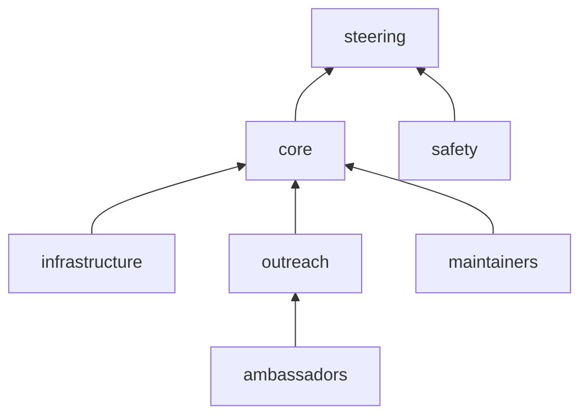

import GitHubProfilePicture from '@components/GitHubProfilePicture.svelte';

## Governance

nf-core is committed to being an open, inclusive, productive, and open-source community.
Anyone interested in the project can join the community and contribute to the project.
All community members must comply with the Code of Conduct (CoC) at all times.

To help manage the project, nf-core has teams that are made up of community members that oversee core activities.

This page describes the structure of the nf-core community, including how governance teams are elected, their responsibilities, and how decisions are made.

#### Steering committee

Changes impacting the community require decisions informed by extensive experience with the nf-core project and the larger ecosystem.
The steering committee is responsible for overseeing the running of the nf-core project.

The steering committee is made up of representatives from the core team and outside advisors who are familiar with the project.
The steering committee is not a fixed size with its members being elected by the current steering committee.
The steering committee will meet regularly to discuss the project, funding and personnel.

**Responsibilities**

- Guiding project initiatives
- Making decisions about the project, funds, and personnel

**Members**

<GitHubProfilePicture name="apeltzer" wrapperClasses="btn btn-light rounded-pill mb-2 p-0 pe-2" image="https://github.com/apeltzer.png" circle={true} size={40}> Alexander Peltzer</GitHubProfilePicture>
<a class="btn btn-light rounded-pill mb-2 p-2">Ellen Sherwood</a>
<GitHubProfilePicture name="evanfloden" image="https://github.com/evanfloden.png" circle={true} size={40} wrapperClasses={"btn btn-light rounded-pill mb-2 p-0 pe-2"}> Evan Floden</GitHubProfilePicture>
<GitHubProfilePicture name="ggabernet" image="https://github.com/ggabernet.png" circle={true} size={40} wrapperClasses={"btn btn-light rounded-pill mb-2 p-0 pe-2"}> Gisela Gabernet</GitHubProfilePicture>
<GitHubProfilePicture name="drpatelh" image="https://github.com/drpatelh.png" circle={true} size={40} wrapperClasses={"btn btn-light rounded-pill mb-2 p-0 pe-2"}> Harshil Patel</GitHubProfilePicture>
<GitHubProfilePicture name="ewels" image="https://github.com/ewels.png" circle={true} size={40} wrapperClasses={"btn btn-light rounded-pill mb-2 p-0 pe-2"}> Phil Ewels</GitHubProfilePicture>

#### Core team

The core team ensures the day-to-day running of the nf-core project and oversees the activities of governance teams.

The core team is made up of community members that have demonstrated a continued commitment to the nf-core community.
New members will be invited to join the core team based on contributions, experience, and engagement with the community.
The core team will aim to have representation from different genders, geography, and employers (e.g., academia, clinical and industry).
Significant community decisions will be made by vote with any decision without a clear majority being passed to the steering committee to resolve.
Core team members will appear as organization members on the GitHub organization and have administrator access to repositories.

**Responsibilities**

- Day-to-day community decisions
- Attendance at the core team annual meeting
- Regular attendance at monthly core team meetings
- Sub-roles within the nf-core governance teams
- A strong community presence

**Members**

<GitHubProfilePicture wrapperClasses="btn btn-light rounded-pill mb-2 p-0 pe-2" image="https://github.com/christopher-hakkaart.png" name={"christopher-hakkaart"} circle={true} size={40}> Chris Hakkaart</GitHubProfilePicture>
<GitHubProfilePicture wrapperClasses="btn btn-light rounded-pill mb-2 p-0 pe-2" image="https://github.com/drpatelh.png" name={"drpatelh"} circle={true} size={40}> Harshil Patel</GitHubProfilePicture>
<GitHubProfilePicture wrapperClasses="btn btn-light rounded-pill mb-2 p-0 pe-2" image="https://github.com/ewels.png" name={"ewels"} circle={true} size={40}> Phil Ewels</GitHubProfilePicture>
<GitHubProfilePicture wrapperClasses="btn btn-light rounded-pill mb-2 p-0 pe-2" image="https://github.com/FranBonath.png" name={"FranBonath"} circle={true} size={40}> Franziska Bonath</GitHubProfilePicture>
<GitHubProfilePicture wrapperClasses="btn btn-light rounded-pill mb-2 p-0 pe-2" image="https://github.com/FriederikeHanssen.png" name={"FriederikeHanssen"} circle={true} size={40}> Friederike Hanssen</GitHubProfilePicture>
<GitHubProfilePicture wrapperClasses="btn btn-light rounded-pill mb-2 p-0 pe-2" image="https://github.com/ggabernet.png" name={"ggabernet"} circle={true} size={40}> Gisela Gabernet</GitHubProfilePicture>
<GitHubProfilePicture wrapperClasses="btn btn-light rounded-pill mb-2 p-0 pe-2" image="https://github.com/jfy133.png" name={"jfy133"} circle={true} size={40}> James A. Fellows Yates</GitHubProfilePicture>
<GitHubProfilePicture wrapperClasses="btn btn-light rounded-pill mb-2 p-0 pe-2" image="https://github.com/JoseEspinosa.png" name={"JoseEspinosa"} circle={true} size={40}> Jose Espinosa-Carrasco</GitHubProfilePicture>
<GitHubProfilePicture wrapperClasses="btn btn-light rounded-pill mb-2 p-0 pe-2" image="https://github.com/mashehu.png" name={"mashehu"} circle={true} size={40}> Matthias Hörtenhuber</GitHubProfilePicture>
<GitHubProfilePicture wrapperClasses="btn btn-light rounded-pill mb-2 p-0 pe-2" image="https://github.com/MaxUlysse.png" name={"MaxUlysse"} circle={true} size={40}> Maxime Garcia</GitHubProfilePicture>
<GitHubProfilePicture wrapperClasses="btn btn-light rounded-pill mb-2 p-0 pe-2" image="https://github.com/mirpedrol.png" name={"mirpedrol"} circle={true} size={40}> Júlia Mir Pedrol</GitHubProfilePicture>
<GitHubProfilePicture wrapperClasses="btn btn-light rounded-pill mb-2 p-0 pe-2" image="https://github.com/mribeirodantas.png" name={"mribeirodantas"} circle={true} size={40}> Marcel Ribeiro-Dantas</GitHubProfilePicture>

**Core team alumni**

<GitHubProfilePicture wrapperClasses="btn btn-light rounded-pill mb-2 p-0 pe-2" image="https://github.com/apeltzer.png" name={"apeltzer"} circle={true} size={40}> Alexander Peltzer</GitHubProfilePicture>
<GitHubProfilePicture wrapperClasses="btn btn-light rounded-pill mb-2 p-0 pe-2" image="https://github.com/alneberg.png" name={"alneberg"} circle={true} size={40}> Johannes Alneberg </GitHubProfilePicture>
<GitHubProfilePicture wrapperClasses="btn btn-light rounded-pill mb-2 p-0 pe-2" image="https://github.com/KevinMenden.png" name={"KevinMenden"} circle={true} size={40}> Kevin Menden</GitHubProfilePicture>
<GitHubProfilePicture wrapperClasses="btn btn-light rounded-pill mb-2 p-0 pe-2" image="https://github.com/olgabot.png" name={"olgabot"} circle={true} size={40}> Olga Botvinnik</GitHubProfilePicture>
<GitHubProfilePicture wrapperClasses="btn btn-light rounded-pill mb-2 p-0 pe-2" image="https://github.com/renbot-bio.png" name={"renbot-bio"} circle={true} size={40}> Renuka Kudva</GitHubProfilePicture>
<GitHubProfilePicture wrapperClasses="btn btn-light rounded-pill mb-2 p-0 pe-2" image="https://github.com/sven1103.png" name={"sven1103"} circle={true} size={40}> Sven F.</GitHubProfilePicture>

#### Safety

The nf-core community should feel comfortable contributing to the project without the risk of harassment or abuse.
The safety team is responsible for ensuring the community is a safe place and responding to instances of misconduct.

The safety team is made up of community members who have displayed integrity, strong communication, and a genuine concern for community welfare.
The safety team is elected by the core team, is not a fixed size, and will scale as the community grows.
The safety team is not a part of the core team and can report directly to the steering committee.

**Members**

<GitHubProfilePicture wrapperClasses="btn btn-light rounded-pill mb-2 p-0 pe-2" image="https://github.com/ctuni.png" name={"ctuni"} circle={true} size={40}> Cris Tuñí</GitHubProfilePicture>
<GitHubProfilePicture wrapperClasses="btn btn-light rounded-pill mb-2 p-0 pe-2" image="https://github.com/heuermh.png" name={"heuermh"} circle={true} size={40}> Michael Heuer</GitHubProfilePicture>
<GitHubProfilePicture wrapperClasses="btn btn-light rounded-pill mb-2 p-0 pe-2" image="https://github.com/snafees.png" name={"snafees"} circle={true} size={40}> Saba Nafees</GitHubProfilePicture>

**Responsibilities**

- Write and maintain the nf-core code of conduct
- Be available for nf-core events (online or in person)
- Monitor Slack channels for instances of misconduct
- Promptly respond to reports of misconduct and escalate to the core team or steering committee as necessary

#### Infrastructure

Tooling is a fundamental part of the nf-core community.
The infrastructure team is responsible for the development and implementation of the nf-core tooling framework.

The infrastructure team will have one or more leads who are responsible for overseeing infrastructure efforts.
The infrastructure team is elected by the core team, is not a fixed size, and will scale as the community grows.
The infrastructure team will have administrator access to repositories.

**Responsibilities**

- Development and maintenance of nf-core tools, website, and mega tests
- Regular attendance at maintenance team meetings

**Leads**

<GitHubProfilePicture wrapperClasses="btn btn-light rounded-pill mb-2 p-0 pe-2" image="https://github.com/ewels.png" name={"ewels"} circle={true} size={40}> Phil Ewels</GitHubProfilePicture>

**Members**

<GitHubProfilePicture wrapperClasses="btn btn-light rounded-pill mb-2 p-0 pe-2" image="https://github.com/mirpedrol.png" name={"mirpedrol"} circle={true} size={40}> Júlia Mir Pedrol</GitHubProfilePicture>
<GitHubProfilePicture wrapperClasses="btn btn-light rounded-pill mb-2 p-0 pe-2" image="https://github.com/mashehu.png" name={"mashehu"} circle={true} size={40}> Matthias Hörtenhuber</GitHubProfilePicture>

#### Outreach

Outreach is an important part of any community project.
The outreach team is responsible for overseeing the organization and running community outreach efforts, including, but not limited to, the nf-core ambassador program, hackathons, and the `#bytesize` seminar series.

The outreach team will have one or more leads who are responsible for overseeing outreach efforts.
New members will be invited to be a part of the outreach team based on experience and outreach activity (e.g., involvement in the ambassador program).
The outreach team is not a fixed size and will scale as the community grows.
The outreach leads will have access to community social media and YouTube accounts (e.g., Twitter and YouTube).

**Responsibilities**

- Organizing and running the `#bytesize` seminar series
- Leading the organization of hackathons, training sessions, mentorship program, ambassador program, and other outreach events
- Creating and sharing community content
- Regular attendance at outreach team meetings

**Leads**

<GitHubProfilePicture wrapperClasses="btn btn-light rounded-pill mb-2 p-0 pe-2" image="https://github.com/christopher-hakkaart.png" name={"christopher-hakkaart"} circle={true} size={40}> Chris Hakkaart</GitHubProfilePicture>
<GitHubProfilePicture wrapperClasses="btn btn-light rounded-pill mb-2 p-0 pe-2" image="https://github.com/FranBonath.png" name={"FranBonath"} circle={true} size={40}> Franziska Bonath</GitHubProfilePicture>
<GitHubProfilePicture wrapperClasses="btn btn-light rounded-pill mb-2 p-0 pe-2" image="https://github.com/mribeirodantas.png" name={"mribeirodantas"} circle={true} size={40}> Marcel Ribeiro-Dantas</GitHubProfilePicture>

**Members**

<GitHubProfilePicture wrapperClasses="btn btn-light rounded-pill mb-2 p-0 pe-2" image="https://github.com/abhi18av.png" name={"abhi18av"} circle={true} size={40}> Abhinav Sharma</GitHubProfilePicture>
<GitHubProfilePicture wrapperClasses="btn btn-light rounded-pill mb-2 p-0 pe-2" image="https://github.com/Emiller88.png" name={"Emiller88"} circle={true} size={40}> Edmund Miller</GitHubProfilePicture>
<GitHubProfilePicture wrapperClasses="btn btn-light rounded-pill mb-2 p-0 pe-2" image="https://github.com/MaxUlysse.png" name={"MaxUlysse"} circle={true} size={40}> Maxime Garcia</GitHubProfilePicture>
<GitHubProfilePicture wrapperClasses="btn btn-light rounded-pill mb-2 p-0 pe-2" image="https://github.com/pcantalupo.png" name={"pcantalupo"} circle={true} size={40}> Paul Cantalupo</GitHubProfilePicture>
<GitHubProfilePicture wrapperClasses="btn btn-light rounded-pill mb-2 p-0 pe-2" image="https://github.com/yuukiiwa.png" name={"yuukiiwa"} circle={true} size={40}> Yuk Kei</GitHubProfilePicture>

**Alumni**

<GitHubProfilePicture wrapperClasses="btn btn-light rounded-pill mb-2 p-0 pe-2" image="https://github.com/Xesus-Abalo.png" name={"Xesus-Abalo"} circle={true} size={40}> Xesús M. Abalo</GitHubProfilePicture>

#### Maintainers

nf-core test data, modules, and pipeline repositories require regular upkeep and maintenance.
The maintainer's team takes an active role in managing nf-core repositories in collaboration with the wider nf-core community.

The maintainer's team will have one or more leads who are responsible for overseeing maintenance efforts.
New members are invited to be a part maintainers team by current maintainers based on experience and activity in the community.
The maintainer's team is not a fixed size and will scale as the community grows.
nf-core maintainers will have write access to repositories.

**Responsibilities**

- Respond to `#github-invitations`
- Review module, subworkflow, and pipeline release pull requests
- Manage repository access for community developers
- Manage test data
- Enable and promote nf-core community values

{/* **Leads**

<GitHubProfilePicture wrapperClasses="btn btn-light rounded-pill mb-2 p-0 pe-2" image="https://github.com/.png" circle={true} size={40}> Member</GitHubProfilePicture> */}

**Members**

<ul>
  <li><GitHubProfilePicture wrapperClasses="btn btn-light rounded-pill mb-2 p-0 pe-2" image="https://github.com/adamrtalbot.png" name={"adamrtalbot"} circle={true} size={40}>  Adam Talbot</GitHubProfilePicture>(Nonacus) </li>
  <li><GitHubProfilePicture wrapperClasses="btn btn-light rounded-pill mb-2 p-0 pe-2" image="https://github.com/asp8200.png" name={"asp8200"} circle={true} size={40}>  Anders Sune Pedersen</GitHubProfilePicture>(Danish National Genome Center) </li>
  <li><GitHubProfilePicture wrapperClasses="btn btn-light rounded-pill mb-2 p-0 pe-2" image="https://github.com/jemten.png" name={"jemten"} circle={true} size={40}>  Anders Jemt</GitHubProfilePicture>(Science for Life Laboratory) </li>
  <li><GitHubProfilePicture wrapperClasses="btn btn-light rounded-pill mb-2 p-0 pe-2" image="https://github.com/christopher-mohr.png" name={"christopher-mohr"} circle={true} size={40}>  Christopher Mohr</GitHubProfilePicture>(Boehringer Ingelheim) </li>
  <li><GitHubProfilePicture wrapperClasses="btn btn-light rounded-pill mb-2 p-0 pe-2" image="https://github.com/erikrikarddaniel.png" name={"erikrikarddaniel"} circle={true} size={40}>  Daniel Lundin</GitHubProfilePicture>(Linnaeus University) </li>
  <li><GitHubProfilePicture wrapperClasses="btn btn-light rounded-pill mb-2 p-0 pe-2" image="https://github.com/Emiller88.png" name={"Emiller88"} circle={true} size={40}>  Edmund Miller</GitHubProfilePicture>(University of Texas at Dallas & Element Biosciences) </li>
  <li><GitHubProfilePicture wrapperClasses="btn btn-light rounded-pill mb-2 p-0 pe-2" image="https://github.com/FriederikeHanssen.png" name={"FriederikeHanssen"} circle={true} size={40}>  Friederike Hanssen</GitHubProfilePicture>(Quantitative Biology Center, QBiC, University of Tübingen) </li>
  <li><GitHubProfilePicture wrapperClasses="btn btn-light rounded-pill mb-2 p-0 pe-2" image="https://github.com/mirpedrol.png" name={"mirpedrol"} circle={true} size={40}>  Júlia Mir Pedrol</GitHubProfilePicture>(Quantitative Biology Center, QBiC, University of Tübingen) </li>
  <li><GitHubProfilePicture wrapperClasses="btn btn-light rounded-pill mb-2 p-0 pe-2" image="https://github.com/ggabernet.png" name={"ggabernet"} circle={true} size={40}>  Gisela Gabernet</GitHubProfilePicture>(Quantitative Biology Center, QBiC, University of Tübingen) </li>
  <li><GitHubProfilePicture wrapperClasses="btn btn-light rounded-pill mb-2 p-0 pe-2" image="https://github.com/drpatelh.png" name={"drpatelh"} circle={true} size={40}>  Harshil Patel</GitHubProfilePicture>(Seqera Labs) </li>
  <li><GitHubProfilePicture wrapperClasses="btn btn-light rounded-pill mb-2 p-0 pe-2" image="https://github.com/jfy133.png" name={"jfy133"} circle={true} size={40}>  James A. Fellows Yates</GitHubProfilePicture>(Leibniz Institute for Natural Product Research and Infection Biology Hans Knöll Institute & Max Planck Institute - for Evolutionary Anthropology)</li>
  <li><GitHubProfilePicture wrapperClasses="btn btn-light rounded-pill mb-2 p-0 pe-2" image="https://github.com/jasmezz.png" name={"jasmezz"} circle={true} size={40}>  Jasmin Frangenberg</GitHubProfilePicture>(Leibniz Institute for Natural Product Research and Infection Biology Hans Knöll Institute) </li>
  <li><GitHubProfilePicture wrapperClasses="btn btn-light rounded-pill mb-2 p-0 pe-2" image="https://github.com/pinin4fjords.png" name={"pinin4fjords"} circle={true} size={40}>  Jon Manning</GitHubProfilePicture>(Healx Ltd) </li>
  <li><GitHubProfilePicture wrapperClasses="btn btn-light rounded-pill mb-2 p-0 pe-2" image="https://github.com/JoseEspinosa.png" name={"JoseEspinosa"} circle={true} size={40}>  Jose Espinosa-Carrasco</GitHubProfilePicture>(Centre for Genomic Regulation) </li>
  <li><GitHubProfilePicture wrapperClasses="btn btn-light rounded-pill mb-2 p-0 pe-2" image="https://github.com/louperelo.png" name={"louperelo"} circle={true} size={40}>  Louisa Perelo</GitHubProfilePicture>(Quantitative Biology Center, QBiC, University of Tübingen) </li>
  <li><GitHubProfilePicture wrapperClasses="btn btn-light rounded-pill mb-2 p-0 pe-2" image="https://github.com/matthdsm.png" name={"matthdsm"} circle={true} size={40}>  Matthias De Smet</GitHubProfilePicture>(Center For Medical Genetics Ghent) </li>
  <li><GitHubProfilePicture wrapperClasses="btn btn-light rounded-pill mb-2 p-0 pe-2" image="https://github.com/mashehu.png" name={"mashehu"} circle={true} size={40}>  Matthias Hörtenhuber</GitHubProfilePicture>(Science for Life Laboratory) </li>
  <li><GitHubProfilePicture wrapperClasses="btn btn-light rounded-pill mb-2 p-0 pe-2" image="https://github.com/maxulysse.png" name={"maxulysse"} circle={true} size={40}>  Maxime U. Garcia</GitHubProfilePicture>(Seqera Labs) </li>
  <li><GitHubProfilePicture wrapperClasses="btn btn-light rounded-pill mb-2 p-0 pe-2" image="https://github.com/Midnighter.png" name={"Midnighter"} circle={true} size={40}>  Moritz E. Beber</GitHubProfilePicture>(Unseen Bio ApS) </li>
  <li><GitHubProfilePicture wrapperClasses="btn btn-light rounded-pill mb-2 p-0 pe-2" image="https://github.com/nvnieuwk.png" name={"nvnieuwk"} circle={true} size={40}>  Nicolas Vannieuwkerke</GitHubProfilePicture>(Center For Medical Genetics Ghent) </li>
  <li><GitHubProfilePicture wrapperClasses="btn btn-light rounded-pill mb-2 p-0 pe-2" image="https://github.com/ramprasadn.png" name={"ramprasadn"} circle={true} size={40}>  Ramprasad Neethiraj</GitHubProfilePicture>(Science for Life Laboratory) </li>
  <li><GitHubProfilePicture wrapperClasses="btn btn-light rounded-pill mb-2 p-0 pe-2" image="https://github.com/robsyme.png" name={"robsyme"} circle={true} size={40}>  Rob Syme</GitHubProfilePicture>(Seqera Labs) </li>
  <li><GitHubProfilePicture wrapperClasses="btn btn-light rounded-pill mb-2 p-0 pe-2" image="https://github.com/sppearce.png" name={"sppearce"} circle={true} size={40}>  Simon Pearce</GitHubProfilePicture>(Cancer Research UK Manchester Institute) </li>
  <li><GitHubProfilePicture wrapperClasses="btn btn-light rounded-pill mb-2 p-0 pe-2" image="https://github.com/sofstam.png" name={"sofstam"} circle={true} size={40}>  Sofia Stamouli</GitHubProfilePicture>(Karolinska Institute & Karolinska University Hospital) </li>
</ul>

We thank all the institutions and companies of the maintainers team for their support of nf-core.

#### Ambassadors

nf-core recognizes a vibrant, worldwide group of nf-core experts whose enthusiasm for knowledge-sharing drives the community forward.
Ambassadors go above and beyond to share knowledge in a variety of ways including online via social media, blog posts and articles; or in person at conferences, workshops, and user group events.

Community members with an interest in sharing knowledge and helping their communities can become nf-core ambassadors.
Ambassadors are expected to regularly engage with the wider community and will be supported by the outreach team and other ambassadors.

More information about becoming a Nextflow and nf-core ambassador will be available soon!

**Responsibilities**

- Engaging with local, national, and international Nextflow and nf-core community
- Writing or sharing tweets, blogs, articles, and technical documentation
- Running nf-core events such as user group meetings, hackathons, workshops, and more
- Speaking about nf-core at meetings and events
- Acting as a local liaison for new community members
