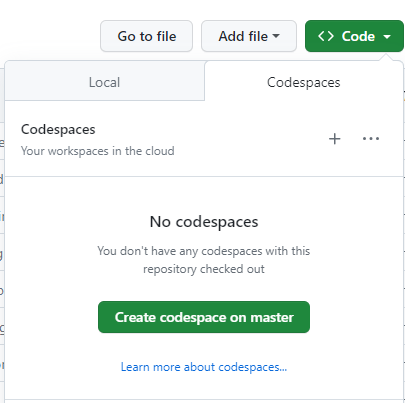
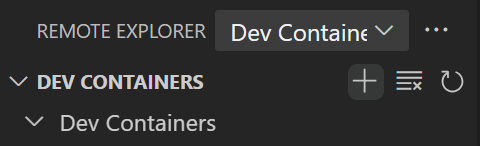

## Gitpod alternatives

Some alternatives to using Gitpod that offer similar convenience/transportability are [GitHub Codespaces](https://github.com/features/codespaces) and [Visual Studio Code Dev Containers](https://code.visualstudio.com/docs/devcontainers/containers).

## GitHub Codespaces

GitHub Codespaces is a browser-based development platform that functions very similarly to Gitpod. It is also free (with a GitHub account) for up to 60 hours/month, with 15 GB of temporary storage, and the use of 2 cores.

Being integrated into GitHub, Codespaces can automatically be used for every nf-core repository.

To create a Codespace, you first click on the `Code` button at the top of any GitHub repository.

  

This will bring up a dropdown menu, you will then select the `Codespaces` tab and press the `+` sign. This will create a Codespace on the current branch of this repository.

  

After the Codespace is created, you should see something that looks very similar to a Gitpod environment (please see nf-core's [Gitpod](gitpod/index.md) page for more information). **An important difference between Gitpod and Codespaces is that `singularity`, and not `docker` profiles will need to be used to run any nextflow commands.** Otherwise, the created codespace can be used almost exactly as you would use a Gitpod environment.

## Dev Containers on Visual Studio Code (VS Code)

As an alternative to Gitpod and Codespaces, which are browser-based, development containers can also be created and run locally through VS Code. In this case, the only monthly limitations are those imposed by your computer. The setup for local development containers is slightly more involved than Gitpod or Codespaces, but offers similar functionality after the initial installations.

The following steps provide a walkthrough for setting up
VS Code Dev Containers on a local computer.

1. **Install Docker Desktop**: Docker desktop can be downloaded for Windows, Mac, and Linux on the [Docker](https://www.docker.com/products/docker-desktop/) website. *You will have to create an account to use Docker desktop.*

2. **Install VS Code**: VS Code can be downloaded from the [VS Code](https://code.visualstudio.com/Download) website.

3. **Install VS Code Remote Development Extension**: The remote development pack allows VS Code to be used for code edition in development containers. This extension can be downloaded from the [VS Code] website, or by typing `remote development` into the extension tab's
 search bar

4. **Clone a Repository in Container Volume**: Once everything is installed, open both Docker Desktop and VS Code prior going through the steps to create a local Dev Container:
- Navigate to the `Remote Explorer`  tab in VS Code
- Click the dropdown menu at the top of the panel and select `Dev Containers`

- Press the `+` sign under the dropdown menu (this is only visible when the cursor is placed over the banner).
- Select `Clone Repository in Container Volume` from the dropdown menu
- Select `GitHub` as the remote source, and type the repository name you want to clone (i.e. `nf-core/phageannotator`)
- Select which branch the container should be based in
- Click `+ Create a new colume`
- Enter the desired volume name (or press `Enter` to use default name)
- Enter the target folder name (or press `Enter` to use the default name)

After going through these steps, a new instance of VS Code will be created for your Dev Container! The layout will be similar to Gitpod and Codespaces, so please see nf-core's [Gitpod](gitpod/index.md) page for more information about the user interface.

## Troubleshooting

1. Using docker profile in Codespace/VS Code Dev Containers

Error message: `docker: Cannot connect to the Docker daemon at unix:///var/run/docker.sock. Is the docker daemon running?.`

Solution: Ensure that `-profile singularity` is used. The `docker` profile will not work in Codespaces or VS Code Dev Containers.

2. Non-privileged status when using singularity profile

Error message: `*FATAL: container creation failed: mount hook function failure: mount /proc/self/fd/3->/var/lib/apptainer/mnt/session/rootfs error: while mounting image /proc/self/fd/3: squashfuse_ll exited with status 1: fuse: device not found, try 'modprobe fuse' first*`

Solution: Add the following line to the `.devcontainer/devcontainer.json` file:
`"runArgs": ["--privileged"],`

