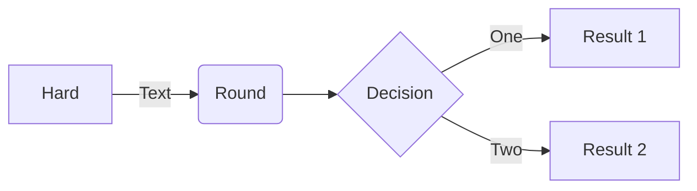

# Admonitions

Admonitions are used to highlight text in a box with a title. They are used to draw attention to important information, or to warn of potential problems.

You can use the following admonitions on this website:

## Notes

```md
:::note
He had half a mind just to keep on `falling`.
:::
```

:::note
He had half a mind just to keep on `falling`.
:::

## Info

```md
:::info
His face froze for a second or two and then began to do that terribly slow crashing `trick` that Arctic ice floes do so spectacularly in the spring.
:::
```

:::info
His face froze for a second or two and then began to do that terribly slow crashing `trick` that Arctic ice floes do so spectacularly in the spring.
:::

## Warnings

```md
:::warning
He smiled the smile that Zaphod had wanted to hit and this time `Zaphod` hit it.
:::
```

:::warning
He smiled the smile that Zaphod had wanted to hit and this time `Zaphod` hit it.
:::

## Danger

```md
:::danger
One of the troublesome circumstances was the Plural nature of this Galactic Sector, where the possible `continually` interfered with the probable.
:::
```

:::danger
One of the troublesome circumstances was the Plural nature of this Galactic Sector, where the possible `continually` interfered with the probable.
:::

## Publication

```md
:::publication
We demand rigidly defined areas of doubt and uncertainty!
:::
```

:::publication
We demand rigidly defined areas of doubt and uncertainty!
:::

## Custom title

```md
:::note{title="Don't Panic"}
Arthur Dent was grappling with his consciousness the way one grapples with a lost bar of soap in the bath. He lay, panting heavily in the wet air, and tried feeling bits of himself to see where he might be hurt. Wherever he touched himself, he encountered a pain. After a short while he worked out that this was because it was his hand that was hurting. Arthur nodded intelligently. Today was one of those bad days.
:::
```

:::note{title="Don't Panic"}
Arthur Dent was grappling with his consciousness the way one grapples with a lost bar of soap in the bath. He lay, panting heavily in the wet air, and tried feeling bits of himself to see where he might be hurt. Wherever he touched himself, he encountered a pain. After a short while he worked out that this was because it was his hand that was hurting. Arthur nodded intelligently. Today was one of those bad days.
:::

# Mermaid diagrams

[Mermaid](https://mermaid.js.org/intro/) is a simple markdown-like script language for generating charts from text via javascript. It supports many different types of diagrams, including flowcharts, sequence diagrams, gantt charts and class diagrams. To display them correctly on an nf-co.re page, you need to wrap them in a code block with the language set to `mermaid`,e.g.:

````md

````
turns into:


# LaTeX formulas

We support latex based formulas using [KaTeX](https://katex.org/). To display them correctly on an nf-co.re page, you need to wrap them in a block surrounded by `$$$`, e.g.:

```md
$$$
z_{n+1} = z_n^2 + c
$$$
```
turns into:

$$$
z_{n+1} = z_n^2 + c
$$$

You can also display formulas inline by wrapping them in `$` instead of `$$$`, e.g.:

```md
The lift $L$ is calculated as follows: $L = \frac{1}{2} \rho v^2 S C_L$
```
gets rendered as:

The lift $L$ is calculated as follows: $L = \frac{1}{2} \rho v^2 S C_L$.
