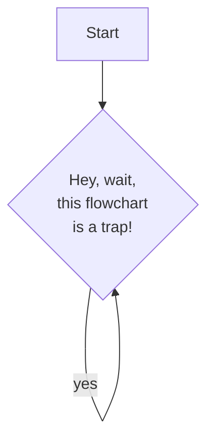

# Introduction

We write all of the nf-core documentation, including pipelines, in [Markdown](https://www.markdownguide.org/). Markdown is a simple markup language that allows you to write text in a way that is easy to read and write, but can be converted to HTML for display on the web.

In general, we follow the [GitHub Flavored Markdown specification](https://github.github.com/gfm/), but there are a few extra features that we support on nf-co.re.

# Admonitions

Admonitions are used to highlight text in a box with a title. They are used to draw attention to important information, or to warn of potential problems.

You can use the following admonitions on this website:

## Notes

```md
:::note
He had half a mind just to keep on `falling`.
:::
```

:::note
He had half a mind just to keep on `falling`.
:::

## Info

```md
:::info
His face froze for a second or two and then began to do that terribly slow crashing `trick` that Arctic ice floes do so spectacularly in the spring.
:::
```

:::info
His face froze for a second or two and then began to do that terribly slow crashing `trick` that Arctic ice floes do so spectacularly in the spring.
:::

## Tip

```md
:::tip
The ships hung in the sky in much the same way that bricks don't.
:::
```

:::tip
The ships hung in the sky in much the same way that bricks don't.
:::

## Warnings

```md
:::warning
He smiled the smile that Zaphod had wanted to hit and this time `Zaphod` hit it.
:::
```

:::warning
He smiled the smile that Zaphod had wanted to hit and this time `Zaphod` hit it.
:::

## Danger

```md
:::danger
One of the troublesome circumstances was the Plural nature of this Galactic Sector, where the possible `continually` interfered with the probable.
:::
```

:::danger
One of the troublesome circumstances was the Plural nature of this Galactic Sector, where the possible `continually` interfered with the probable.
:::

## Custom title

You can replace the default title with a custom one by adding a title attribute to the admonition, e.g.:

```md
:::note{title="Don't Panic"}
Arthur Dent was grappling with his consciousness the way one grapples with a lost bar of soap in the bath. He lay, panting heavily in the wet air, and tried feeling bits of himself to see where he might be hurt. Wherever he touched himself, he encountered a pain. After a short while he worked out that this was because it was his hand that was hurting. Arthur nodded intelligently. Today was one of those bad days.
:::
```

:::note{title="Don't Panic"}
Arthur Dent was grappling with his consciousness the way one grapples with a lost bar of soap in the bath. He lay, panting heavily in the wet air, and tried feeling bits of himself to see where he might be hurt. Wherever he touched himself, he encountered a pain. After a short while he worked out that this was because it was his hand that was hurting. Arthur nodded intelligently. Today was one of those bad days.
:::

## Custom icon

You can replace the default icon with a custom one by adding a [fontawesome icon class name](https://fontawesome.com/icons/) with a leading period to the admonition, e.g.:

```md
:::note{.fa-whale}
Another thing that got forgotten was the fact that against all probability a sperm whale had suddenly been called into existence several miles above the surface of an alien planet.
:::
```

:::note{.fa-whale}
Another thing that got forgotten was the fact that against all probability a sperm whale had suddenly been called into existence several miles above the surface of an alien planet.
:::

## Custom icon and title

When changing both title and icon, the order is important. You need to first specify the icon and then the title, e.g.:

```md
:::warning{.fa-flower-daffodil title="I wonder if it will be friends with me?"}
Curiously enough, the only thing that went through the mind of the bowl of petunias as it fell was Oh no, not again.
:::
```

:::warning{.fa-flower-daffodil title="I wonder if it will be friends with me?"}
Curiously enough, the only thing that went through the mind of the bowl of petunias as it fell was Oh no, not again.
:::

# Code blocks

We use [rehype-pretty-code](https://rehype-pretty-code.netlify.app/) to generate code blocks on the website. This allows us to add line numbers, highlight lines, add file names to code blocks, etc. These directives can be mixed and matched.

See the [rehype-pretty-code documentation](https://rehype-pretty-code.netlify.app/) for more information.

## Line numbers

````md
```bash showLineNumbers
echo "Look ma!"
echo "Code line numbers!"
```
````

```bash showLineNumbers
echo "Look ma!"
echo "Code line numbers!"
```

## Line numbers

````md
```bash {1-3,4}
# This line is highlighted
echo "Me too"
echo "Third line lucky!"
# This line is not highlighted
# This is again!
# ok, nothing to see from here on..
```
````

```bash {1-3,4}
# This line is highlighted
echo "Me too"
echo "Third line lucky!"
# This line is not highlighted
# This is again!
# ok, nothing to see from here on..
```

## File names

````md
```nextflow title="main.nf"
// My awesome workflow
```
```

```nextflow title="main.nf"
// My awesome workflow
```

## Code block captions

````md
```nextflow caption="This one is really special"
// My awesome workflow
```
```

```nextflow caption="This one is really special"
// My awesome workflow
```

## Putting it all together

````md
```nextflow showLineNumbers {1, 5-7} title="main.nf" caption="This one is really special"
// My awesome workflow

process {
  script:
  """
  echo "This is awesome!"
  """
}
```
````

```nextflow showLineNumbers {1, 5-7} title="main.nf" caption="This one is really special"
// My awesome workflow

process {
  script:
  """
  echo "This is awesome!"
  """
}
```


## Code blocks with file names

You can add a file name to a code block by adding a `title` attribute to the code block, e.g.:

````md
```groovy title="nextflow.config"
params {
  input = null
}
```
````

```groovy title="nextflow.config"
params {
  input = null
}
```

The icon next to the title is based on the file extension.

# Mermaid diagrams

[Mermaid](https://mermaid.js.org/intro/) is a simple markdown-like script language for generating charts from text via javascript. It supports many different types of diagrams, including flowcharts, sequence diagrams, gantt charts and class diagrams. To display them correctly on an nf-co.re page, you need to wrap them in a code block with the language set to `mermaid`,e.g.:

````md

````

turns into:


# LaTeX formulas

We support latex based formulas using [KaTeX](https://katex.org/). To display them correctly on an nf-co.re page, you need to wrap them in a block surrounded by `$$`, e.g.:

```md
$$
z_{n+1} = z_n^2 + c
$$
```

turns into:

$$
z_{n+1} = z_n^2 + c
$$

You can also display formulas inline by wrapping them in `$` instead of `$$`, e.g.:

```md
The lift $L$ is calculated as follows: $L = \frac{1}{2} \rho v^2 S C_L$
```

gets rendered as:

The lift $L$ is calculated as follows: $L = \frac{1}{2} \rho v^2 S C_L$.
